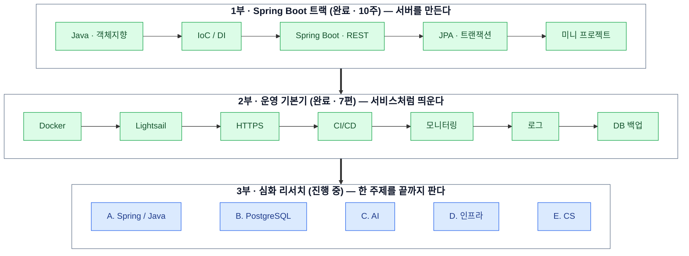

# backend-deep-dive · 멋사 백엔드 스터디

> 멋사 백엔드 스터디 레포입니다. (구 `zero-to-devops`)
> **1부(Spring Boot 트랙)** 와 **2부(배포/운영 기본기)** 는 강의형으로 진행했고,
> **3부는 각자 주제를 골라 깊게 파서 발표하는 리서치형**으로 전환했습니다.

---

## 전체 지도




- 1부는 Java 문법부터 Spring Boot·JPA까지 10주 커리큘럼으로 진행했습니다. 각자 작성한 코드는 [`spring/`](./spring)에 있습니다.
- 2부는 "앞 편이 만든 불편함을 다음 편이 해결한다"는 흐름으로 7편을 진행했습니다. 끝나면 "내 앱 하나가 자동 배포되고, 죽으면 알림 오고, 데이터도 백업된다"는 1인 서비스 운영이 완성됩니다. 이 지점에서 강의형은 마무리했습니다.
- 3부는 강의 대신 **각자 리서치 → 발표 → Q&A** 로 진행합니다. 주제 목록과 운영 규칙은 [`research/RESEARCH_TOPICS.md`](./research/RESEARCH_TOPICS.md)에 있습니다.

---

## 1부 — Spring Boot 트랙 (완료)

> 테마: **Java와 Spring Boot로 서버를 만든다.** API 설계, 데이터베이스, JPA까지 백엔드 전반.
> 코드는 [`spring/<이름>/`](./spring) 에 사람별로 있습니다. (원본: [BabyLionJD/Spring](https://github.com/BabyLionJD/Spring), 히스토리 포함 이관)
> 3부 리서치 주제 A(Spring/Java 심화)의 선행 과정입니다.

| 주차 | 미션 | 핵심 키워드 | 단계 |
| --- | --- | --- | --- |
| 1주 | Java 핵심 문법 & 흐름 | 변수, 조건문, 반복문 | Java |
| 2주 | 객체지향 I - 클래스와 캡슐화 | Class, Field, Method | Java |
| 3주 | 객체지향 II - 상속/다형성/추상화 | Inheritance, Polymorphism, Interface | Java |
| 4주 | Java Collections & 설계 확장 | List, Map, Generics | Java |
| 5주 | 자바로 배우는 IoC/DI | IoC, DI, Constructor Injection | Java |
| 6주 | Spring Boot 전환 | Spring Boot, Bean, Annotation | Spring Core |
| 7주 | REST API 설계 (CRUD) | REST, HTTP, DTO | Spring Core |
| 8주 | JPA 기초 & 영속성 컨텍스트 | JPA, Entity, Repository | JPA |
| 9주 | 연관관계 & 트랜잭션 | @OneToMany, @ManyToOne, Transactional | JPA |
| 10주 | 개인 미니 프로젝트: 예외 처리 통합 & 프론트엔드 연동 | Architecture, Refactoring | Project |

**1부 완료 시점:** "Java 문법 → 객체지향 → DI → Spring Boot → REST API → JPA"까지 혼자 CRUD 서버를 만들 수 있다.

---

## 2부 — 운영 기본기 (완료)

> 테마: **내 앱 하나를 진짜 서비스처럼 띄우고 운영한다.** 자료는 [`devops/`](./devops)에 있습니다.

| 회차 | 제목 | 해결하는 불편함 | 핵심 도구 |
| --- | --- | --- | --- |
| 1 | [Docker 편](./devops/1_docker.md) | "내 노트북에서만 돌아요" | Docker, docker compose |
| 2 | [Lightsail 배포 편](./devops/2_aws_lightsail.md) | "어디에 24시간 올리지?" | AWS Lightsail |
| 3 | [도메인 & HTTPS 편](./devops/3_domain_https.md) | "IP 못생겼고 자물쇠 없음" | Caddy, Let's Encrypt |
| 4 | [CI/CD 편](./devops/4_cicd.md) | "고칠 때마다 손으로 배포 귀찮음" | GitHub Actions |
| 5 | [모니터링 & 알림 편](./devops/5_monitoring.md) | "죽으면 어떻게 알지?" | 헬스체크, 디스코드/슬랙 웹훅 |
| 6 | [로그 관리 편](./devops/6_logs.md) | "logs를 언제까지 손으로 보냐" | 로그 수집·검색 |
| 7 | [DB 백업 자동화 편](./devops/7_db_backup.md) | "데이터 날아가면 끝인데?" | cron, mysqldump |

**2부 완료 시점:** "내 앱 하나가 자동 배포되고, 죽으면 알림 오고, 데이터도 백업된다" = 1인 서비스 운영 완성.

---

## 3부 — 심화 리서치 (진행 중)

> 테마: **한 주제를 "이미 써본 사람이 잘못 알고 있던 걸 바로잡는" 깊이까지 파서 발표한다.**

- **주제 목록 & 담당자 등록**: [`research/RESEARCH_TOPICS.md`](./research/RESEARCH_TOPICS.md)
  - A. Spring / Java 심화 · B. PostgreSQL 심화 · C. AI(LLM 앱 · 온톨로지 · 모델 내부/추론) · D. 인프라 / 아키텍처 · E. CS / 개발자 소양
  - 원하는 주제의 담당자 칸에 GitHub ID를 적고 커밋하면 본인 주제가 됩니다.
- **리서치 본문**: [`research/<GitHub ID>/`](./research/README.md) 아래 사람별 디렉토리에 작성
- **깊이 기준**: 1차 자료 인용, 재현 가능한 데모 또는 실측, 반론/트레이드오프, 우리 프로젝트 연결, 예상 질문 5개
- **발표 형식**: 30분 발표 + 15분 Q&A

원래 2막(무중단 배포·리버스 프록시·환경 분리·캐싱)과 3막(EC2·Terraform·오케스트레이션)으로 계획했던 내용은 강의 대신 리서치 주제로 흡수했습니다. 각각 D5 무중단 배포, D1 Redis 캐시, D10 IaC, D9 쿠버네티스 등에 대응합니다.

---

## 디렉토리 구조

```
spring/      1부 · Spring Boot 트랙 코드 (사람별)
devops/      2부 · 배포/운영 강의 자료 1~7편
research/    3부 · 심화 리서치 주제 목록 + 사람별 리서치 본문
MCP.md       MCP 발표 자료
```

---

## 기타 자료

- [`MCP.md`](./MCP.md) — MCP(Model Context Protocol) 발표 자료. 리서치 주제 C7(MCP 서버 직접 만들기)의 참고 자료.
