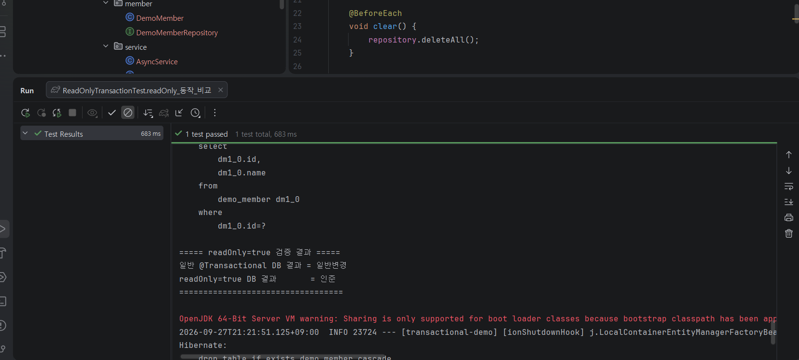
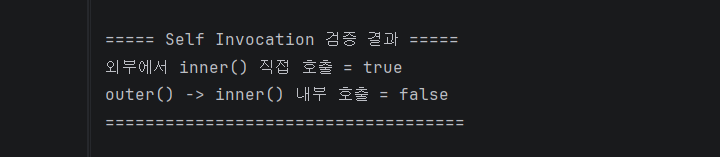
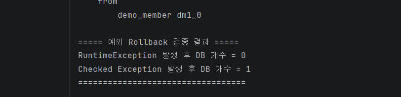
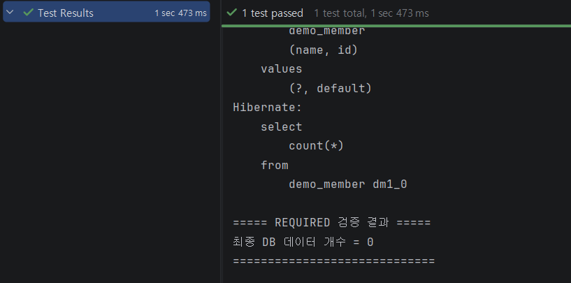
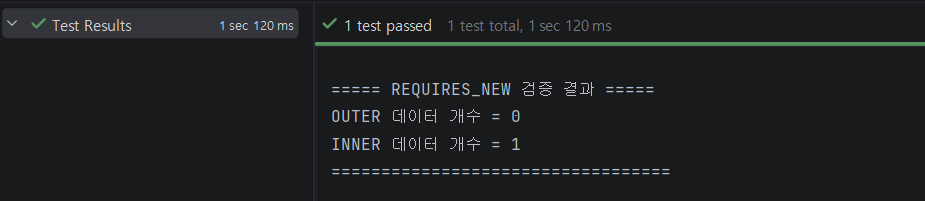
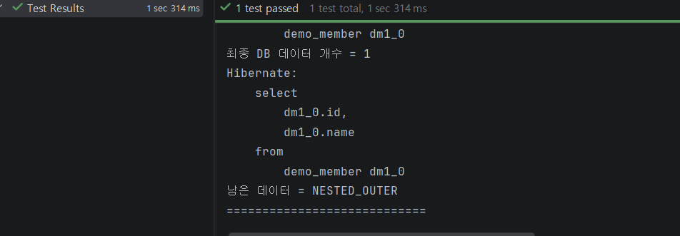
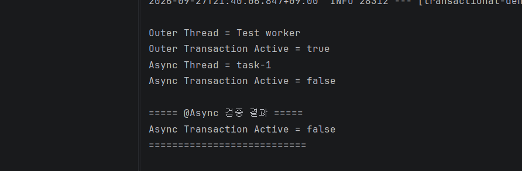
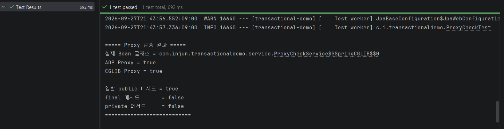

# A1. `@Transactional`이 안 먹는 순간들

> Spring 트랜잭션을 직접 이해하고 검증해보기

## 한 줄 요약

`@Transactional`은 단순히 애노테이션을 붙인다고 항상 기대한 방식으로 동작하는 것이 아니다.  
`readOnly`, Proxy, Self Invocation, 예외 종류, 전파 방식, `@Async` 등에 따라 실제 동작이 달라질 수 있으며 이를 직접 테스트해 확인해보았다.

## 데모 코드

- [spring-transactional-deep-dive](https://github.com/cij041109-del/spring-transactional-deep-dive)

---

## 1. 먼저 트랜잭션이란?

Spring 프로젝트를 진행하다 보면 `@Transactional`을 자주 사용하게 된다.

나 역시 프로젝트를 하면서 조회 기능에는

```java
@Transactional(readOnly = true)
```

를 사용하고,

등록·수정·삭제처럼 데이터를 변경하는 기능에는

```java
@Transactional
```

을 사용하는 방식으로 익혀왔다.

그리고 트랜잭션 안에서 예외가 발생하면 Spring이 알아서 Rollback을 해준다고 생각했다.

그런데 조금 더 깊게 들어가 보니 한 가지 의문이 생겼다.

> **우리는 `@Transactional`을 어떻게 사용하는지는 알고 있었지만, 실제로 어떻게 동작하는지는 정확히 알고 있었을까?**

이번 글에서는 `@Transactional`을 사용하면서 흔히 가질 수 있는 오해를 하나씩 살펴보고, 실제 Spring에서는 어떻게 동작하는지 직접 확인해보았다.

### 트랜잭션의 기본 개념

트랜잭션은 여러 데이터베이스 작업을 **하나의 작업 단위로 묶는 것**이다.

예를 들어 A 작업과 B 작업을 하나의 트랜잭션으로 묶었다고 해보자.

```text
A 작업 성공
     ↓
B 작업 성공
     ↓
Commit
```

두 작업이 모두 정상적으로 끝나면 결과를 확정한다.

이것을 **Commit**이라고 한다.

반대로 A 작업은 성공했지만 B 작업에서 문제가 발생한다면,

```text
A 작업 성공
     ↓
B 작업 실패
     ↓
Rollback
     ↓
A 작업도 취소
```

앞에서 성공했던 A 작업까지 다시 되돌린다.

이것이 **Rollback**이다.

> **트랜잭션은 여러 DB 작업을 하나의 묶음으로 처리하고, 전부 성공하면 저장하고 하나라도 문제가 생기면 되돌리는 것이다.**

### 계좌이체로 생각하면 쉽다

트랜잭션은 **계좌이체**로 생각하면 이해하기 쉽다.

친구에게 1만 원을 송금한다고 해보자.

```text
내 통장에서 1만 원 차감
        ↓
친구 통장에 1만 원 입금
```

두 작업이 모두 성공해야 정상적인 송금이 된다.

내 통장에서는 돈이 빠졌는데 친구 통장에는 돈이 들어오지 않는다면 문제가 된다.

그래서 중간에 하나라도 실패하면 처음 상태로 되돌린다.

```text
모두 성공 → Commit
하나라도 실패 → Rollback
```

> **트랜잭션 = 여러 작업을 하나로 묶어서 "전부 성공하거나, 전부 취소하도록" 만드는 기능**

---

## 2. 우리가 가지고 있던 세 가지 오해

프로젝트에서 `@Transactional`을 사용할 때 나는 보통 다음과 같이 이해했다.

- 조회 기능 → `readOnly=true`
- 등록·수정·삭제 → 일반 `@Transactional`
- 예외 발생 → Rollback

그런데 조금 생각해보면 몇 가지 의문이 생긴다.

### 첫 번째

> **`readOnly=true`를 붙이면 정말 데이터를 수정할 수 없는 걸까?**

### 두 번째

> **`@Transactional`을 메서드에 붙이기만 하면 항상 트랜잭션이 적용될까?**

### 세 번째

> **트랜잭션 안에서 예외가 발생하면 모든 예외가 Rollback될까?**

결론부터 말하면,

> **셋 다 그렇게 단순하지 않다.**

이제 하나씩 살펴보자.

---

## 3. `readOnly=true`는 정말 쓰기 금지일까?

처음 `readOnly=true`라는 이름을 보면 의미가 굉장히 직관적으로 보인다.

```text
readOnly
= 읽기 전용
= 수정 불가능?
```

처음에는

> **"`readOnly=true`를 붙이면 조회만 가능하고 수정이나 저장은 막아주는 옵션이겠구나."**

라고 생각했다.

하지만 실제 의미는 조금 다르다.

Spring에서 `readOnly=true`는

> **"절대로 데이터를 수정하지 못하게 막아라."**

라는 강제 명령이라기보다,

> **"이 트랜잭션은 조회를 중심으로 사용하는 트랜잭션입니다."**

라는 정보를 전달하는 힌트에 가깝다.

### 그렇다면 왜 사용할까?

여기서 이런 의문이 생긴다.

> **쓰기 자체를 막는 것도 아닌데 왜 굳이 `readOnly=true`를 사용할까?**

이유는 조회만 하는 작업에서는 **불필요한 작업을 줄일 수 있기 때문**이다.

JPA로 데이터를 조회하면 Hibernate는 조회한 객체를 관리한다.

그리고 일반적인 트랜잭션에서는 관리하고 있는 객체의 값이 바뀌었는지를 확인할 수 있다.

예를 들어 처음에 이름이

```text
인준
```

이었던 객체가 실행 도중

```text
준
```

으로 변경되었다고 해보자.

Hibernate는 이 변화를 확인할 수 있다.

이렇게 객체의 값이 변경되었는지를 감지하는 것을 **Dirty Checking, 변경 감지**라고 한다.

그런데 단순 조회 기능이라면 데이터를 수정할 일이 거의 없다.

그렇다면 굳이 변경 여부를 확인하거나 변경 내용을 자동으로 반영하기 위한 작업을 계속 준비할 필요도 줄어든다.

그래서 `readOnly=true`를 사용하면 Spring은 Hibernate에게

> **"이번 트랜잭션은 조회용이야."**

라는 정보를 전달한다.

Hibernate는 이를 바탕으로 Flush나 변경 감지와 관련된 작업을 최적화할 수 있다.

```text
내가 처음 생각한 readOnly

readOnly = 수정 자체를 못 하게 막는다 ❌
```

실제로는,

```text
Spring의 readOnly=true

"이번 트랜잭션은 조회 중심입니다."
        ↓
Hibernate가 조회용으로 동작
        ↓
불필요한 변경 관련 작업 감소 가능 ⭕
```

즉,

> **`readOnly=true`는 단순한 쓰기 금지 스위치가 아니라, 조회용 트랜잭션이라는 의도를 전달하는 옵션이다.**

라고 이해하는 것이 더 정확하다.

### 실험 결과



실험 결과
일반 @Transactional에서는 객체의 값을 변경하자 Hibernate의 Dirty Checking을 통해 DB에도 변경된 값이 반영되었다.
반면 @Transactional(readOnly = true)에서는 Java 객체의 값 자체는 변경할 수 있었지만, 이번 실험에서는 그 변경 내용이 DB에 자동으로 반영되지 않았다.
이를 통해 readOnly=true는 “코드에서 값을 아예 수정하지 못하게 막는 기능”이나 “모든 DB 쓰기를 강제로 차단하는 기능”이 아니라, 조회 중심으로 동작하도록 Hibernate의 변경 감지와 Flush 방식에 영향을 주는 설정이라는 것을 확인했다.

> **`readOnly=true`에 대해 내가 기대했던 의미와 실제 동작이 달랐던 사례**

라고 볼 수 있다.

---

## 4. 그렇다면 `@Transactional`은 실제로 어떻게 동작할까?

여기서 두 번째 의문이 생겼다.

> **`@Transactional`은 메서드에 붙이는 순간 어떻게 트랜잭션을 만들어주는 걸까?**

처음에는 애노테이션 자체가 데이터베이스에 가서 트랜잭션을 시작하는 것처럼 느껴질 수도 있다.

하지만 그렇지 않다.

`@Transactional`은 쉽게 말하면

> **"이 메서드는 트랜잭션 처리가 필요합니다."**

라고 Spring에게 알려주는 표시다.

실제 트랜잭션 처리는 Spring이 담당한다.

그리고 여기서 등장하는 것이 **AOP Proxy**다.

### Proxy란?

Proxy를 어렵게 생각할 필요는 없다.

실제 Service 객체 앞에 Spring이 **대리인 하나를 세워놓는 것**이라고 생각하면 된다.

```text
호출자
  ↓
Proxy
  ↓
트랜잭션 시작
  ↓
실제 Service 메서드 실행
  ↓
성공 → Commit
실패 → Rollback
```

우리가 Service 메서드를 호출하면 바로 실제 Service 메서드로 들어가는 것이 아니라 먼저 Proxy를 통과한다.

Proxy가 메서드를 확인하고

> **"`@Transactional`이 붙어 있네?"**

라고 판단하면 트랜잭션을 시작한다.

그 이후 실제 Service 메서드를 실행한다.

메서드가 정상적으로 끝나면 Commit하고, Rollback 대상 예외가 발생하면 Rollback한다.

즉 중요한 점은,

> **`@Transactional` 자체가 트랜잭션을 실행하는 것이 아니라 Spring Proxy가 호출을 가로채서 트랜잭션 처리를 추가한다는 것이다.**

---

## 5. 그런데 Proxy를 거치지 않는다면?

바로 여기에서 `@Transactional`이 예상대로 동작하지 않는 대표적인 상황이 나온다.

앞에서 설명했듯이 Spring의 트랜잭션 처리는 Proxy가 메서드 호출을 가로채면서 동작한다.

그렇다면 이런 질문이 생긴다.

> **Proxy를 거치지 않고 메서드를 호출하면 어떻게 될까?**

대표적인 사례가 바로 **Self Invocation**이다.

### Self Invocation이란?

이름은 어렵지만 의미는 단순하다.

> **같은 객체 안에서 자신의 다른 메서드를 호출하는 것**

이다.

하나의 Service 안에 A 메서드와 B 메서드가 있다고 해보자.

외부에서 A 메서드를 호출하고, A 안에서 다시 B 메서드를 호출한다.

그리고 B에는 `@Transactional`이 붙어 있다고 가정해보자.

처음 보면,

> **"B에 `@Transactional`이 있으니까 B를 실행할 때 트랜잭션 처리가 되겠지?"**

라고 생각하기 쉽다.

하지만 문제가 있다.

외부에서 A를 호출할 때는 Proxy를 지나지만,

A 안에서 B를 호출할 때는 같은 객체 안에서 바로 이동한다.

```text
외부
 ↓
Proxy
 ↓
A 메서드
 ↓
B 메서드
```

A에서 B로 갈 때는 Proxy를 다시 지나지 않는다.

예를 들어 다음과 같은 코드가 있다고 해보자.

```java
@Service
public class MemberService {

    public void A() {
        B(); // 같은 객체 내부 호출
    }

    @Transactional
    public void B() {
        // DB 작업
    }
}
```

위 코드에서 `B()`에는 `@Transactional`이 붙어 있다.

하지만 `A()` 안에서 `B()`를 직접 호출하면 Proxy를 다시 거치지 않는다.

따라서 `B()`의 `@Transactional` 설정이 기대한 방식으로 적용되지 않을 수 있다.

### 건물 입구로 생각하면 쉽다

Proxy를 건물 입구의 경비원이라고 생각해보자.

외부에서 건물로 들어오면 반드시 경비원을 지나간다.

```text
외부
 ↓
경비원
 ↓
건물 내부
```

하지만 이미 건물 안에 들어온 사람이

```text
1번 방 → 2번 방
```

으로 이동할 때는 건물 입구의 경비원을 다시 만나지 않는다.

`@Transactional`도 비슷하다.

같은 객체 안에서 다른 메서드를 직접 호출하면 Proxy가 호출을 다시 가로챌 기회를 얻지 못한다.

그 결과 내부 메서드에 붙어 있는 트랜잭션 설정이 기대한 방식으로 적용되지 않을 수 있다.

따라서 중요한 것은,

> **"`@Transactional`이 붙어 있는가?"뿐만 아니라 "그 호출이 Proxy를 통과했는가?"까지 확인해야 한다.**

### 실험 결과



`inner()`를 외부에서 직접 호출했을 때는 트랜잭션이 정상적으로 시작되었다.

반면 같은 클래스의 `outer()`에서 `inner()`를 내부 호출했을 때는 트랜잭션이 시작되지 않았다.

```text
외부에서 @Transactional 메서드 직접 호출
→ Transaction Active = true

Self Invocation으로 호출
→ Transaction Active = false
```

즉 같은 메서드에 `@Transactional`이 붙어 있어도,

**같은 객체 내부에서 직접 호출하면 Proxy를 다시 거치지 않기 때문에 트랜잭션 처리가 적용되지 않을 수 있다는 것을 확인했다.**

---

## 6. 예외가 발생하면 무조건 Rollback될까?

다음으로 확인한 것은 예외와 Rollback의 관계다.

나 역시 처음에는

> **"`@Transactional` 안에서 예외가 발생하면 당연히 전부 Rollback되겠지."**

라고 생각했다.

하지만 Spring은 **모든 예외를 똑같이 처리하지 않는다.**

Spring의 기본 규칙에서는 다음과 같이 동작한다.

```text
RuntimeException  → Rollback O
Error             → Rollback O
Checked Exception → 기본 Rollback X
```

### 왜 차이가 있을까?

`RuntimeException`은 보통 프로그램을 실행하는 도중 정상적으로 작업을 계속하기 어려운 문제가 발생했을 때 사용된다.

Spring은 이런 상황을

> **"현재 작업을 정상적인 결과라고 보기 어렵다."**

라고 보고 기본적으로 Rollback한다.

반면 Checked Exception은 Java에서 개발자에게

> **"이 예외가 발생할 수 있으니 직접 처리하거나 밖으로 던진다고 명시해라."**

라고 요구하는 예외다.

즉 애플리케이션에서 **미리 예상하고 처리할 수 있는 상황**으로 사용되는 경우가 많다.

그래서 Checked Exception이 발생했다고 해서 Spring이 무조건 지금까지의 DB 작업을 모두 취소하지는 않는다.

예를 들어,

```text
A 작업 성공
↓
B 작업 중 예외 발생
```

했다고 생각해보자.

B에서 `RuntimeException`이 발생하면 기본적으로 전체 트랜잭션을 Rollback한다.

반면 Checked Exception이라면 예외 자체는 발생하지만 Spring의 기본 Rollback 대상은 아니다.

따라서 중요한 것은

> **"예외가 발생했는가?"**

뿐만 아니라,

> **"어떤 종류의 예외가 발생했고, 그 예외가 Rollback 대상인가?"**

까지 확인하는 것이다.

> **Checked Exception이라서 Rollback을 못 하는 것이 아니라, Spring의 기본 Rollback 대상이 아닌 것이다.**

### 실험 결과



두 경우 모두 먼저 데이터를 DB에 저장한 뒤 예외를 발생시켰다.

`RuntimeException`이 발생한 경우에는 Spring의 기본 Rollback 규칙이 적용되어 앞에서 저장했던 데이터까지 취소되었다.

반면 Checked Exception이 발생한 경우에는 예외는 발생했지만 기본 Rollback 대상이 아니었기 때문에 앞에서 저장한 데이터가 그대로 남았다.

| 상황 | 기본 동작 | DB 결과 |
|---|---|---|
| `RuntimeException` 발생 | Rollback | 저장되지 않음 |
| Checked Exception 발생 | 기본 Rollback X | 저장됨 |

이를 통해 중요한 것은 단순히 **예외가 발생했는지가 아니라 그 예외가 Spring의 기본 Rollback 대상인지 여부**라는 것을 확인했다.

---

## 7. 트랜잭션 안에서 또 트랜잭션을 호출한다면?

이번에는 조금 다른 상황이다.

이미 A 트랜잭션이 실행되고 있는데 그 안에서 또 `@Transactional`이 붙은 B 메서드를 호출했다고 해보자.

이때 B는 어떻게 해야 할까?

- A의 트랜잭션을 같이 사용할까?
- 새로운 트랜잭션을 만들까?

이것을 결정하는 것이 **트랜잭션 전파, Propagation**이다.

쉽게 말하면,

> **"이미 트랜잭션이 있는데 또 트랜잭션이 필요한 메서드를 만나면 어떻게 할까?"**

를 정하는 규칙이다.

### REQUIRED

가장 기본적인 설정이다.

이미 트랜잭션이 있다면 **같이 사용한다.**

```text
하나의 트랜잭션

A 작업
 ↓
B 작업
```

A와 B가 같은 트랜잭션에 참여하기 때문에 문제가 생기면 둘이 함께 영향을 받을 수 있다.

#### 실험 결과



Outer와 Inner 모두 `@Transactional`을 사용했지만, 기본 전파 방식인 `REQUIRED`에서는 같은 트랜잭션에 참여했다.

이후 Outer에서 예외가 발생하자 두 작업이 함께 Rollback되어 DB에는 데이터가 남지 않았다.

> **`REQUIRED`는 기존 트랜잭션이 있으면 새로운 트랜잭션을 만들지 않고 기존 트랜잭션을 함께 사용한다.**

---

### REQUIRES_NEW

이름 그대로 **새로운 트랜잭션을 만든다.**

```text
A 트랜잭션
   ↓
A 작업

B 호출

B용 새로운 트랜잭션
   ↓
B 작업
   ↓
Commit 또는 Rollback
```

기존 A 트랜잭션과 B 트랜잭션이 분리된다.

따라서 B가 먼저 Commit되었다면 이후 A가 실패하더라도 B의 결과는 남을 수 있다.

#### 실험 결과



Outer에서는 마지막에 예외가 발생하여 저장했던 데이터가 Rollback되었다.

반면 `REQUIRES_NEW`를 사용한 Inner는 새로운 트랜잭션에서 따로 실행되었기 때문에 데이터가 DB에 그대로 남았다.

> **`REQUIRES_NEW`는 기존 트랜잭션과 별개의 트랜잭션을 만들어 독립적으로 Commit 또는 Rollback될 수 있다.**

---

### NESTED

`NESTED`는 새로운 트랜잭션을 완전히 하나 더 만드는 방식과는 다르다.

기존 트랜잭션 안에 **되돌아갈 지점인 Savepoint**를 만들어 놓는 방식에 가깝다.

```text
A 트랜잭션 시작

A 작업
 ↓
[Savepoint]
 ↓
B 작업
```

Savepoint는 쉽게 말하면 **게임의 체크포인트**와 비슷하다.

중간 지점까지 진행한 내용은 유지하고 이후 작업에서 문제가 생기면 해당 지점까지 되돌아가는 방식이다.

```text
REQUIRES_NEW
→ 새로운 트랜잭션 생성

NESTED
→ 기존 트랜잭션 안에 중간 체크포인트 생성
```

다만 `NESTED`는 사용하는 TransactionManager나 Savepoint 지원 여부에 영향을 받기 때문에 모든 환경에서 동일하게 동작한다고 볼 수는 없다.

#### 실험 결과



최종 DB에는 바깥쪽에서 저장한 `NESTED_OUTER` 데이터만 남았고, 안쪽 작업의 데이터는 남지 않았다.

이번 실험을 통해 바깥쪽 작업과 안쪽 작업의 결과가 다르게 처리될 수 있다는 것을 확인했다.

`NESTED`는 개념적으로 기존 트랜잭션 안에 **Savepoint라는 중간 체크포인트**를 두고 안쪽 작업에서 문제가 발생하면 해당 지점까지 되돌릴 수 있는 방식이다.

> 단, 이번 결과만으로 실제 Savepoint 생성 자체를 직접 측정한 것은 아니며, `NESTED`는 사용하는 트랜잭션 환경이 Savepoint를 지원하는지도 확인해야 한다.

### 전파 속성 정리

| 전파 방식 | 의미 |
|---|---|
| `REQUIRED` | 기존 트랜잭션이 있으면 같이 사용 |
| `REQUIRES_NEW` | 새로운 트랜잭션을 따로 생성 |
| `NESTED` | 기존 트랜잭션 안에 Savepoint 생성 |

---

## 8. `@Async`(에이싱크)를 사용하면 기존 트랜잭션도 따라갈까?

`@Async`는 쉽게 말하면

> **지금 하고 있던 작업을 다른 작업자에게 넘겨 따로 실행하는 것**

이라고 생각하면 된다.

A 작업이 트랜잭션 안에서 실행되고 있다고 해보자.

```text
A 작업
[트랜잭션 진행 중]
```

그런데 A가 `@Async`가 붙어 있는 B 작업을 호출한다.

B는 A와 같은 흐름에서 계속 실행되는 것이 아니라 **다른 스레드에서 실행된다.**

```text
A 스레드
[트랜잭션 있음]

       ↓ @Async

B 스레드
[별도 실행]
```

Spring의 일반적인 트랜잭션은 현재 작업을 수행하는 스레드와 연결되어 관리된다.

그래서 A가 사용하고 있던 트랜잭션이 B에게 자동으로 전달되는 것은 아니다.

즉,

> **"A 안에서 B를 호출했으니까 같은 트랜잭션이겠지."**

라고 생각하면 실제 결과와 달라질 수 있다.

A가 나중에 Rollback된다고 해서 다른 스레드에서 실행된 B의 작업까지 함께 Rollback된다고 볼 수 없는 것이다.

> **`@Async`는 다른 스레드에서 실행되기 때문에 기존 트랜잭션이 자동으로 따라가지 않는다.**

### Self Invocation과 무엇이 다를까?

둘 다 `@Transactional`이 기대한 방식대로 이어지지 않을 수 있다는 점은 비슷하지만 원인은 다르다.

| 상황 | 원인 |
|---|---|
| Self Invocation | 같은 객체 내부 호출이라 Proxy를 다시 지나지 않음 |
| `@Async` | 다른 스레드에서 실행되어 기존 트랜잭션이 전달되지 않음 |

### 실험 결과



Outer 작업에서는

```text
Transaction Active = true
```

로 트랜잭션이 활성화되어 있었다.

하지만 `@Async`로 실행된 작업은 다른 `task-1` 스레드에서 실행되었고,

```text
Transaction Active = false
```

가 확인되었다.

이를 통해 `@Async`를 사용하면 작업이 다른 스레드에서 실행되기 때문에 **기존 트랜잭션이 자동으로 이어지지 않는다는 것을 확인했다.**

---

## 9. Proxy도 만드는 방식이 다르다

앞에서 Spring은 실제 Service 메서드를 바로 실행하는 것이 아니라 중간에 **Proxy를 거쳐 `@Transactional` 처리를 추가한다**고 설명했다.

그런데 Spring에서 Proxy를 만드는 대표적인 방식도 크게 두 가지가 있다.

### JDK Dynamic Proxy

JDK Dynamic Proxy는 **인터페이스를 기준으로 Proxy를 만드는 방식**이다.

예를 들어,

```text
MemberService 인터페이스
        ↑
MemberServiceImpl 구현체
```

와 같은 구조가 있다고 해보자.

Spring은 `MemberService` 인터페이스를 기준으로 Proxy를 만들 수 있다.

쉽게 말하면,

> **"이 객체가 구현하고 있는 인터페이스를 기준으로 대리 객체를 만든다."**

라고 이해하면 된다.

### CGLIB Proxy

CGLIB는 방식이 조금 다르다.

인터페이스를 기준으로 만드는 것이 아니라 **실제 클래스를 상속해서 Proxy 클래스를 만든다.**

```text
실제 Service 클래스
        ↑
Spring이 만든 Proxy 클래스
```

정리하면,

```text
JDK Dynamic Proxy
→ 인터페이스 기반

CGLIB Proxy
→ 클래스 상속 기반
```

이라고 기억하면 된다.

### 그렇다면 `private`, `final` 메서드는 왜 문제가 될까?

특히 CGLIB는 **기존 클래스를 상속해서 Proxy를 만드는 방식**이기 때문에 Java의 상속 규칙에 영향을 받는다.

일반 메서드는 자식 클래스에서 다시 오버라이드할 수 있다.

```text
일반 메서드
→ 오버라이드 가능
→ Proxy가 가로챌 수 있음
```

하지만 `final` 메서드는 자식 클래스에서 오버라이드할 수 없다.

```text
final 메서드
→ 오버라이드 불가능
→ Proxy가 가로챌 수 없음
```

`private` 메서드 역시 해당 클래스 내부에서만 사용할 수 있고 자식 클래스가 상속받아 오버라이드하는 대상이 아니다.

```text
private 메서드
→ 상속·오버라이드 대상이 아님
→ Proxy가 가로챌 수 없음
```

### 결국 중요한 것은?

처음에는

> **"메서드에 `@Transactional`만 붙어 있으면 당연히 트랜잭션이 적용되겠지."**

라고 생각하기 쉽다.

하지만 실제로는 애노테이션이 붙어 있다는 사실만으로 끝나는 것이 아니다.

Spring의 기본 Proxy 방식에서는

> **"이 메서드 호출을 Proxy가 실제로 가로챌 수 있는가?"**

도 중요하다.

```text
@Transactional 존재
        +
Proxy가 호출을 가로챌 수 있음
        ↓
트랜잭션 처리 적용
```

### 실험 결과



실제 Service 객체를 확인한 결과 Spring이 만든 **CGLIB Proxy**가 사용되고 있었다.

```text
AOP Proxy = true
CGLIB Proxy = true

일반 public 메서드 = true
final 메서드       = false
private 메서드     = false
```

일반 `public` 메서드에서는 트랜잭션이 정상적으로 활성화되었지만, `final` 메서드와 `private` 메서드에서는 트랜잭션이 활성화되지 않았다.

이를 통해 `@Transactional`을 메서드에 붙이는 것만으로 항상 적용되는 것은 아니며,

> **Spring의 Proxy가 해당 메서드 호출을 실제로 가로챌 수 있는지도 중요하다.**

는 것을 확인했다.

---

## 10. 반론 / 트레이드오프

이번 내용을 정리하면서 느낀 점은 `@Transactional`은 **많이 붙인다고 좋은 것이 아니라는 점**이었다.

특히 `REQUIRES_NEW`를 보면 처음에는 굉장히 좋아 보인다.

기존 트랜잭션과 안쪽 작업을 완전히 분리할 수 있기 때문에 바깥쪽 작업이 실패하더라도 안쪽 작업의 결과를 따로 남길 수 있다.

```text
A 작업 → 실패해서 Rollback

B 작업 → REQUIRES_NEW
      → 이미 Commit
      → 결과 유지
```

그래서 처음에는

> **"그럼 안전하게 모든 작업을 REQUIRES_NEW로 분리하면 되는 거 아닌가?"**

라는 생각을 할 수도 있다.

하지만 그렇게 하면 오히려 문제가 생길 수 있다.

`REQUIRES_NEW`는 기존 트랜잭션을 그대로 사용하는 것이 아니라 **새로운 트랜잭션을 하나 더 만드는 방식**이다.

즉 DB 입장에서는 새로운 작업을 처리하기 위한 별도의 연결과 자원이 추가로 필요할 수 있다.

쉽게 말하면,

> 기존 작업자가 일을 하고 있는데 또 다른 작업자를 한 명 더 불러서 따로 일을 시키는 것

과 비슷하다.

필요할 때는 도움이 되지만 모든 작업마다 새로운 작업자를 부르면 비효율적일 수 있다.

또 트랜잭션을 너무 잘게 나누면 결과도 복잡해질 수 있다.

```text
A 데이터 → Rollback되어 사라짐
B 데이터 → Commit되어 남음
C 데이터 → 또 다른 트랜잭션에서 처리됨
```

이렇게 되면 문제가 발생했을 때

> **"왜 이 데이터는 남아 있고 저 데이터는 사라졌지?"**

를 확인하기가 더 어려워진다.

`readOnly=true`도 비슷하다.

조회 기능에서는 변경 감지나 Flush와 관련된 불필요한 작업을 줄이는 데 도움이 될 수 있다.

하지만 데이터를 수정해야 하는 기능에서 잘못 사용하면 예상한 것과 다른 결과가 나올 수 있다.

그래서 중요한 것은

> **"어떤 옵션이 더 좋은가?"**

가 아니다.

그보다 먼저,

> **"이 기능에서 어떤 작업들은 반드시 같이 성공하고 같이 실패해야 하는가?"**

를 생각해야 한다.

같이 성공하고 같이 실패해야 한다면 하나의 트랜잭션으로 묶는 것이 자연스럽다.

반대로 반드시 따로 처리해야 하는 작업이라면 `REQUIRES_NEW`처럼 트랜잭션을 분리하는 방법을 생각할 수 있다.

> **`@Transactional`은 많이 붙이는 것이 중요한 것이 아니라, 기능의 목적에 맞게 트랜잭션의 범위를 정하는 것이 중요하다.**

---

## 11. 우리 프로젝트에 적용해보기

우리 멋사 프로젝트에서도 Service 계층에서 이미 `@Transactional`을 사용하고 있었다.

조회 기능에는

```java
@Transactional(readOnly = true)
```

를 사용하고,

등록·수정·삭제처럼 데이터를 변경하는 기능에는

```java
@Transactional
```

을 사용했다.

처음에는 단순히,

```text
조회 기능 → readOnly=true
수정 기능 → 일반 @Transactional
```

정도로 이해했다.

하지만 이번 리서치를 진행하면서 중요한 것은 애노테이션을 붙이는 것 자체보다,

> **"어디부터 어디까지를 하나의 트랜잭션으로 묶을 것인가?"**

라는 점이라는 것을 알게 되었다.

예를 들어 하나의 기능 안에서 여러 DB 작업이 발생한다고 해보자.

```text
회원 정보 저장
↓
관련 데이터 저장
↓
추가 기록 저장
```

이 세 작업이 반드시 같이 성공해야 하는 기능이라면 하나의 트랜잭션으로 묶는 것이 자연스럽다.

반대로 어떤 작업은 본 작업과 반드시 같이 성공할 필요가 없을 수도 있다.

예를 들어 별도로 남겨도 되는 기록이나 독립적으로 처리해야 하는 작업이라면 트랜잭션을 나누는 방법을 생각할 수 있다.

또 같은 Service 안에서 다른 `@Transactional` 메서드를 직접 호출하고 있다면 Self Invocation 때문에 내부 메서드의 트랜잭션 설정이 예상대로 적용되는지도 확인할 필요가 있다.

`@Async`를 사용하는 기능도 마찬가지다.

같은 기능 안에서 호출했다고 해서 기존 트랜잭션이 그대로 따라가는 것이 아니라 다른 스레드에서 별도로 실행될 수 있기 때문이다.

그래서 앞으로 우리 프로젝트에서 `@Transactional`을 사용할 때는 단순히,

> **"여기에 `@Transactional`을 붙일까?"**

라고 생각하기보다,

> **"이 기능에서 어떤 작업들이 반드시 같이 성공하고 같이 실패해야 할까?"**

를 먼저 생각하는 것이 중요하다고 느꼈다.

결국 우리 프로젝트에서도 `@Transactional`의 개수보다 **트랜잭션의 범위를 어떻게 잡는지가 더 중요하다.**

---

## 12. 예상 질문 5개 + 답변

### Q1. `readOnly=true`를 사용하면 데이터를 아예 수정할 수 없는가?

아니다.

`readOnly=true`는 단순히 데이터를 수정하지 못하게 강제로 막는 기능이라고 보면 안 된다.

Spring은 `readOnly=true`를 통해

> **"이 트랜잭션은 조회 위주로 사용할 것이다."**

라는 정보를 전달한다.

Hibernate는 이 정보를 바탕으로 변경 감지나 DB 반영과 관련된 작업을 줄일 수 있다.

이번 실험에서도 일반 트랜잭션에서는 변경한 값이 DB에 반영되었지만 `readOnly=true`에서는 기존 값이 그대로 남아 있는 것을 확인했다.

```text
readOnly=true = 무조건 쓰기 금지 ❌
readOnly=true = 조회용 트랜잭션이라는 의도를 전달하는 설정 ⭕
```

---

### Q2. `@Transactional`을 붙였는데도 왜 동작하지 않는 경우가 생기는가?

Spring의 `@Transactional`은 기본적으로 **Proxy를 통해 동작하기 때문**이다.

쉽게 말하면 실제 Service 객체 앞에 Spring이 만든 중간 관리자 역할의 Proxy가 있다고 생각하면 된다.

```text
호출자
  ↓
Proxy
  ↓
트랜잭션 시작
  ↓
실제 Service 메서드
```

그런데 같은 객체 안에서 자신의 다른 메서드를 직접 호출하는 Self Invocation이 발생하면 Proxy를 다시 거치지 않는다.

```text
외부 → Proxy → A()
               ↓
              B()
```

따라서 B에 `@Transactional`이 붙어 있더라도 B의 트랜잭션 설정이 기대한 방식으로 적용되지 않을 수 있다.

> **`@Transactional`이 붙어 있는지만 볼 것이 아니라 실제 호출이 Proxy를 거치는지도 확인해야 한다.**

---

### Q3. 트랜잭션 안에서 예외가 발생하면 무조건 Rollback되는가?

아니다.

Spring은 기본적으로 모든 예외를 똑같이 처리하지 않는다.

```text
RuntimeException  → Rollback O
Error             → Rollback O
Checked Exception → 기본 Rollback X
```

데이터를 저장한 뒤 `RuntimeException`이 발생하면 기본적으로 Rollback되어 저장했던 데이터도 취소된다.

반면 Checked Exception이 발생하면 예외 자체는 발생하지만 기본 Rollback 대상이 아니기 때문에 저장한 데이터가 남을 수 있다.

따라서 중요한 것은

> **"예외가 발생했는가?"**

뿐만 아니라,

> **"어떤 종류의 예외가 발생했고 그 예외가 Rollback 대상인가?"**

까지 확인하는 것이다.

---

### Q4. `REQUIRED`와 `REQUIRES_NEW`의 가장 큰 차이는 무엇인가?

가장 큰 차이는 **기존 트랜잭션을 같이 사용하는지, 새로운 트랜잭션을 따로 만드는지**이다.

`REQUIRED`는 이미 트랜잭션이 있다면 기존 트랜잭션에 같이 참여한다.

```text
A 트랜잭션
 ├─ A 작업
 └─ B 작업
```

반면 `REQUIRES_NEW`는 기존 트랜잭션이 있더라도 새로운 트랜잭션을 따로 만든다.

```text
A 트랜잭션
   ↓
B 호출

B 새 트랜잭션
   ↓
별도로 Commit / Rollback
```

따라서 B가 먼저 Commit된 뒤 A가 실패하여 Rollback되더라도 B의 데이터는 남을 수 있다.

```text
REQUIRED
= 기존 트랜잭션 같이 사용

REQUIRES_NEW
= 새로운 트랜잭션 따로 생성
```

---

### Q5. `@Async`로 호출한 것도 같은 기능인데 왜 같은 트랜잭션이 아닌가?

`@Async`는 작업을 **다른 스레드에서 따로 실행하기 때문**이다.

쉽게 말하면 A 작업자가 하던 일을 B 작업자에게 넘기는 것과 비슷하다.

```text
A 스레드
[트랜잭션 있음]

      ↓ @Async

B 스레드
[별도 실행]
```

Spring의 일반적인 트랜잭션은 현재 작업을 실행하고 있는 스레드와 연결되어 관리된다.

따라서 A가 사용하던 트랜잭션이 `@Async`로 실행된 B에게 자동으로 넘어가지는 않는다.

이번 실험에서도 Outer에서는

```text
Transaction Active = true
```

였지만 `@Async` 작업에서는

```text
Transaction Active = false
```

가 나오는 것을 확인했다.

> **같은 기능 안에서 호출했다고 해서 무조건 같은 트랜잭션을 사용하는 것은 아니다.**

`@Async`처럼 다른 스레드에서 실행되는 경우에는 기존 트랜잭션이 자동으로 이어지지 않는다.

---

## 13. 마무리

처음에는 `@Transactional`을 단순하게 생각했다.

```text
@Transactional을 붙인다
        ↓
트랜잭션 시작
        ↓
예외 발생
        ↓
Rollback
```

하지만 실제로 확인해보니 `readOnly`, Proxy, Self Invocation, 예외 종류, 트랜잭션 전파, `@Async` 등 여러 조건에 따라 실제 동작이 달라질 수 있었다.

이번 리서치를 통해 가장 중요하게 느낀 점은,

> **`@Transactional`을 붙였는지가 아니라 내가 의도한 트랜잭션 범위가 실제로도 그렇게 동작하고 있는지를 확인해야 한다는 것이다.**

앞으로 프로젝트에서도 단순히 애노테이션을 붙이는 것에서 끝나는 것이 아니라,

**어디부터 어디까지를 하나의 트랜잭션으로 묶을 것인지 먼저 생각하면서 사용해야 한다.**

---

## 14. 참고 자료

- Spring Framework Reference - Declarative Transaction Management
- Spring Framework Reference - `@Transactional`
- Spring Framework Reference - Transaction Propagation
- Spring Data JPA Reference - Transactionality
- Hibernate ORM User Guide

---

## 15. 데모

이번 리서치에서는 다음 상황을 직접 테스트 코드로 재현했다.

| # | 재현 내용 | 확인 결과 |
|---|---|---|
| 1 | `readOnly=true` | 일반 트랜잭션과 DB 반영 결과가 달라짐 |
| 2 | Self Invocation | 외부 호출 `true`, 내부 호출 `false` |
| 3 | Checked Exception | RuntimeException과 Rollback 결과가 달라짐 |
| 4 | `REQUIRED` | Outer와 Inner가 함께 Rollback |
| 5 | `REQUIRES_NEW` | Outer Rollback 후에도 Inner 데이터 유지 |
| 6 | `NESTED` | Outer 데이터만 DB에 남는 결과 확인 |
| 7 | `@Async` | 다른 스레드에서 기존 트랜잭션이 이어지지 않음 |
| 8 | CGLIB / `private` / `final` | `public=true`, `private/final=false` 확인 |

### 전체 데모 코드

👉 [spring-transactional-deep-dive](https://github.com/cij041109-del/spring-transactional-deep-dive)
