# A5. JVM 메모리와 GC

> 기준 버전: **JDK 21 (HotSpot)**. 버전에 따라 달라지는 부분은 본문에 따로 표시했다.
> 데모 코드와 측정 결과: [`A5_jvm_memory_gc/`](./A5_jvm_memory_gc)

## 들어가며: 하나의 질문

Spring Boot 앱을 Docker 컨테이너에 올렸다. 컨테이너 메모리 제한은 1GB, JVM 옵션은 `-Xmx512m`. 힙을 512MB로 묶었으니 넉넉하다고 생각했다. 그런데 트래픽이 몰린 어느 날, 앱이 **아무 에러 로그도 없이** 죽었다. 종료 코드는 137. `OutOfMemoryError`도, 힙덤프도 남지 않았다.

> **힙을 512MB로 잡았는데, 왜 컨테이너는 1GB를 넘겨서 죽었을까?**

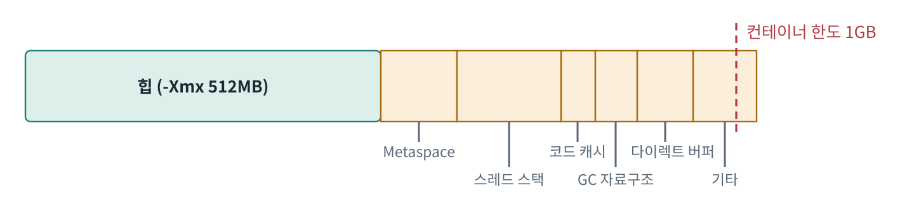
*그림 0-1. 이 문서 전체가 설명하는 한 장의 그림. 초록은 `-Xmx`로 제한되는 힙, 주황은 `-Xmx`와 무관한 힙 밖 메모리 (수치는 예시)*

이 글은 이 질문 하나에 답하기 위해 JVM 메모리 구조와 GC를 처음부터 따라간다.

1. JVM 메모리 전체 지도: 힙은 전체의 일부일 뿐이다
2. GC의 기본 원리: 무엇을 쓰레기로 보는가
3. 힙 안쪽: 객체는 어디서 태어나고 어떻게 나이를 먹는가 (TLAB, Young/Old)
4. G1: 기본 GC는 힙을 어떻게 청소하는가
5. GC 로그 읽기: 청소 기록을 해석하는 법
6. STW와 Safepoint: 청소의 대가
7. ZGC와 Generational ZGC: 대가를 줄이려면 무엇을 포기하는가
8. 힙 밖의 메모리: Metaspace, 스레드 스택, 다이렉트 버퍼
9. 컨테이너 안의 JVM: 두 종류의 OOM
10. 원인 찾기: 힙덤프와 MAT
11. 처음 질문에 대한 답

이어서 흔한 오해(12), 트레이드오프와 반론(13), 우리 프로젝트 적용(14), 예상 질문(15), 데모와 실측 결과(16), 1차 자료(17)를 다룬다.

**주제문**: JVM이 쓰는 메모리는 `-Xmx`가 전부가 아니며, GC 선택은 '멈춤 시간'과 '처리량·메모리' 사이의 거래다.

---

## 1. JVM 메모리 전체 지도


### 1.1 명세가 정한 것

JVM 명세(The Java Virtual Machine Specification) 2.5절은 런타임 데이터 영역을 여섯 가지로 정의한다.

| 영역 | 범위 | 역할 |
|---|---|---|
| PC 레지스터 | 스레드마다 | 현재 실행 중인 바이트코드 명령어의 위치 |
| JVM 스택 | 스레드마다 | 메서드 호출마다 프레임이 쌓임. 프레임 안에 지역 변수 배열과 피연산자 스택 |
| 네이티브 메서드 스택 | 스레드마다 | 네이티브(C/C++) 메서드 실행용 |
| 힙 | 공유 | 모든 객체와 배열 |
| 메서드 영역 | 공유 | 클래스별 구조: 필드·메서드 정보, 바이트코드 |
| 런타임 상수 풀 | 공유(클래스별) | 클래스 파일의 상수 테이블이 실행 시점에 올라온 것 |

중요한 것은 명세가 **"무엇이 있어야 하는가"만 정하고 "어떻게 만드는가"는 구현에 맡긴다**는 점이다. 힙은 자동 저장소 관리 시스템(GC)이 회수한다고만 할 뿐 어떤 GC 기법을 쓸지는 정하지 않는다. 메서드 영역도 논리적으로는 힙의 일부라고 하면서, 위치와 GC 여부는 구현이 정하도록 열어 둔다. **Young/Old, Eden, TLAB, Metaspace라는 단어는 명세에 한 번도 나오지 않는다.** 전부 HotSpot JVM의 구현 선택이다.

### 1.2 HotSpot은 이렇게 구현했다

| 명세 개념 | HotSpot 실제 위치 |
|---|---|
| JVM 스택 + 네이티브 메서드 스택 | 하나의 OS 스레드 스택으로 합쳐서 사용 (네이티브 메모리) |
| 힙 | Java Heap. 내부 구조(세대, 리전)는 GC 종류마다 다름 |
| 메서드 영역 | 대부분 **Metaspace** (네이티브 메모리, JDK 8부터) |
| 메서드 영역에 있을 것 같지만 실제로는 힙에 있는 것 | `java.lang.Class` 객체, **static 필드의 값**, intern된 문자열 |

여기에 명세에는 없지만 JVM이 실제로 쓰는 공간이 더 있다. JIT 컴파일된 기계어를 담는 **코드 캐시**, GC가 자기 일을 하려고 쓰는 **GC 자료구조**, NIO의 **다이렉트 버퍼**, JVM 내부 심볼 테이블 등이다. 이것들은 모두 힙 밖, 즉 JVM이 OS로부터 직접 받은 **네이티브 메모리**에 있다.

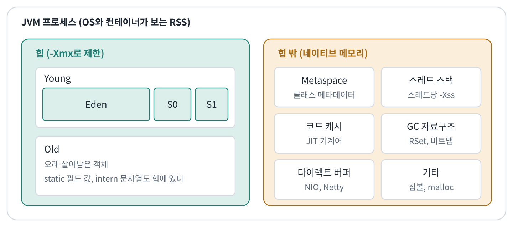
*그림 1-1. HotSpot JVM 프로세스의 메모리 지도. `-Xmx`가 제한하는 것은 왼쪽 초록 영역뿐이다*

### 1.3 메모리 숫자를 읽기 위한 세 가지 용어

- **reserved**: 가상 주소 공간만 예약한 상태. 물리 메모리를 쓰지 않는다.
- **committed**: OS에 실제로 쓰겠다고 확보한 상태.
- **RSS (Resident Set Size)**: 실제로 물리 메모리에 올라와 있는 양. OS와 컨테이너가 보는 숫자다.

`-Xmx`는 **힙의 상한**일 뿐이다. 프로세스 RSS는 대략 다음과 같다.

```text
RSS ≈ 힙 + Metaspace + 스레드 스택 + 코드 캐시 + GC 자료구조 + 다이렉트 버퍼 + 기타(심볼, malloc 오버헤드 등)
```

이 식이 처음 질문의 뼈대다. 2~7장은 식의 첫 항(힙)을, 8장은 나머지 항을 다룬다.

> 📎 1차 자료: [JVM 명세 SE 21, 2.5 Run-Time Data Areas](https://docs.oracle.com/javase/specs/jvms/se21/html/jvms-2.html#jvms-2.5) (2.5.3 Heap, 2.5.4 Method Area) / [JVM 명세 SE 21, 2.6 Frames](https://docs.oracle.com/javase/specs/jvms/se21/html/jvms-2.html#jvms-2.6)

---

## 2. GC의 기본 원리: 무엇을 쓰레기로 보는가

### 2.1 도달 가능성

자바 GC는 참조 카운팅이 아니라 **추적(tracing)** 방식이다. 쓰레기를 직접 찾는 것이 아니라 **살아 있는 것을 찾고, 나머지를 전부 쓰레기로 간주**한다.

1. **GC Root**에서 출발한다. 대표적인 GC Root는 살아 있는 스레드 스택의 지역 변수와 매개변수, 로드된 클래스의 static 필드, JNI 참조, 모니터로 잡혀 있는 객체다.
2. Root에서 참조를 따라가며 닿는 모든 객체에 "살아 있음" 표시(mark)를 한다.
3. 표시되지 않은 객체는 누구도 접근할 수 없으므로 회수한다.

참조 카운팅을 쓰지 않는 이유 중 하나는 순환 참조다. A와 B가 서로를 가리키면 카운트는 영원히 0이 되지 않지만, 추적 방식에서는 Root에서 닿지 않으니 그냥 회수된다.

이 정의에서 **자바 메모리 누수의 정의**가 나온다. C처럼 "해제를 잊은 것"이 아니라, **"더 이상 쓰지 않는데 Root에서 여전히 닿는 것"**이다. 전형적인 예는 static `Map`에 넣기만 하는 캐시, 등록만 하고 해제하지 않는 리스너, 스레드풀 스레드의 `ThreadLocal`에 남은 값이다.

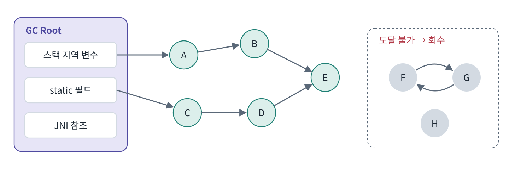
*그림 2-1. 도달 가능성. A~E는 Root에서 닿아 살아 있고, 서로를 가리키는 F와 G(순환 참조)는 Root에서 닿지 않아 함께 회수된다*

### 2.2 세 가지 기본 알고리즘

- **Mark–Sweep**: 살아 있는 것을 표시하고, 나머지 자리를 빈 공간 목록에 등록한다. 객체를 옮기지 않아 빠르지만 **단편화**가 생긴다. 빈 공간 총량은 충분한데 연속된 큰 덩어리가 없어 할당에 실패할 수 있다.
- **Mark–Compact**: 표시한 뒤 살아 있는 객체를 한쪽으로 밀어 모은다. 단편화는 없지만, 객체를 옮기고 그 객체를 가리키던 **모든 참조를 새 주소로 고쳐야** 해서 비싸다.
- **Copying**: 공간을 둘로 나누고 살아 있는 객체만 반대편으로 복사한 뒤 원래 공간을 통째로 비운다. 비용이 **살아 있는 객체 양에만 비례**하고, 복사 후 빈 공간이 한 덩어리여서 다음 할당이 "포인터 하나 밀기"로 끝난다. 대신 복사받을 공간이 추가로 필요하다.

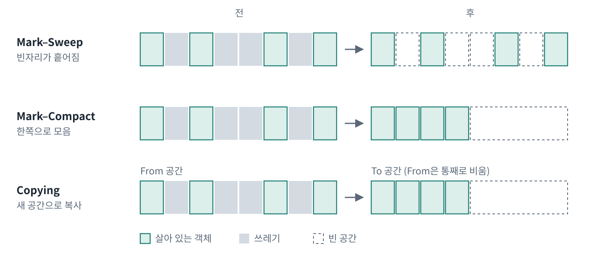
*그림 2-2. 세 가지 기본 알고리즘. 같은 '전' 상태에서 결과가 어떻게 달라지는지 비교한다*

현대 GC는 이것들을 영역별로 섞어 쓴다. 그리고 **객체를 옮기는 GC만이 포인터 밀기 할당을 가능하게 한다**는 점이 3장의 TLAB으로 이어진다.

### 2.3 STW, Parallel, Concurrent

- **STW (Stop-The-World)**: GC가 작업하는 동안 애플리케이션 스레드를 전부 멈추는 것. 객체를 옮기는 도중에 애플리케이션이 그 객체를 건드리면 안 되기 때문이다. 자세한 내용은 6장.
- **Parallel**: 애플리케이션을 멈춘 상태에서 **GC 스레드 여러 개가 동시에** 일하는 것.
- **Concurrent**: **애플리케이션이 돌아가는 동안** GC가 함께 일하는 것.

이 두 단어를 섞어 쓰는 자료가 많다. G1 공식 문서는 G1을 "generational, incremental, parallel, mostly concurrent, stop-the-world, evacuating" 컬렉터라고 설명한다. 이 수식어를 하나씩 설명할 수 있으면 4장은 끝난 것이다.

### 2.4 세 가지 목표는 동시에 가질 수 없다

- **처리량(throughput)**: 전체 시간 중 GC가 아닌 일에 쓰는 비율
- **지연(latency)**: 한 번에 멈추는 시간
- **메모리 사용량(footprint)**

Parallel GC는 처리량에, ZGC는 지연에 치우쳐 있고, G1은 그 중간을 노린다. 이 틀이 7장과 결론의 트레이드오프를 설명하는 기준이 된다.

> 📎 1차 자료: [GC Tuning Guide 21, 1장 Introduction](https://docs.oracle.com/en/java/javase/21/gctuning/introduction-garbage-collection-tuning.html) / [GC Tuning Guide 21, 5장 Available Collectors](https://docs.oracle.com/en/java/javase/21/gctuning/available-collectors.html)

---

## 3. 힙 안쪽: 객체는 어디서 태어나고 어떻게 나이를 먹는가

### 3.1 세대를 나누는 이유

**약한 세대 가설(weak generational hypothesis)**: 대부분의 객체는 생성 직후 금방 죽고, 오래 살아남은 객체는 계속 오래 산다는 경험적 관찰이다. 웹 요청 하나를 처리할 때 만든 DTO, 문자열, 컬렉션은 응답이 나가면 모두 쓰레기가 된다.

그래서 HotSpot은 힙을 **Young 세대**와 **Old 세대**로 나눈다. 새 객체만 모인 공간을 자주, 싸게 청소하고, 오래 사는 객체는 가끔만 본다.

- **Young**: Eden 1개 + Survivor 2개(S0, S1). Survivor 둘 중 하나는 항상 비어 있다.
- **Old**: Young에서 오래 살아남은 객체가 옮겨 오는 곳.

> 🖼️ 공식 그림: [GC Tuning Guide 21, 3장 Generations 절](https://docs.oracle.com/en/java/javase/21/gctuning/garbage-collector-implementation.html)에 객체 수명 분포 그래프와 세대 배치 그림이 있다.

### 3.2 객체의 탄생: TLAB

새 객체는 Eden에 할당된다. 그런데 Eden은 모든 스레드가 공유한다. 할당을 "현재 top 포인터 읽기 → 크기만큼 더하기 → 저장"으로 하면 두 스레드가 같은 top을 동시에 읽는 경쟁이 생긴다. 매번 락이나 CAS를 쓰면, 초당 수백만 번 할당하는 자바에서는 병목이 된다.

그래서 각 스레드는 Eden에서 **자기 전용 구간을 미리 받아 둔다**. 이것이 **TLAB (Thread-Local Allocation Buffer)**이다.

1. **빠른 경로**: 스레드 안에서 `top += size`를 하고 `end`를 넘지 않으면 끝. 동기화가 전혀 없다. JIT 코드에서는 명령어 몇 개 수준이다.
2. **느린 경로**: TLAB이 다 차면 남은 조각을 채움 객체(filler)로 메우고 새 TLAB을 받는다. 이때만 공유 Eden에 대한 동기화가 필요하다. 채움 객체가 있어야 GC가 힙을 순서대로 훑을 때 구조가 깨지지 않는다.
3. **큰 객체**: TLAB에 맞지 않는 객체는 TLAB 밖 공유 영역에 직접 할당한다.

TLAB 크기는 스레드별 할당 패턴을 보고 JVM이 자동 조정한다.

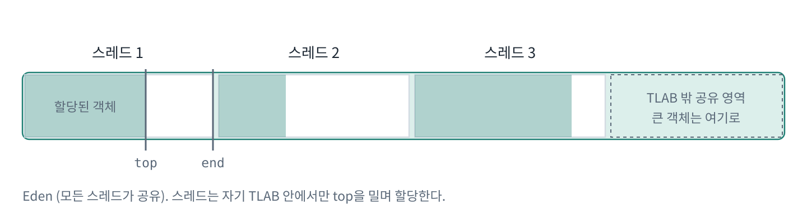
*그림 3-1. TLAB. 각 스레드는 Eden의 한 구간을 전용으로 받아, 그 안에서는 동기화 없이 top 포인터를 밀며 할당한다*

TLAB은 Eden의 일부일 뿐이므로 그 안에 만든 객체의 참조를 다른 스레드에 넘기면 당연히 보인다. **스레드 전용인 것은 할당 권한뿐이다.** 정말로 스레드 전용인 것은 스택의 지역 변수이고, 그 지역 변수가 가리키는 객체는 힙에 있다.

### 3.3 Minor GC 한 번의 흐름

1. Eden이 가득 차면 **Minor GC(Young GC)**가 일어난다.
2. Eden과 "사용 중인 Survivor(from)"에서 **살아 있는 객체만** "빈 Survivor(to)"로 복사한다. 이때 각 객체의 **나이(age)**가 1 증가한다. 나이는 객체 헤더에 저장된다.
3. Eden과 from은 통째로 비워진다. 개별 해제가 아니라 영역 전체를 빈 것으로 취급하므로 매우 빠르다.
4. from과 to의 역할이 바뀐다.
5. 나이가 기준을 넘은 객체는 Survivor 대신 Old로 **승격(promotion)**된다.

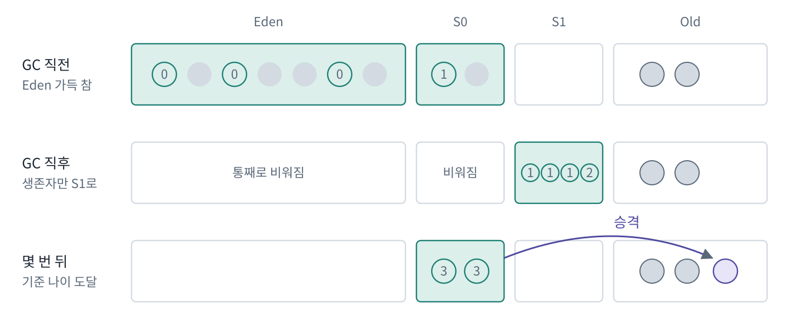
*그림 3-2. Minor GC의 흐름. 살아남은 객체만 Survivor로 복사되며 나이가 오르고, 기준 나이를 넘으면 Old로 승격된다*

Minor GC는 2.2의 Copying 방식이다. 비용이 살아 있는 객체 양에만 비례하므로, 대부분이 죽어 있는 Young에서 매우 효율적이다.

승격 기준은 `MaxTenuringThreshold`(기본 15)가 상한이지만, JVM이 Survivor 점유율을 보고 **동적으로 낮출 수 있다**. Survivor가 넘칠 것 같으면 어린 객체도 바로 Old로 간다. 이를 **조기 승격(premature promotion)**이라 하며, 금방 죽을 객체가 Old에 쌓여 Old 청소를 잦게 만드는 원인이 된다.

### 3.4 Old → Young 참조 문제: 카드 테이블과 쓰기 배리어

Minor GC는 Young만 보고 싶다. 그런데 Old의 어떤 객체가 Young 객체를 가리키고 있다면, 그 Young 객체는 살아 있는 것이다. 이를 알려고 Old 전체를 훑으면 Young만 따로 청소하는 의미가 없다.

해결책은 **카드 테이블과 쓰기 배리어**다.

- 힙을 작은 구역(**카드**, HotSpot 기준 512바이트)으로 나누고, 카드마다 1바이트짜리 표시를 둔다.
- 애플리케이션이 `obj.field = ref`처럼 참조를 쓸 때마다, JIT가 끼워 넣은 짧은 코드(**쓰기 배리어**)가 해당 카드를 dirty로 표시한다.
- Minor GC 때는 dirty 카드만 추가 Root로 훑는다.

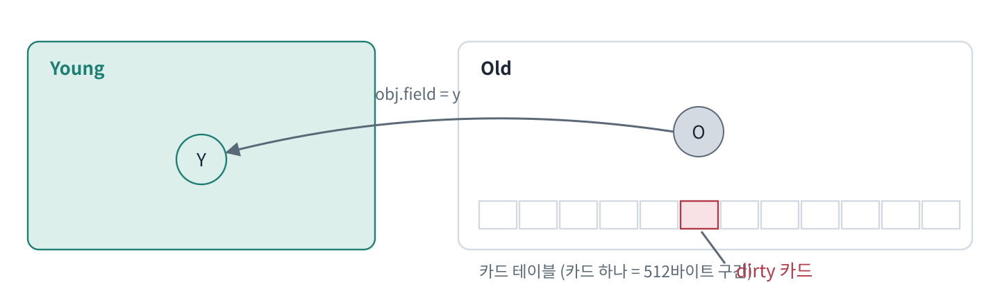
*그림 3-3. 카드 테이블. 참조를 쓰는 순간 쓰기 배리어가 해당 카드를 dirty로 표시하고, Minor GC는 dirty 카드만 확인한다*

"GC가 애플리케이션 코드에 비용을 심는다"는 이 개념이 4장 G1의 Remembered Set, 7장 ZGC의 로드 배리어로 이어진다.

> 📎 1차 자료: [GC Tuning Guide 21, 3장 Garbage Collector Implementation](https://docs.oracle.com/en/java/javase/21/gctuning/garbage-collector-implementation.html) / [GC Tuning Guide 21, 4장 Factors Affecting GC Performance](https://docs.oracle.com/en/java/javase/21/gctuning/factors-affecting-garbage-collection-performance.html) / [OpenJDK 소스 gc/shared (threadLocalAllocBuffer.inline.hpp)](https://github.com/openjdk/jdk/tree/master/src/hotspot/share/gc/shared) / [JVM Anatomy Quarks](https://shipilev.net/jvm/anatomy-quarks/)

---

## 4. G1: 기본 GC는 힙을 어떻게 청소하는가

G1(Garbage-First)은 JDK 9부터 기본 GC다(JEP 248). 단, 작은 환경에서는 기본 GC가 달라진다(9장).

### 4.1 왜 리전인가

Young과 Old가 각각 연속된 큰 공간이면, Old를 청소할 때 Old 전체를 한 번에 봐야 한다. 힙이 커질수록 멈춤도 길어진다. G1은 힙을 **같은 크기의 작은 조각(리전) 수천 개**로 나눠 "이번에는 몇 조각만" 청소하는 방식으로 멈춤 시간을 통제한다.

- 리전 크기는 힙 크기에 따라 자동으로 정해지며, 리전 수가 약 2048개를 넘지 않도록 한다(전통적으로 1MB~32MB, 상한은 JDK 버전에 따라 확장됨).
- 각 리전은 그때그때 **Eden, Survivor, Old, Humongous, 빈 리전** 중 하나의 역할을 맡는다.
- 따라서 **Young과 Old는 연속된 공간이 아니라 리전들의 논리적 집합**이다. 블로그에서 흔히 보는 "Young과 Old가 물리적으로 나뉜 그림"은 G1에는 맞지 않는다.

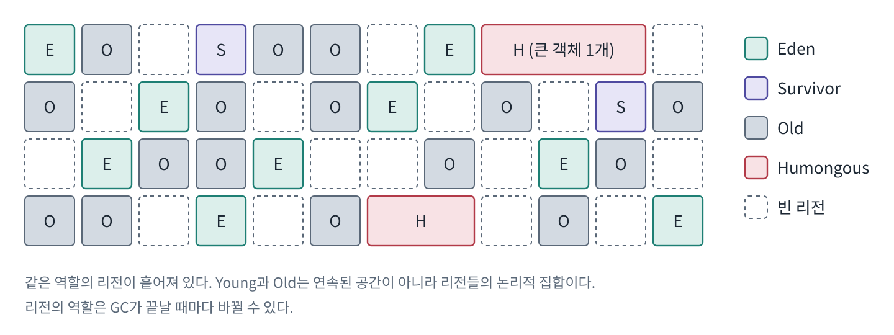
*그림 4-1. G1의 리전 배치. 같은 역할의 리전이 흩어져 있고, 역할은 GC마다 바뀔 수 있다*

> 🖼️ 공식 그림: [GC Tuning Guide 21, 7장](https://docs.oracle.com/en/java/javase/21/gctuning/garbage-first-g1-garbage-collector1.html)의 **Figure 7-1 G1 Garbage Collector Heap Layout**

**Humongous 리전**: 리전 크기의 절반 이상인 큰 객체는 연속된 리전 여러 개를 차지하며 처음부터 Old로 취급된다. 큰 배열이나 큰 문자열을 자주 만들면 Humongous 할당이 늘어 단편화나 이른 GC의 원인이 된다.

### 4.2 Remembered Set

리전 단위로 청소하려면 "다른 리전에서 이 리전을 가리키는 참조"를 알아야 한다. 3.4의 카드 테이블 문제가 리전 단위로 확장된 것이다. G1은 리전마다 **Remembered Set(RSet)**을 두어 들어오는 참조의 위치를 기록한다.

- 쓰기 배리어가 참조 변경을 감지해 dirty 카드를 큐에 넣는다.
- 동시 정제(concurrent refinement) 스레드가 백그라운드에서 이를 RSet에 반영한다.

덕분에 원하는 리전만 골라 청소할 수 있지만, 대가로 **네이티브 메모리를 추가로 쓰고**, 쓰기 배리어가 Parallel GC보다 무겁다. G1의 처리량이 Parallel GC보다 약간 낮은 이유다. (이 RSet 메모리는 8장의 "GC 자료구조" 항목으로 다시 등장한다.)

### 4.3 한 사이클의 흐름

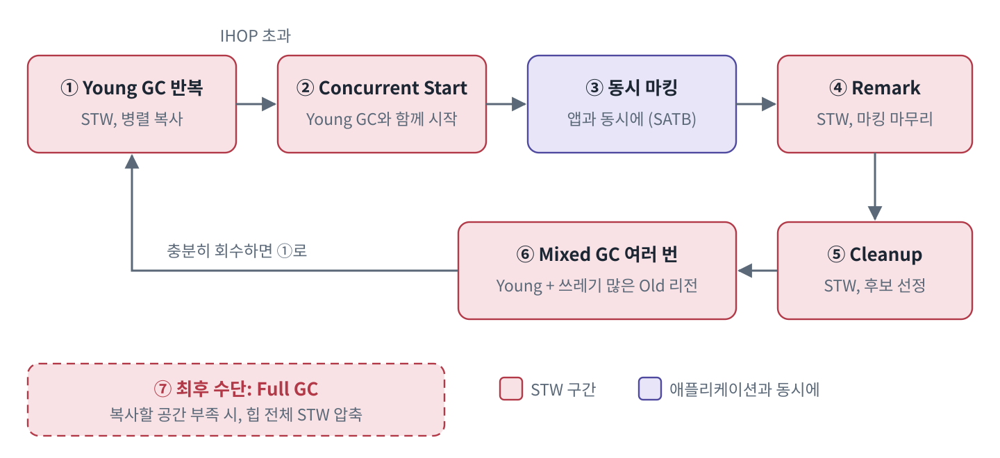
*그림 4-2. G1 한 사이클. 동시 마킹을 빼면 모든 단계가 STW다. 각 STW를 짧게 나누는 것이 G1의 전략이다*

> 🖼️ 공식 그림: [GC Tuning Guide 21, 7장](https://docs.oracle.com/en/java/javase/21/gctuning/garbage-first-g1-garbage-collector1.html)의 **Figure 7-2 Garbage Collection Cycle Overview**

**① Young-only 단계**
Eden 리전들이 차면 **Young GC**를 한다. STW 상태에서 여러 GC 스레드가 병렬로 살아 있는 객체를 Survivor나 Old 리전으로 복사(evacuation)한다. G1은 멈춤 목표를 맞추려고 **Young 리전의 개수 자체를 매번 조정**한다.

**② 동시 마킹 시작 (Concurrent Start)**
Old 점유율이 기준(IHOP, `InitiatingHeapOccupancyPercent`, 기본 45%)을 넘으면, 다음 Young GC가 "Concurrent Start"로 표시되며 Old 전체에 대한 동시 마킹을 시작한다. 기본적으로 이 기준은 관찰된 할당 패턴에 맞춰 **적응형으로 조정**된다.

**③ 동시 마킹 (Concurrent Mark)**
애플리케이션이 돌아가는 동안 살아 있는 객체를 표시한다. 마킹 도중 애플리케이션이 참조를 바꾸면 놓치는 객체가 생길 수 있다. G1은 **SATB (Snapshot-At-The-Beginning)** 방식으로 이를 막는다. 참조를 덮어쓰기 **직전의 옛 값**을 배리어가 기록해서, "마킹 시작 시점에 살아 있던 것은 전부 살아 있다"고 보수적으로 처리한다.

**④ Remark (STW)**
마킹을 마무리하고, 참조 처리(`WeakReference` 등)와 클래스 언로딩을 한다.

**⑤ Cleanup (STW, 짧음)**
리전별 살아 있는 객체 양을 정리하고, 완전히 빈 리전은 즉시 회수하며, 다음 단계에서 청소할 후보 Old 리전을 고른다.

**⑥ Space-reclamation 단계 (Mixed GC)**
Young GC를 하면서 **쓰레기 비율이 높은 Old 리전 몇 개를 함께** 청소한다. 쓰레기가 가장 많은 곳부터(Garbage-First) 청소한다는 것이 이름의 유래다. 한 번에 다 하지 않고 여러 번의 Mixed GC로 나눠 각 멈춤이 목표 안에 들어가게 한다. 더 청소해도 얻을 게 적다고 판단되면 다시 ①로 돌아간다.

**⑦ 최후 수단: Full GC**
복사할 빈 리전이 부족하거나 마킹이 할당 속도를 따라가지 못하면, G1은 STW 상태에서 힙 전체를 제자리 압축하는 **Full GC**를 수행한다. JDK 10부터 병렬화되었지만(JEP 307) 여전히 가장 긴 멈춤이다. **G1 튜닝의 목표는 대부분 "Full GC가 나지 않게 하기"다.**

### 4.4 MaxGCPauseMillis는 약속이 아니다

`MaxGCPauseMillis`(기본 200ms)는 G1이 맞추려고 노력하는 **목표(soft goal)**다. 목표를 낮게 잡으면 G1은 Young을 작게 유지해 한 번의 멈춤을 줄이지만, GC가 더 자주 일어나 처리량이 떨어진다. 공식 튜닝 가이드도 처리량을 원하면 멈춤 목표를 느슨하게 하거나 힙을 더 주라고 권한다.

> 📎 1차 자료: [GC Tuning Guide 21, 7장 G1](https://docs.oracle.com/en/java/javase/21/gctuning/garbage-first-g1-garbage-collector1.html) / [GC Tuning Guide 21, 8장 G1 Tuning](https://docs.oracle.com/en/java/javase/21/gctuning/garbage-first-garbage-collector-tuning.html) / [JEP 248](https://openjdk.org/jeps/248) / [JEP 307](https://openjdk.org/jeps/307) / [OpenJDK 소스 gc/g1](https://github.com/openjdk/jdk/tree/master/src/hotspot/share/gc/g1) / Detlefs 외 "Garbage-First Garbage Collection"(ISMM 2004)

---

## 5. GC 로그 읽기

### 5.1 켜는 법 (Unified Logging, JDK 9+)

```bash
java -Xlog:gc*:file=gc.log:time,uptime,level,tags:filecount=5,filesize=20m -jar app.jar
```

콜론으로 구분된 네 부분: **무엇을**(`gc*` = gc로 시작하는 모든 태그) : **어디에**(파일) : **데코레이터**(각 줄 앞 정보) : **옵션**(로테이션).

JDK 8 시절의 `-XX:+PrintGCDetails`, `-Xloggc` 계열은 JDK 9에서 통합 로깅으로 대체되었다(JEP 271). 옛 블로그 옵션을 그대로 쓰면 JVM이 경고를 내거나 시작하지 않을 수 있다.

### 5.2 기본 한 줄

```text
[1.234s][info][gc] GC(5) Pause Young (Normal) (G1 Evacuation Pause) 120M->35M(256M) 4.123ms
```

| 부분 | 의미 |
|---|---|
| `1.234s` | JVM 시작 후 경과 시간 |
| `GC(5)` | GC 번호. 같은 번호의 여러 줄은 같은 GC에 대한 정보 |
| `Pause Young (Normal)` | STW Young GC, 일반 |
| `(G1 Evacuation Pause)` | 원인: Eden이 가득 참 |
| `120M->35M(256M)` | GC 전 힙 사용량 → GC 후 사용량 (현재 committed 힙 크기) |
| `4.123ms` | 멈춘 시간 (safepoint 도달 시간은 포함되지 않음, 6장) |

### 5.3 G1 사이클을 로그로 따라가기

4.3의 흐름은 로그에 대략 이런 순서로 나타난다(정확한 문구는 버전마다 조금 다르다).

```text
GC(8)  Pause Young (Normal) ...
GC(9)  Pause Young (Concurrent Start) ...      ← ② 동시 마킹 시작
GC(10) Concurrent Mark Cycle                   ← ③
GC(10) Pause Remark ...                        ← ④
GC(10) Pause Cleanup ...                       ← ⑤
GC(11) Pause Young (Prepare Mixed) ...
GC(12) Pause Young (Mixed) ...                 ← ⑥
GC(13) Pause Young (Mixed) ...
GC(14) Pause Young (Normal) ...                ← 다시 ①
```

### 5.4 `gc*`로 켰을 때 추가되는 정보

```text
GC(5) Eden regions: 30->0(28)
GC(5) Survivor regions: 2->3(4)
GC(5) Old regions: 10->11
GC(5) Humongous regions: 0->0
GC(5) Metaspace: 45M(46M)->45M(46M)
GC(5) User=0.02s Sys=0.00s Real=0.00s
```

- `Eden regions: 30->0(28)`: GC 전 30개 → 후 0개, 다음 Young 목표는 28개. 멈춤 목표에 맞추려고 Young 크기를 조정하는 모습이 보인다.
- `Old regions` 증가량: 이번 GC에서 승격된 양. 매번 크게 늘면 조기 승격을 의심한다.
- `User / Sys / Real`: GC 스레드들이 쓴 CPU 시간 합과 실제 경과 시간. 병렬이 잘 되면 User가 Real보다 여러 배 크다. **Real이 User+Sys보다 훨씬 크면** GC 스레드가 CPU를 못 받았거나 스왑 중이라는 신호다. 컨테이너 CPU 제한에서 자주 보인다.

### 5.5 위험 신호

- `Pause Full (...)`: Full GC. 괄호 속 원인을 반드시 확인한다.
- `To-space exhausted` / evacuation failure: 복사할 공간 부족.
- 원인이 `G1 Humongous Allocation`인 GC가 잦음: 큰 객체 할당 패턴 점검.
- **Full GC 직후 사용량이 시간에 따라 계단식으로 오름**: 메모리 누수 (10장).
- (ZGC) `Allocation Stall`: GC가 할당 속도를 못 따라감 (7장).

유용한 추가 태그: `-Xlog:gc+age=trace`(Survivor 나이 분포), `-Xlog:safepoint`(6장).

> 📎 1차 자료: [JEP 158 Unified JVM Logging](https://openjdk.org/jeps/158) / [JEP 271 Unified GC Logging](https://openjdk.org/jeps/271) / [java 명령어 레퍼런스](https://docs.oracle.com/en/java/javase/21/docs/specs/man/java.html) ("Enable Logging with the JVM Unified Logging Framework" 절)

---

## 6. STW와 Safepoint: 청소의 대가

### 6.1 Safepoint

GC가 객체를 옮기거나 Root를 정확히 스캔하려면, 모든 스레드가 **"스택과 레지스터의 어떤 값이 객체 참조인지 JVM이 정확히 알 수 있는 지점"**에 서 있어야 한다. 이 지점이 **safepoint**다.

1. JVM 내부의 VM 스레드가 safepoint를 요청한다.
2. 각 애플리케이션 스레드는 실행 중에 주기적으로 요청 여부를 확인(poll)한다. 인터프리터는 바이트코드 경계에서, JIT 코드는 메서드 반환과 루프 되돌아가는 지점에 심어진 poll에서 확인한다.
3. 요청을 발견한 스레드는 멈춘다. 네이티브 코드(JNI, 블로킹 I/O)를 실행 중인 스레드는 힙을 건드릴 수 없는 상태이므로 이미 안전한 것으로 간주된다.
4. 모든 스레드가 멈추면 GC 작업이 실행된다.

### 6.2 멈춤 시간 = 도달 시간 + 작업 시간

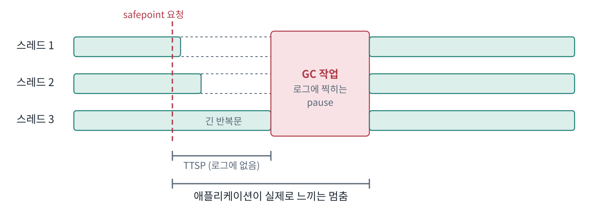
*그림 6-1. Safepoint 타임라인. 스레드 3이 긴 반복문 때문에 늦게 도착해 모두가 기다린다. GC 로그에는 작업 시간만 찍힌다*

**TTSP (Time To Safepoint)**: 요청 후 마지막 스레드가 멈출 때까지 걸린 시간. 긴 반복문을 도느라 poll에 늦게 도착한 스레드 하나가 나머지 모두를 기다리게 만들 수 있다(과거 JIT는 `int` 카운터 루프에서 poll을 생략했고, 이후 루프 스트립 마이닝으로 완화되었다).

**GC 로그의 pause 시간은 safepoint에 들어간 뒤의 작업 시간이다.** 애플리케이션이 체감하는 멈춤은 여기에 TTSP가 더해진 값이다. `-Xlog:safepoint`를 켜면 safepoint마다 도달 시간과 머문 시간이 따로 찍히므로 직접 비교할 수 있다.

### 6.3 GC가 아니어도 STW는 생긴다

safepoint는 GC 외의 작업에도 걸린다.

- **힙덤프 생성**: 운영 서버에서 `jcmd GC.heap_dump`을 실행하면 덤프가 끝날 때까지 전체가 멈춘다. 힙이 크면 수 초 이상.
- **스레드 덤프**
- **JIT 역최적화(deoptimization)**
- **클래스 재정의**(핫스왑, 에이전트)

JDK 10부터는 스레드 전체가 아니라 개별 스레드만 잠깐 멈추는 **thread-local handshake**(JEP 312)가 도입되어, 일부 작업은 전역 STW 없이 처리된다. ZGC가 이를 적극 활용한다.

### 6.4 어떤 GC에서 어디가 STW인가

| GC | STW 구간 |
|---|---|
| Serial / Parallel | Young GC, Full GC 전부 STW |
| G1 | Young GC, Mixed GC(객체 이동), Remark, Cleanup, Full GC. 동시 마킹만 concurrent |
| ZGC | 짧은 pause 3개(Mark Start, Mark End, Relocate Start). 마킹과 **객체 이동까지** concurrent |

G1이 멈추는 가장 큰 이유는 **객체를 옮기는 작업(evacuation)이 STW**라는 점이다. 살아 있는 객체가 많을수록 옮길 것이 많아 멈춤이 길어진다. 이 한계에서 ZGC가 출발한다.

> 📎 1차 자료: [java 명령어 레퍼런스](https://docs.oracle.com/en/java/javase/21/docs/specs/man/java.html) (-Xlog:safepoint) / [JEP 312 Thread-Local Handshakes](https://openjdk.org/jeps/312) / [JVM Anatomy Quarks](https://shipilev.net/jvm/anatomy-quarks/)

---

## 7. ZGC와 Generational ZGC: 대가를 줄이려면 무엇을 포기하는가

### 7.0 먼저 쉽게 보기

> 한 줄 정의: ZGC는 **"가장 빠른 GC"가 아니라 "애플리케이션을 오래 멈추지 않는 GC"**다. GC를 안 하는 게 아니라, GC 일의 대부분을 애플리케이션이 돌아가는 동안 함께 한다.

**왜 필요한가: 평균이 아니라 꼬리 지연**
평소 50ms에 응답하는 API 서버가 GC 때문에 가끔 1~2초씩 멈춘다고 하자. 평균 응답 시간은 여전히 좋아 보이지만, 그 순간 요청한 사용자는 느리다고 느낀다. 이런 "가끔 나오는 느린 응답"을 보는 지표가 p99(상위 1% 응답 시간)다. 서버끼리 호출이 얽혀 있으면 한 서버의 멈춤이 다른 서버의 타임아웃으로 번지기도 한다. ZGC는 이 꼬리 지연을 줄이려고 만든 GC다.

**GC가 하는 일 네 가지와 G1·ZGC의 차이**

| GC가 하는 일 | G1 | ZGC |
|---|---|---|
| 1. 살아 있는 객체 찾기 (Mark) | 대부분 동시 | 대부분 동시 |
| 2. 객체 옮기기 (Relocate) | **멈춘 채로** (Young/Mixed GC) | **동시** |
| 3. 옮긴 객체를 가리키는 참조 고치기 (Remap) | 멈춘 채로, 옮기면서 함께 | 참조를 **읽는 순간** 하나씩 고침 |
| 4. 빈 메모리 돌려받기 | 옮긴 뒤 바로 | 옮긴 뒤 바로 |

결국 차이는 2번과 3번이다. 6장에서 본 것처럼 멈춤의 대부분은 "객체를 옮기는 일"에서 생기는데(16장 실험 C에서도 Remark·Cleanup은 1ms 미만, 옮기는 GC는 수~수십 ms), ZGC는 이것까지 애플리케이션을 멈추지 않고 해낸다.

**객체를 옮기면 무엇이 문제인가: 코드로 보기**

```java
User user = order.getUser();   // order 안에 저장된 User 참조(주소)를 읽는다
```

GC가 User 객체를 A 위치에서 B 위치로 옮겼는데 `order` 안의 참조는 아직 A를 가리키고 있다면, 이 코드는 엉뚱한 곳을 읽게 된다. G1은 이걸 막으려고 옮기는 동안 애플리케이션을 멈춘다. ZGC는 멈추지 않는 대신, **참조를 읽는 바로 그 순간 검사하고 고친다.** 여기에 필요한 두 장치가 컬러드 포인터와 로드 배리어다.

**비유: 영업하면서 이사하는 가게**

- **컬러드 포인터** = 주소가 적힌 종이에 붙은 색깔 스티커. 참조 값(주소) 안의 몇 비트를 "이 주소는 최신이다 / 확인이 필요하다" 표시로 쓴다.
- **로드 배리어** = 주소를 읽을 때마다 스티커 색을 확인하는 짧은 검사. 최신이면 그대로 가고, 오래된 주소면 새 주소를 찾아 끝난 뒤 종이의 주소도 고쳐 쓴다. 다음에 같은 주소를 읽으면 바로 통과한다.
- 이 두 가지 덕분에 "참조를 한꺼번에 다 고치는 작업(Remap)"을 멈춘 채 모아서 할 필요가 없고, 애플리케이션이 읽는 순서대로 조금씩 고쳐진다.

**JEP 333의 비교 수치 (SPECjbb 2015, 힙 128GB)**

| | ZGC | G1 |
|---|---|---|
| 평균 GC 멈춤 | 1.091ms | 156.806ms |
| 99% GC 멈춤 | 1.512ms | 428.095ms |
| 최대 GC 멈춤 | 1.681ms | 543.846ms |
| critical-jOPS (응답 시간 제약을 지키며 처리한 양) | 76.1% | 54.7% |

힙이 128GB로 매우 큰 조건이라는 점에 주의한다. 힙이 클수록 옮길 것이 많아 G1의 멈춤이 길어지므로 ZGC의 장점이 커진다. 수 GB 힙의 일반 웹 서버에서는 차이가 훨씬 작다.

**JDK 버전별 켜는 법**

| JDK | 옵션 | 결과 |
|---|---|---|
| 21 | `-XX:+UseZGC` | 세대 없는 ZGC |
| 21 | `-XX:+UseZGC -XX:+ZGenerational` | Generational ZGC (JDK 21이면 이쪽을 검토) |
| 23 | `-XX:+UseZGC` | Generational이 기본. `ZGenerational`은 deprecated 경고 |
| 24 이후 | `-XX:+UseZGC` | 세대 없는 모드 제거, 항상 Generational |

> 📖 참고 블로그: [iks-room, JVM 저지연 GC, ZGC 쉽게 이해하기](https://iks-room.tistory.com/entry/JVM-%EC%A0%80%EC%A7%80%EC%97%B0-GC-ZGC-%EC%89%BD%EA%B2%8C-%EC%9D%B4%ED%95%B4%ED%95%98%EA%B8%B0)

아래 7.1부터는 같은 내용을 조금 더 정확한 용어로 다시 설명한다.

### 7.1 목표

ZGC의 목표는 **힙 크기나 살아 있는 객체 양과 무관하게 멈춤 시간을 매우 짧게(밀리초 이하) 유지**하는 것이다. 방법은 G1이 STW로 하는 **객체 이동까지 애플리케이션과 동시에** 하는 것이다.

### 7.2 핵심 난제: 옮기는 도중 옛 주소를 읽으면?

애플리케이션이 돌아가는 동안 객체를 옮기면, 애플리케이션이 옛 주소를 들고 있다가 읽을 수 있다. ZGC는 두 장치로 해결한다.

**컬러드 포인터 (colored pointers)**
64비트 참조 값의 일부 비트에 "이 참조가 현재 GC 단계 기준으로 올바른 상태인가"라는 메타데이터를 담는다. 참조가 스스로 자기 상태를 안다.

**로드 배리어 (load barrier)**
애플리케이션이 힙에서 참조를 **읽을 때마다** JIT가 끼워 넣은 짧은 검사 코드가 실행된다.

- 참조의 색이 "좋은 상태"면 그대로 진행한다. 대부분의 경우이며 매우 빠르다.
- "나쁜 상태"면 느린 경로로 간다. 객체가 이미 옮겨졌으면 포워딩 테이블에서 새 주소를 찾고, 아직 안 옮겨졌으면 **읽은 스레드가 직접 옮기기도** 한다.
- 그리고 읽었던 필드를 새 주소로 고쳐 쓴다(**self-healing**). 같은 필드를 다시 읽을 때는 빠른 경로로 간다.

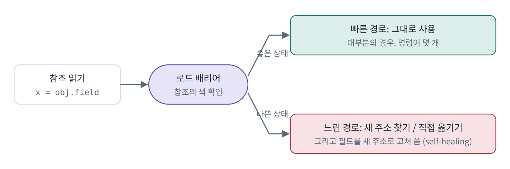
*그림 7-1. 로드 배리어. 한 번 고쳐진 필드는 다음부터 빠른 경로로 간다*

G1의 배리어는 참조를 **쓸 때** 동작하고, ZGC의 로드 배리어는 참조를 **읽을 때** 동작한다는 대비가 핵심이다.

### 7.3 사이클

1. Pause Mark Start (STW, 짧음)
2. Concurrent Mark
3. Pause Mark End (STW, 짧음)
4. Concurrent: 옮길 페이지 선택
5. Pause Relocate Start (STW, 짧음)
6. Concurrent Relocate

STW가 **3번 있다**. 각각 매우 짧고, 스레드 스택 스캔까지 동시 처리로 바뀌면서(JEP 376, JDK 16) 힙 크기와 무관해졌다. 즉 **"ZGC에는 STW가 없다"는 틀린 말이고, "STW가 있지만 짧고 힙 크기에 비례하지 않는다"가 정확하다.**

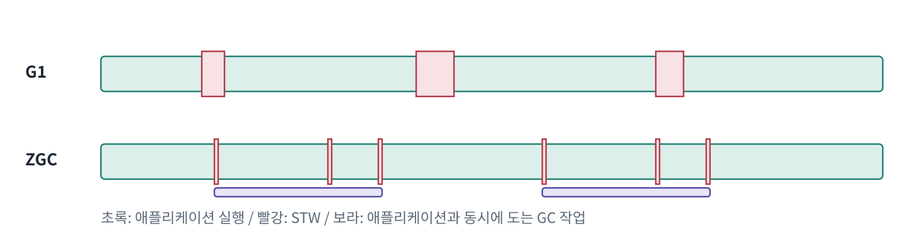
*그림 7-2. 멈춤의 모양 비교(개념도). ZGC는 멈춤을 잘게 쪼개는 대신 GC 작업을 애플리케이션 실행 중에 나눠 한다*

### 7.4 대가

- **처리량 감소**: 모든 참조 읽기에 배리어 검사가 붙는다.
- **CPU 사용**: 동시 GC 스레드가 애플리케이션과 CPU를 나눠 쓴다. CPU가 적은 작은 컨테이너에서는 불리하다.
- **메모리 여유 필요**: GC가 도는 동안에도 애플리케이션은 계속 할당하므로 여유 힙이 필요하다. 여유가 부족해 GC가 할당 속도를 따라가지 못하면 스레드가 멈추는 **allocation stall**이 생긴다.
- **압축 포인터 불가**: 컬러드 포인터가 64비트를 쓰므로 G1처럼 참조를 32비트로 압축(compressed oops)할 수 없다. 같은 데이터라도 힙을 더 차지한다.

### 7.5 Generational ZGC

초기 ZGC는 세대 구분이 없어 매 사이클마다 힙 전체를 마킹했다. 3.1의 세대 가설을 활용하지 못해 할당이 많은 애플리케이션에서 비효율적이었다.

| JEP | JDK | 내용 |
|---|---|---|
| JEP 333 | 11 | ZGC 실험적 도입 |
| JEP 377 | 15 | ZGC 정식 기능 |
| JEP 439 | 21 | Generational ZGC 도입 (`-XX:+UseZGC -XX:+ZGenerational`) |
| JEP 474 | 23 | Generational이 ZGC의 기본 모드 |
| JEP 490 | 24 | 세대 없는 모드 제거 |

세대 버전에서는 Old → Young 참조를 추적하기 위해 **쓰기 배리어도 추가**되었다. "세대 구분의 이점을 얻으려면 쓰기 배리어 비용을 치러야 한다"는 3.4의 원리가 ZGC에서도 반복된다.

### 7.6 그래서 왜 기본은 여전히 G1인가

일반적인 웹 애플리케이션은 힙이 수 GB 이하이고, G1의 수십 ms 멈춤으로 충분한 경우가 많다. 그런 환경에서는 처리량, CPU, 메모리 효율 면에서 G1이 유리하다. ZGC는 힙이 크거나 지연에 극도로 민감한 서비스에서 효과가 크다. GC 선택은 "좋은 GC"가 아니라 2.4의 세 목표 중 **무엇을 포기할지의 선택**이다.

### 7.7 튜닝 포인트: -Xmx 여유와 SoftMaxHeapSize

**-Xmx가 가장 중요한 옵션이다.** ZGC는 GC가 도는 동안에도 애플리케이션이 계속 객체를 만든다. 그래서 힙은 "살아 있는 객체 크기"가 아니라 이렇게 잡아야 한다.

```text
필요한 힙 = 살아 있는 객체 + GC가 도는 동안 새로 만들어질 객체 + 여유
```

살아 있는 객체가 2GB인데 `-Xmx2.5g`처럼 빡빡하게 잡으면, GC가 끝나기 전에 남은 0.5GB가 다 차버린다. 그러면 새 객체를 만들려는 스레드가 GC를 기다리며 멈추는데, 이것이 **allocation stall**이다. ZGC를 썼는데도 지연이 생기면 힙 여유와 할당 속도부터 확인한다. (16장 실험 C에서 G1도 힙이 빡빡하자 Full GC가 반복됐던 것과 같은 원리다.)

**SoftMaxHeapSize는 "되도록이면"의 상한이다.**

```bash
java -XX:+UseZGC -Xmx5g -XX:SoftMaxHeapSize=4g -jar app.jar
```

평소에는 4GB 안에서 관리하려고 노력하고, 트래픽이 몰려 멈춤이 생길 것 같으면 5GB(`-Xmx`)까지 쓴다. "4GB를 절대 넘지 마라"는 뜻이 아니다.

**CPU도 필요하다.** ZGC는 GC 스레드가 애플리케이션과 동시에 돌아야 한다. 16장의 측정 환경처럼 CPU가 1개인 작은 컨테이너에서는 GC 스레드와 요청 처리 스레드가 CPU를 나눠 써야 해서 ZGC의 장점이 줄어든다.

> 📎 1차 자료: [GC Tuning Guide 21, 9장 ZGC](https://docs.oracle.com/en/java/javase/21/gctuning/z-garbage-collector.html) / [JEP 333](https://openjdk.org/jeps/333) / [JEP 376](https://openjdk.org/jeps/376) / [JEP 377](https://openjdk.org/jeps/377) / [JEP 439](https://openjdk.org/jeps/439) / [JEP 474](https://openjdk.org/jeps/474) / [JEP 490](https://openjdk.org/jeps/490) / [ZGC 위키](https://wiki.openjdk.org/display/zgc) / [inside.java](https://inside.java)

---

## 8. 힙 밖의 메모리

1.3의 식에서 힙을 제외한 나머지 항들이다. 모두 `-Xmx`와 무관하게 늘어난다.

### 8.1 Metaspace

클래스를 로드하면 JVM은 그 클래스의 내부 표현(클래스 구조, 메서드 정보와 바이트코드, 상수 풀, 어노테이션 정보)을 만든다. 이 **메타데이터**가 Metaspace에 저장된다. 객체가 아니라 JVM 내부 C++ 자료구조이므로 **네이티브 메모리**에 있다.

**PermGen에서 Metaspace로 (JDK 8, JEP 122)**
JDK 7까지는 힙에 인접한 고정 크기 영역인 PermGen에 저장했다. 크기를 미리 맞추기 어려워 `OutOfMemoryError: PermGen space`가 흔했다. Metaspace는 필요한 만큼 늘어나며 **기본 상한이 없다**.

**해제는 클래스로더 단위**
Metaspace는 클래스로더별로 메모리를 할당하고, **클래스로더가 GC로 회수될 때** 그 로더가 로드한 모든 클래스의 메타데이터를 한꺼번에 해제한다. 애플리케이션 기본 클래스로더가 로드한 클래스는 사실상 해제되지 않는다. 동적으로 클래스를 계속 만들며 새 클래스로더를 생성하는 코드, 재배포 시 옛 클래스로더가 붙잡혀 있는 경우가 Metaspace 누수의 전형이다.

**헷갈리는 옵션**

- `MaxMetaspaceSize`: 상한. 기본은 사실상 무제한.
- `MetaspaceSize`: 이름과 달리 초기 크기가 아니라, **도달하면 클래스 언로딩을 위한 GC를 유발하는 첫 기준선(high-water mark)**.
- Compressed Class Space: 압축 클래스 포인터 사용 시 클래스 구조 일부가 들어가는 별도 예약 영역. NMT에서 Class 항목 아래 따로 보인다.

**static 필드와 문자열 상수 풀은 힙에 있다.** 클래스 메타데이터에는 "이런 static 필드가 있다"는 정보만 있고, 값은 `java.lang.Class` 객체 안(힙)에 있다. intern된 문자열도 JDK 7부터 힙에 있다.

### 8.2 스레드 스택

플랫폼 스레드 하나마다 OS 스레드 스택이 `-Xss` 크기만큼 **예약**된다(64비트 리눅스 기본 1MB). 실제 RSS는 스택을 깊이 쓴 만큼만 올라온다. 따라서 스레드 수와 호출 깊이에 비례해 늘어난다. Spring Boot 내장 Tomcat은 기본 최대 요청 처리 스레드가 200개이므로, 트래픽이 몰려 스레드가 늘어날수록 스택 메모리도 늘어난다. 스레드를 너무 많이 만들면 `OutOfMemoryError: unable to create native thread`가 난다.

(A3 주제와 연결) 가상 스레드는 멈출 때 스택을 **힙 객체로 옮겨 저장**한다. 그래서 가상 스레드는 네이티브 스택 대신 힙을 쓴다.

### 8.3 다이렉트 버퍼

소켓이나 파일 I/O는 OS가 읽을 수 있는 고정 주소의 메모리가 필요하다. 힙 객체는 GC가 옮길 수 있어서, 힙 버퍼로 I/O를 하면 JDK가 내부적으로 네이티브 임시 버퍼에 한 번 복사한다. `ByteBuffer.allocateDirect()`는 처음부터 **힙 밖에 버퍼를 만들어** 이 복사를 없앤다. Netty 같은 네트워크 라이브러리가 많이 쓴다.

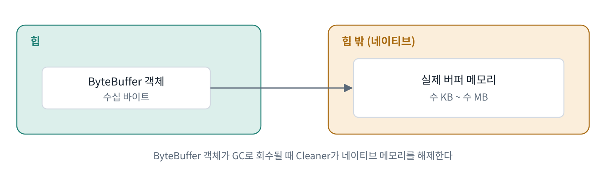
*그림 8-1. 다이렉트 버퍼. 힙에서 보면 작은 객체지만, 실제로는 힙 밖의 큰 메모리를 붙잡고 있다*

**해제 방식이 핵심이다.** 다이렉트 버퍼의 네이티브 메모리는 **힙에 있는 작은 `ByteBuffer` 객체가 GC로 회수될 때** Cleaner라는 장치로 해제된다.

- 힙에 여유가 많아 GC가 거의 돌지 않으면, 작은 `ByteBuffer` 객체들이 회수되지 않고 남아 네이티브 메모리를 계속 붙잡는다. **힙은 한가한데 RSS는 계속 오르는** 상황이다.
- 상한 `MaxDirectMemorySize`(기본값은 최대 힙 크기와 같음)에 닿으면 JDK는 `System.gc()`를 호출해 회수를 시도한 뒤 재시도한다(`java.nio.Bits`).
- 운영에서 흔히 쓰는 `-XX:+DisableExplicitGC`를 켜면 이 `System.gc()`가 무시되어 `OutOfMemoryError: Direct buffer memory`가 나기 쉬워진다.

또한 힙 `ByteBuffer`로 I/O를 하면 JDK가 스레드별로 **임시 다이렉트 버퍼를 캐시**한다. 큰 힙 버퍼로 I/O를 하는 스레드가 많으면 이 캐시가 조용히 네이티브 메모리를 늘린다(`-Djdk.nio.maxCachedBufferSize`로 제한 가능).

### 8.4 그 밖의 항목

- **코드 캐시**: JIT가 컴파일한 기계어. 앱이 워밍업되며 점점 커진다.
- **GC 자료구조**: G1의 Remembered Set, 마킹 비트맵 등. 힙이 클수록 커진다.
- **Symbol / Internal**: 클래스 이름 등 심볼 테이블, JVM 내부용 메모리.
- **malloc 오버헤드**: glibc malloc은 스레드 경합을 줄이려고 여러 arena를 만들고, 이 단편화 때문에 RSS가 JVM이 아는 양보다 커질 수 있다.

### 8.5 NMT로 보기

```bash
java -XX:NativeMemoryTracking=summary -jar app.jar
jcmd <pid> VM.native_memory summary          # 현재 상태
jcmd <pid> VM.native_memory baseline         # 기준점 저장
jcmd <pid> VM.native_memory summary.diff     # 기준점 대비 변화
```

Java Heap, Class, Thread, Code, GC, Internal 등 카테고리별로 reserved와 committed가 출력된다. 실제로 쓰는 것은 committed다. baseline을 찍고 diff로 어느 카테고리가 자라는지 보는 것이 네이티브 누수 진단의 기본이다.

**한계**: NMT는 JVM이 직접 할당한 메모리만 추적한다. JNI 라이브러리의 할당이나 malloc 단편화는 NMT 합계와 RSS의 차이로만 드러난다. NMT 자체에도 약간의 성능 비용이 있다.

> 📎 1차 자료: [JEP 122 Remove the Permanent Generation](https://openjdk.org/jeps/122) / [GC Tuning Guide 21, Other Considerations (Class Metadata)](https://docs.oracle.com/en/java/javase/21/gctuning/other-considerations.html) / [Troubleshooting Guide 21, 2장 Diagnostic Tools (NMT, jcmd)](https://docs.oracle.com/en/java/javase/21/troubleshoot/diagnostic-tools.html) / [ByteBuffer Javadoc](https://docs.oracle.com/en/java/javase/21/docs/api/java.base/java/nio/ByteBuffer.html) / [OpenJDK 소스 java/nio/Bits.java](https://github.com/openjdk/jdk/blob/master/src/java.base/share/classes/java/nio/Bits.java)

---

## 9. 컨테이너 안의 JVM

### 9.1 JVM은 컨테이너를 어떻게 인식하는가

과거 JVM은 컨테이너 안에서도 **호스트 머신 전체의 메모리와 CPU**를 보고 기본값을 정했다. 64GB 호스트 위의 1GB 컨테이너에서 힙을 16GB로 잡으려다 죽는 식이었다. JDK 10(8u191에 백포트)부터 JVM이 cgroup 제한을 읽도록 바뀌었고(JDK-8146115), `UseContainerSupport`가 기본으로 켜져 있다. cgroup v2 지원은 이후 별도로 추가되었으므로 사용하는 JDK 버전을 확인해야 한다.

### 9.2 `-Xmx`를 안 주면 힙은 얼마인가

JVM은 인식한 메모리에 비율을 곱한다.

- `MaxRAMPercentage` (기본 **25%**): 최대 힙 비율. 1GB 컨테이너면 약 256MB.
- `MinRAMPercentage` (기본 50%): 이름과 달리 "최소 힙"이 아니라, **아주 작은 메모리 환경에서 적용되는 최대 힙 비율**이다.
- `InitialRAMPercentage`: 초기 힙 비율.

25%라는 보수적인 기본값은 8장의 힙 밖 메모리를 위한 여유를 남겨 두는 것이다.

### 9.3 기본 GC도 환경에 따라 달라진다

JVM은 머신이 "서버급"인지 판단해 기본 GC를 고른다. **CPU가 2개 미만이거나 메모리가 약 2GB(1792MB) 미만이면 G1이 아니라 Serial GC**를 선택한다. 작은 클라우드 인스턴스나 컨테이너에 올린 Spring 앱은 G1이 아닐 수 있다.

```bash
docker run --rm --memory=1g eclipse-temurin:21 \
  java -XX:+PrintFlagsFinal -version | grep -E "MaxHeapSize|UseSerialGC|UseG1GC"
```

### 9.4 두 종류의 OOM

| | Java OOM | 컨테이너 OOMKilled |
|---|---|---|
| 누가 판단 | JVM | 리눅스 커널 (cgroup) |
| 원인 | 특정 영역(힙, Metaspace, 다이렉트 버퍼 등)의 한도 초과 | **프로세스 전체 메모리**가 컨테이너 한도 초과 |
| 증상 | `OutOfMemoryError` 예외와 스택 트레이스 | 프로세스가 즉시 강제 종료, 종료 코드 137 (128 + SIGKILL 9) |
| 힙덤프 | `-XX:+HeapDumpOnOutOfMemoryError`로 남길 수 있음 | 남지 않음 (JVM이 개입할 틈이 없음) |

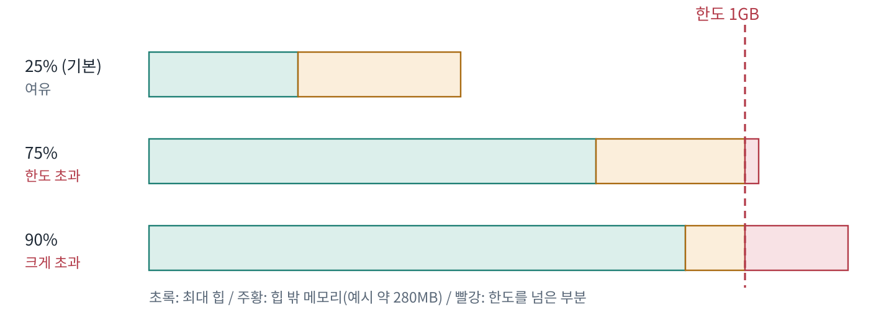
*그림 9-1. 1GB 컨테이너에서 힙 비율에 따른 전체 메모리. 힙을 키울수록 힙 밖 메모리가 들어갈 자리가 줄어든다*

`MaxRAMPercentage`를 90%처럼 크게 잡으면 힙 OOM은 줄지만, 힙 밖 메모리를 합쳐 한도를 넘는 순간 흔적 없이 죽는다. 흔히 50~75%를 권하는 이유다. 정답은 NMT로 힙 밖 메모리를 실측해서 역산하는 것이다.

> 📎 1차 자료: [JDK-8146115 컨테이너 인식](https://bugs.openjdk.org/browse/JDK-8146115) / [java 명령어 레퍼런스](https://docs.oracle.com/en/java/javase/21/docs/specs/man/java.html) (MaxRAMPercentage, MinRAMPercentage, UseContainerSupport) / [GC Tuning Guide 21, 2장 Ergonomics](https://docs.oracle.com/en/java/javase/21/gctuning/ergonomics.html)

---

## 10. 원인 찾기: 힙덤프와 MAT

### 10.1 OOM 메시지로 영역 판별

| 메시지 | 영역 | 비고 |
|---|---|---|
| `Java heap space` | 힙 (3장) | 누수일 수도, 단순히 힙이 작을 수도 있음 |
| `GC overhead limit exceeded` | 힙 | GC에 대부분의 시간을 쓰는데 회수가 거의 안 될 때 (Parallel GC) |
| `Metaspace` / `Compressed class space` | Metaspace (8.1) | 클래스로더 누수 |
| `Direct buffer memory` | 다이렉트 버퍼 (8.3) | DisableExplicitGC와 연관 가능 |
| `unable to create native thread` | 스레드 (8.2) | 스레드 수 / OS 한계 |
| 메시지 없이 종료 코드 137 | 컨테이너 전체 (9.4) | Java OOM이 아님 |

`Java heap space`가 누수인지 단순 힙 부족인지는 GC 로그의 **Full GC(또는 Mixed GC) 직후 사용량** 추이로 구분한다. 시간이 지날수록 계단식으로 오르면 누수, 일정하면 힙이 작은 것이다.

### 10.2 힙덤프 뜨기

```bash
# OOM 발생 시 자동
java -XX:+HeapDumpOnOutOfMemoryError -XX:HeapDumpPath=/dumps/ -jar app.jar
# 실행 중 수동
jcmd <pid> GC.heap_dump /dumps/heap.hprof
```

- `jcmd GC.heap_dump`은 기본적으로 **살아 있는 객체만** 덤프하므로 먼저 Full GC를 유발한다. 6.3의 STW 문제가 그대로 적용된다.
- 덤프 파일 크기는 사용 중인 힙 크기와 비슷하다. 컨테이너라면 디스크 공간과 볼륨 마운트를 미리 준비한다.
- OOMKilled는 덤프를 남기지 않는다.

### 10.3 MAT로 분석하기

- **Shallow heap**: 객체 자신의 크기.
- **Retained heap**: 이 객체가 사라지면 **함께 회수될 모든 것의 크기**. 누수를 찾을 때는 항상 이 값을 본다.
- **Dominator Tree**: Root에서 Y로 가는 모든 경로가 X를 지나면 X가 Y를 지배한다. retained 크기 순으로 정렬하면 맨 위에 범인 후보가 뜬다.
- **Path to GC Roots** (weak/soft 참조 제외): 범인 후보가 **왜 회수되지 않는지**, 2.1의 Root부터의 참조 체인을 보여준다. 예: `static` 필드 → `ArrayList` → 쌓인 객체들.

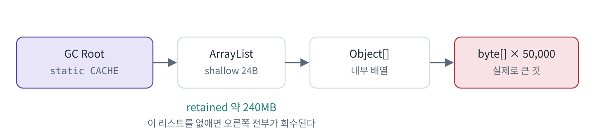
*그림 10-1. Path to GC Roots. ArrayList의 shallow 크기는 작지만 retained 크기는 크다. 원인은 왼쪽 끝의 static 필드다*

- **Leak Suspects 리포트**: 자동 요약. 편리하지만 Dominator Tree → Path to GC Roots로 직접 추적하는 과정이 원리를 보여준다.

> 📎 1차 자료: [Troubleshooting Guide 21, 3장 Troubleshoot Memory Leaks](https://docs.oracle.com/en/java/javase/21/troubleshoot/troubleshooting-memory-leaks.html) / [Troubleshooting Guide 21, 2장 Diagnostic Tools (jcmd)](https://docs.oracle.com/en/java/javase/21/troubleshoot/diagnostic-tools.html) / [Eclipse MAT](https://eclipse.dev/mat/)

---

## 11. 처음 질문에 대한 답

> **힙을 512MB로 잡았는데, 왜 컨테이너는 1GB를 넘겨서 죽었을까?**

### 11.1 무엇이 1GB를 채웠나

처음에 본 그림 0-1이 바로 이 상황이다. 1.3의 식에 지금까지 배운 것을 대입하면 이렇다. (아래 수치는 설명용 예시다.)

| 항목 | 예시 | 왜 늘어나나 |
|---|---|---|
| 힙 | 최대 512MB | `-Xmx`만큼 커질 수 있고, G1은 여유가 있어도 바로 반납하지 않을 수 있음 |
| Metaspace | 100MB 이상 | Spring Boot는 로드하는 클래스가 많음 (8.1) |
| 스레드 스택 | 수십~200MB | 트래픽이 몰리면 Tomcat 스레드가 최대 200개까지 증가 (8.2) |
| 코드 캐시 | 수십 MB | 워밍업될수록 JIT 코드 증가 (8.4) |
| GC 자료구조 | 수십 MB | G1 RSet, 마킹 비트맵 (4.2) |
| 다이렉트 버퍼 | 가변 | 힙이 한가하면 회수가 늦어짐 (8.3) |
| 기타 | 가변 | 심볼, malloc arena 단편화 (8.4) |

평소에는 합계가 1GB 아래였지만, 트래픽이 몰리며 **스레드 스택, 다이렉트 버퍼, 힙 사용량이 동시에 늘자** 합계가 1GB를 넘었다. 이때 판단한 것은 JVM이 아니라 리눅스 커널이었고, 그래서 `OutOfMemoryError`도 힙덤프도 없이 종료 코드 137만 남았다(9.4).

### 11.2 어떻게 확인하나

1. 종료 코드 137과 `docker inspect`의 OOMKilled 여부로 **Java OOM이 아니라 컨테이너 OOM**임을 확인한다.
2. 같은 조건으로 재현하며 NMT(8.5)로 카테고리별 committed 메모리를 측정한다.
3. GC 로그(5장)로 힙 자체의 사용량 추이를 확인한다. 힙 누수가 의심되면 10장 방법으로 힙덤프를 분석한다.

### 11.3 어떻게 고치나

- 힙을 컨테이너 메모리 기준 비율로 설정하되, **NMT로 측정한 힙 밖 메모리만큼 여유**를 남긴다 (`-XX:MaxRAMPercentage`).
- 스레드 수 상한, 다이렉트 메모리 상한(`-XX:MaxDirectMemorySize`)을 명시한다.
- GC 로그와 `HeapDumpOnOutOfMemoryError`를 항상 켜 두어, 다음 장애 때 증거가 남게 한다.
- 컨테이너 크기와 CPU에 따라 기본 GC가 무엇이 되는지 확인하고, 필요하면 명시한다(9.3).

### 11.4 요약

1. JVM이 쓰는 메모리는 힙과 힙 밖 메모리의 합이고, `-Xmx`는 힙만 제한한다.
2. GC는 살아 있는 것만 남기고, 그 대가로 STW를 만든다. G1과 ZGC는 멈춤 시간과 처리량·메모리 사이에서 서로 다른 선택을 한다.
3. 컨테이너에서는 힙 밖 메모리를 NMT로 실측해 힙 비율을 정하고, GC 로그와 힙덤프 옵션으로 다음 장애의 증거를 남긴다.

---

## 12. 흔한 오해 정리

| 흔한 설명 | 실제 (JDK 8 이후 HotSpot) | 근거 |
|---|---|---|
| 힙은 Eden, Survivor, Old, **Permanent**로 나뉜다 | PermGen은 JDK 8에서 제거, Metaspace(네이티브)로 대체 | JEP 122 |
| static 변수는 메서드 영역에 있다 | static 필드 값은 `Class` 객체와 함께 힙에 있다 | JEP 122 |
| Young과 Old는 물리적으로 나뉜 공간이다 | G1에서는 리전들의 논리적 집합 | GC Tuning Guide 7장 |
| `-Xmx` = JVM이 쓰는 메모리 | 힙 밖 메모리가 별도로 있음 | NMT 실측 (16장 E) |
| 기본 GC는 항상 G1 | 작은 환경에서는 Serial | GC Tuning Guide 2장 Ergonomics, 16장 A |
| ZGC에는 STW가 없다 | 짧은 STW 3개가 있다 | GC Tuning Guide 9장 |
| STW는 GC 때만 생긴다 | 힙덤프, 스레드덤프, 역최적화 등도 safepoint | -Xlog:safepoint 실측 (16장 C) |
| TLAB은 스레드 전용 메모리다 | 전용인 것은 할당 권한뿐 | OpenJDK 소스 |
| `MaxGCPauseMillis`는 최대 멈춤 보장이다 | 목표(soft goal)일 뿐 | GC Tuning Guide 7·8장 |

---

## 13. 트레이드오프와 반론

**G1 vs ZGC**: ZGC는 멈춤을 줄이는 대신 처리량, CPU, 메모리(압축 포인터 불가, 여유 힙)를 내준다. 일반 웹 서버 규모에서는 G1이 합리적인 기본값이다. 힙이 크거나 p99 지연이 핵심 지표인 서비스라면 ZGC를 검토한다.

**MaxRAMPercentage를 얼마로?**: 크게 잡으면 힙 OOM은 줄지만 OOMKilled 위험이 커진다. 작게 잡으면 GC가 잦아진다. 고정된 정답은 없고, **힙 밖 메모리를 실측해서 역산**하는 것이 유일하게 근거 있는 방법이다.

**`-XX:+DisableExplicitGC`는 무조건 좋은가?**: 라이브러리의 불필요한 `System.gc()`로 인한 Full GC를 막아 주지만, 다이렉트 버퍼 회수 경로도 함께 막는다(16장 F). 대안으로 `-XX:+ExplicitGCInvokesConcurrent`(G1에서 `System.gc()`를 동시 사이클로 처리)가 있다.

**MaxGCPauseMillis를 낮추면 좋은가?**: 한 번의 멈춤은 짧아지지만 GC 빈도가 늘어 처리량이 떨어진다.

**`-Xms`를 `-Xmx`와 같게?**: 힙 크기 조정 비용과 예측 불가능성을 없애지만, 쓰지 않는 메모리를 OS에 반납하지 못한다. 여러 앱이 한 호스트를 나눠 쓰는 환경이라면 손해다.

---

## 14. 예상 질문과 답

**Q1. ZGC가 멈춤이 짧다면 왜 기본 GC는 G1인가?**
ZGC는 멈춤을 줄이는 대가로 로드 배리어로 인한 처리량 감소, 동시 GC 스레드의 CPU 사용, 여유 힙과 압축 포인터 불가로 인한 메모리 증가를 치른다. 수 GB 이하 힙의 일반 서버에서는 G1의 수십 ms 멈춤으로 충분하고 효율은 G1이 좋다. (7.4, 7.6)

**Q2. 힙은 클수록 좋은 것 아닌가?**
힙이 크면 GC 빈도는 줄지만, 컨테이너 안에서는 힙 밖 메모리의 여유가 줄어 OOMKilled 위험이 커진다. 또 Full GC가 일어나면 정리할 대상이 많아 멈춤이 길어질 수 있다. 힙 크기는 전체 메모리 예산 안에서 힙 밖 실측치를 뺀 값으로 정한다. (9.4, 11.3)

**Q3. `System.gc()`를 호출하면 안 되는 이유는? 필요한 경우는?**
G1에서 `System.gc()`는 기본적으로 STW Full GC를 일으킨다. 그래서 애플리케이션 코드에서 호출하지 않는 것이 원칙이다. 하지만 JDK 자신은 다이렉트 버퍼 한도에 닿았을 때 회수를 위해 호출한다. 그래서 `DisableExplicitGC`로 완전히 막으면 `Direct buffer memory` OOM 위험이 생긴다. (8.3, 13장, 16장 F)

**Q4. GC 로그의 pause 시간과 사용자가 체감하는 지연은 왜 다를 수 있나?**
GC 로그의 pause에는 safepoint 도달 시간(TTSP)이 포함되지 않는다. 또 멈춘 동안 쌓인 요청이 한꺼번에 처리되며 대기열 지연이 생기고, 동시 GC는 CPU를 나눠 쓰며, ZGC에서는 allocation stall이 따로 발생할 수 있다. (6.2, 7.4)

**Q5. 가상 스레드(A3)를 쓰면 메모리 구조가 어떻게 달라지나?**
가상 스레드는 멈출 때 스택을 힙 객체로 옮겨 저장한다. 그래서 스레드마다 1MB씩 예약하던 네이티브 스택 대신 실제로 쓴 만큼 힙을 쓴다. 스레드 스택 항목은 줄고 힙 사용량과 GC 부담은 늘 수 있다. (8.2)

**(백업) 운영 중 힙덤프를 떠도 되나?**
덤프 중에는 STW가 걸리고, 기본 옵션은 Full GC를 먼저 일으킨다. 힙이 크면 수 초 이상 멈출 수 있으므로 트래픽을 빼고 뜨거나, OOM 시 자동 덤프에 의존한다. (6.3, 10.2, 16장 C)

---

## 15. 데모와 실측 결과

> 측정 환경: OpenJDK 21.0.10, Ubuntu 24.04, CPU 1개, 메모리 4GB, Docker 없음.
> 데모 코드는 [`A5_jvm_memory_gc/`](./A5_jvm_memory_gc)에 있고 `./run_all.sh` 한 번으로 전부 재현된다. 원본 로그는 [`A5_jvm_memory_gc/results/`](./A5_jvm_memory_gc/results)에 있다. 수치는 CPU 수와 메모리에 따라 달라진다.

### A. 메모리·CPU에 따른 기본 힙과 GC (9장)

옵션 없이 실행한 측정 환경(CPU 1개, 4GB)의 기본값: **Serial GC, 최대 힙 1GB(25%)**. CPU가 1개라 G1이 아니다.

| 조건 (MaxRAM, ActiveProcessorCount로 흉내) | 최대 힙 | 기본 GC |
|---|---|---|
| CPU 1 / 512MB, 1GB, 2GB, 4GB | 128 / 256 / 512 / 1024MB | Serial |
| CPU 2 / 512MB, 1GB, 2GB, 4GB | 128 / 256 / 512 / 1024MB | G1 |
| 아주 작은 메모리 128MB / 200MB / 256MB / 300MB | 64 / 100 / 126 / 126MB | - |

- 최대 힙은 정확히 25%. 아주 작은 메모리에서는 50%(`MinRAMPercentage`)가 적용된다.
- CPU 2개 미만이면 Serial이 선택된다. 단, "메모리 약 2GB 미만이면 Serial" 조건은 `MaxRAM`으로 흉낼 수 없어 512MB에서도 G1이 나왔다. 실제 컨테이너 조건은 `run_container_check.sh`(Docker)로 확인한다.

### B. 약한 세대 가설: Survivor 나이 분포 (3장)

`AgeDemo` / Serial GC, Young 96MB 고정, 8초 실행 → Young GC 873회, 매번 `62M->14M` 약 2ms.

```text
GC(882) - age   1:  674832 bytes
GC(882) - age   2:  579040 bytes
GC(882) - age   5:  362800 bytes
GC(882) - age  10:  176240 bytes
GC(882) - age  15:   81840 bytes
```

- 오래 살아남은 나이일수록 양이 계속 줄어든다. 매 GC마다 Eden 약 48MB 중 대부분이 회수되고 Survivor에는 약 4MB만 남는다.
- **조기 승격**: G1 + 캐시(100KB 항목 다수)로 돌리면 로그에 `new threshold 1 (max threshold 15)`이 찍힌다. Survivor가 넘칠 것 같자 JVM이 승격 기준 나이를 15에서 1로 낮췄다.
- **부수 발견 (탈출 분석)**: 처음에는 `new byte[256]`을 매 루프 20번 했는데도 GC가 거의 안 일어났다. 객체가 메서드 밖으로 나가지 않자 JIT가 할당 자체를 없앤 것이다. static 필드에 담아 밖으로 내보내자 정상적으로 할당됐다. "모든 객체는 힙에 할당된다"의 실제 예외 사례.

### C. G1 한 사이클, Full GC, 힙덤프의 STW (4~6장)

`AllocationChurn` / 짧게 사는 객체 + 계속 교체되는 캐시(Old에 쓰레기를 만듦)

| 멈춤 종류 | 여유 있는 힙 (512MB, 살아 있는 데이터 약 50MB, 16초) | 빡빡한 힙 (256MB, 약 110MB, 20초) |
|---|---|---|
| Pause Young (Normal) | 431회, 평균 9.2ms | 849회, 평균 3.7ms |
| Pause Young (Concurrent Start) | 43회, 평균 7.5ms | 223회 |
| Pause Remark / Pause Cleanup | 평균 0.42ms / 0.15ms | 평균 0.13ms / 0.09ms |
| Pause Young (Mixed) | 73회, 평균 11.1ms | 556회 |
| Pause Full | 1회 | **138회, 평균 24.2ms, 최대 60.4ms** |

- 로그에 Concurrent Start → Concurrent Mark Cycle → Remark → Cleanup → Prepare Mixed → Mixed 순서가 그대로 찍힌다 (4.3의 흐름).
- 마킹만 하는 Remark·Cleanup은 1ms 미만, 객체를 옮기는 Young·Mixed는 수~수십 ms. **멈춤의 대부분은 객체 이동에서 생긴다**는 6장의 실측 근거.
- 빡빡한 힙에서는 `Pause Young (Mixed) ... (Evacuation Failure)` 직후 `Pause Full (G1 Compaction Pause)`가 반복됐다. 복사할 빈 리전이 없어 최후 수단으로 간 것(4.3 ⑦). CPU가 1개라 동시 마킹이 애플리케이션과 CPU를 나눠 쓰는 것도 원인.
- safepoint(여유 있는 힙): 675회, 도달 시간(TTSP) 합계 22.3ms, 최대 5.5ms. GC 로그의 pause에는 이 시간이 포함되지 않는다.
- **힙덤프의 STW**: 실행 중 `jcmd GC.heap_dump` → `Pause Full (Heap Dump Initiated GC)` 19.5ms + `Safepoint "HeapDumper"` 73.0ms. 살아 있는 데이터 50MB에서 약 93ms 멈춤. 힙이 클수록 길어진다.

### D. 누수 → OOM → 힙덤프 (2, 10장)

```java
static final List<byte[]> LEAK = new ArrayList<>();   // GC Root
static void handleRequest(int n) {
    byte[] temp = new byte[20 * 1024];   // 정상: 요청이 끝나면 회수
    LEAK.add(new byte[50 * 1024]);       // 누수: 요청마다 50KB씩 쌓임
}
```

`-Xmx128m`, G1 / 약 0.66초 만에 `OutOfMemoryError: Java heap space`

- Young GC 직후 사용량: 3M → 9M → 24M → 54M → 77M → 103M → 117M → 127M. **GC를 해도 바닥이 계속 올라간다** (5.5의 누수 신호).
- 마지막에 Full GC 7회가 모두 `124M->124M`. 하나도 회수하지 못하고 OOM.
- 힙덤프(133MB) 분석 결과 (`hprof_chain.py`, MAT의 Path to GC Roots와 같은 내용):

```text
GC Root: static 필드 LeakDemo.LEAK
  → java/util/ArrayList (size=2517)
  → Object[] elementData (length=2776)
  → byte[] 2517개, 개당 51200B, 합계 122.9MB
힙 전체 byte[] 중 이 경로가 차지하는 비율: 99.8%
```

힙덤프 파일은 용량 때문에 레포에 올리지 않았다. `run_all.sh`를 실행하면 `results/D_leak.hprof`로 다시 생성된다.

### E. 힙 밖 메모리 (1, 8장)

`NativeMemoryDemo` / `-Xmx64m`, 스레드 200개, 다이렉트 버퍼 100MB, NMT 측정

| NMT 항목 | reserved | committed |
|---|---|---|
| Java Heap | 64MB | 64MB |
| Other (다이렉트 버퍼) | 100MB | 100MB |
| GC (G1 자료구조) | 36MB | 36MB |
| Thread (스레드 200개) | 219MB | 29MB |
| Code / Symbol / Internal 등 | - | 약 23MB |
| **합계** | 1767MB | **252MB** |

- `-Xmx64m`인데 JVM 전체 committed 252MB, 실제 RSS 169MB. **힙은 전체의 일부**라는 1장의 실측 근거.
- Thread는 스레드당 1MB씩 예약(219MB)했지만 실제 사용은 29MB. reserved와 committed의 차이(1.3).
- **다이렉트 메모리 기본 한도 = 최대 힙**: `MaxDirectMemorySize`를 주지 않자 64MB에서 `OutOfMemoryError: Cannot reserve 1048576 bytes of direct buffer memory (allocated: 67108864, limit: 67108864)`.

### F. 다이렉트 버퍼와 DisableExplicitGC (8.3, 13장 트레이드오프)

`DirectBufferDemo` / 힙 1GB, 다이렉트 한도 64MB, 1MB 버퍼를 만들고 바로 버리기를 2000번 반복

| 옵션 | 결과 |
|---|---|
| 기본 | 2000MB 모두 성공. JDK가 한도에 닿을 때마다 `System.gc()`를 호출(31회)해 버려진 버퍼를 회수 |
| `-XX:+DisableExplicitGC` | GC 0회, 64MB에서 바로 `OutOfMemoryError: ... direct buffer memory` |

힙이 넉넉해 GC가 안 돌면 다이렉트 버퍼가 회수되지 않는다. `System.gc()` 금지가 무조건 좋은 게 아니라는 13장 반론의 실측 근거.

---

## 16. 참고한 1차 자료

- JVM 명세 2.5절 Run-Time Data Areas: <https://docs.oracle.com/javase/specs/jvms/se21/html/jvms-2.html#jvms-2.5>
- HotSpot GC Tuning Guide (JDK 21): <https://docs.oracle.com/en/java/javase/21/gctuning/>
  - 1장 Introduction / 2장 Ergonomics / 3장 Garbage Collector Implementation / 5장 Available Collectors / 7장 G1 / 8장 G1 Tuning / 9장 ZGC / Other Considerations
- Java Troubleshooting Guide (JDK 21): <https://docs.oracle.com/en/java/javase/21/troubleshoot/>
  - 2장 Diagnostic Tools (NMT, jcmd) / 3장 Troubleshoot Memory Leaks
- java 명령어 레퍼런스: <https://docs.oracle.com/en/java/javase/21/docs/specs/man/java.html>
- JEP 122, 158, 248, 271, 307, 312, 333, 376, 377, 439, 474, 490: <https://openjdk.org/jeps/0>
- JDK-8146115: <https://bugs.openjdk.org/browse/JDK-8146115>
- OpenJDK 소스: <https://github.com/openjdk/jdk> (`gc/shared/threadLocalAllocBuffer*`, `gc/g1/`, `gc/z/`, `java/nio/Bits.java`)
- ByteBuffer Javadoc: <https://docs.oracle.com/en/java/javase/21/docs/api/java.base/java/nio/ByteBuffer.html>
- ZGC 위키: <https://wiki.openjdk.org/display/zgc>
- 논문: Detlefs, Flood, Heller, Printezis, "Garbage-First Garbage Collection", ISMM 2004
- Eclipse MAT: <https://eclipse.dev/mat/>

---

## 17. 참고 블로그
- JVM 메모리 내부구조 : <https://inpa.tistory.com/entry/JAVA-%E2%98%95-JVM-%EB%82%B4%EB%B6%80-%EA%B5%AC%EC%A1%B0-%EB%A9%94%EB%AA%A8%EB%A6%AC-%EC%98%81%EC%97%AD-%EC%8B%AC%ED%99%94%ED%8E%B8>
- GC 동작원리 : <https://inpa.tistory.com/entry/JAVA-%E2%98%95-%EA%B0%80%EB%B9%84%EC%A7%80-%EC%BB%AC%EB%A0%89%EC%85%98GC-%EB%8F%99%EC%9E%91-%EC%9B%90%EB%A6%AC-%EC%95%8C%EA%B3%A0%EB%A6%AC%EC%A6%98-%F0%9F%92%AF-%EC%B4%9D%EC%A0%95%EB%A6%AC>
- ZGC (저지연 GC) : <https://iks-room.tistory.com/entry/JVM-%EC%A0%80%EC%A7%80%EC%97%B0-GC-ZGC-%EC%89%BD%EA%B2%8C-%EC%9D%B4%ED%95%B4%ED%95%98%EA%B8%B0> 
