# E6. 실무 자료구조와 저장 엔진

> 기준 버전: **JDK 21**, **Redis 7.x**, **PostgreSQL 16**, **MySQL 8 (InnoDB)**, **RocksDB 8.x**
> 데모 코드와 측정 결과: [`E6_data_structures_storage_engines/`](./E6_data_structures_storage_engines) · 재현은 `run_all.sh` 한 번 (부록 A)

---

## 들어가며

자료구조 수업에서는 이렇게 배웁니다. `LinkedList`의 중간 삽입은 O(1)이고, `ArrayList`는 뒤 원소를 전부 밀어야 하니 O(n)이다. 그러니 중간 삽입이 잦으면 `LinkedList`를 쓰라고.

그런데 10만 개짜리 리스트 한가운데에 넣고 빼기를 반복해 직접 재 보면 **`ArrayList`가 18배 빠릅니다.** 교과서가 틀린 걸까요?

틀린 건 아닙니다. 빅오는 **연산을 몇 번 하느냐**만 세고, **그 연산 하나가 실제로 얼마나 걸리는지**는 세지 않습니다. 그리고 컴퓨터에서 "값 하나 읽기"는 그 값이 어디 있느냐에 따라 1ns에서 수 ms까지, 백만 배 넘게 차이 납니다.

이 글은 실무에서 쓰는 자료구조 여섯 가지를 따라가며 이런 **빅오 밖의 비용**과 그것을 다루는 설계를 봅니다. 각 장은 앞 장이 남긴 질문에서 출발합니다.

| 부 | 장 | 주제 | 이 장에서 알게 되는 것 |
|---|---|---|---|
| **1부. 메모리 안의 자료구조** | 1 | 캐시 지역성 *(실측)* | 같은 O(n)인데 왜 18배 차이가 나는가 |
| | 2 | 해시테이블 | 평균 O(1)을 지키는 리사이징과 트리화 |
| | 3 | 블룸 필터 *(실측)* | 없는 키를 적은 메모리로 걸러 DB를 지키는 법 |
| | 4 | 스킵리스트 | Redis 랭킹은 왜 트리 대신 이것을 쓰는가 |
| **2부. 디스크 위의 저장 엔진** | 5 | B-tree vs LSM 트리 | 디스크에서 읽기와 쓰기 중 무엇을 내주는가 |
| | 6 | WAL | 메모리에 든 변경을 크래시에서 지키는 법 |

1부는 데이터가 **메모리 안**에 있을 때, 2부는 데이터가 너무 커서 **디스크로 내려갔을 때**의 이야기입니다.

---

# 1부. 메모리 안의 자료구조

## 1장. 캐시 지역성: 같은 O(n)인데 왜 18배 차이가 나는가

### 1.1 같은 "읽기 1번"이 백만 배 넘게 차이 난다

CPU가 값을 하나 읽을 때 걸리는 시간은 그 값이 어디 있느냐에 따라 완전히 달라집니다.

| 위치 | 읽기 1번 (대략) | 비유 |
|---|---|---|
| L1 캐시 | ~1 ns | 지금 펼쳐 놓은 책 |
| L2 캐시 | ~4 ns | 책상 위에 쌓아 둔 책 |
| 메인 메모리 | ~100 ns | 열람실 책장 (일어나서 가야 함) |
| SSD | ~16–100 µs | 지하 서고 (신청하고 기다림) |
| HDD | ~수 ms | 다른 건물 창고 |

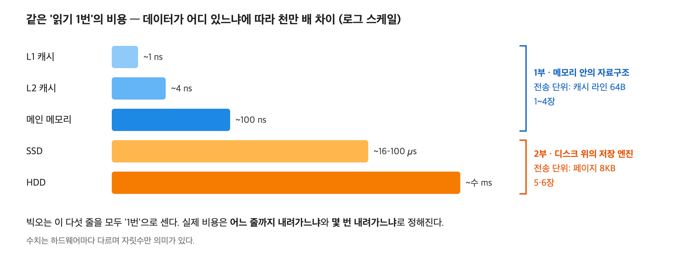
*그림 1-1. 빅오는 다섯 줄을 모두 '1번'으로 센다. 수치는 하드웨어마다 다르며 자릿수만 의미가 있다*

1µs = 1,000ns, 1ms = 1,000,000ns입니다. L1 캐시와 HDD는 백만 배 넘게 차이 납니다. 빅오는 이 모든 것을 똑같이 "1번"으로 셉니다.

### 1.2 하드웨어의 두 가지 꾀

CPU는 메인 메모리에 가는 횟수를 줄이려고 두 가지 꾀를 씁니다.

**꾀 1. 한 번 갈 때 묶어서 가져온다 (캐시 라인)**
CPU는 메모리에서 1바이트만 가져오지 않고 **64바이트 덩어리**를 통째로 가져옵니다. 이 덩어리를 **캐시 라인**이라고 합니다. `int` 배열의 `arr[0]`을 읽으면 `arr[0]`부터 `arr[15]`까지 16개가 한꺼번에 캐시로 들어오고, 그다음 15개는 메모리에 가지 않고 읽습니다. 서고에 책 한 권 가지러 가면서 옆에 꽂힌 15권도 같이 들고 오는 셈입니다.

**꾀 2. 다음에 읽을 것을 미리 가져온다 (하드웨어 프리페처)**
CPU 안의 **프리페처**는 접근 패턴을 지켜보다가 "주소를 순서대로 읽고 있구나" 싶으면, 아직 요청하지 않은 다음 캐시 라인을 미리 가져다 놓습니다. 1권, 2권, 3권을 순서대로 보는 사람을 위해 사서가 4권을 미리 꺼내 두는 것과 같습니다.

**두 꾀 모두 데이터가 메모리에 붙어 있을 때만 효과가 있습니다.** 가까이 붙은 데이터를 이어서 읽는 성질을 **공간 지역성**이라고 합니다. 이 장의 제목인 캐시 지역성이 이것입니다.

### 1.3 ArrayList와 LinkedList는 메모리에서 어떻게 생겼나

- `ArrayList`: 내부에 **배열 하나**가 있고, 원소들의 참조가 그 배열에 빈틈없이 붙어 있습니다. 원소 하나당 참조 **4바이트**입니다.
- `LinkedList`: 원소마다 `Node` 객체를 따로 만듭니다. `Node`에는 값(item), 이전(prev), 다음(next) 세 참조가 있고, 크기는 원소 하나당 **24바이트**입니다(객체 헤더 12바이트 + 참조 3개 × 4바이트).

> 참조가 4바이트인 이유: 64비트 주소는 원래 8바이트지만, JVM은 힙이 32GB보다 작으면 주소를 압축해 4바이트로 저장합니다(compressed oops).

같은 캐시에 들어가는 원소 수가 6배 차이 납니다. 하지만 더 큰 차이는 크기가 아니라 **읽는 방식**에서 나옵니다.

### 1.4 함정: `LinkedList.add(i, x)`는 O(1)이 아니다

`LinkedList`의 삽입이 O(1)인 건 **삽입할 위치의 노드를 이미 손에 쥐고 있을 때**의 이야기입니다. `list.add(i, x)`는 "i번째 위치에 넣어라"인데, `LinkedList`는 i번째 노드가 어디 있는지 모릅니다. 앞(또는 뒤)에서부터 하나씩 따라가야 합니다. 가운데라면 n/2걸음입니다.

```text
LinkedList.add(i, x) = [i번째까지 걸어가기: O(n)] + [링크 바꾸기: O(1)] = O(n)
ArrayList.add(i, x)  = [바로 찾기: O(1)]          + [뒤 원소 밀기: O(n)] = O(n)
```

**둘 다 O(n)입니다.** 빅오로는 승부가 안 나고, **"n번 중 한 번이 얼마나 걸리느냐"** 가 승부를 가릅니다.

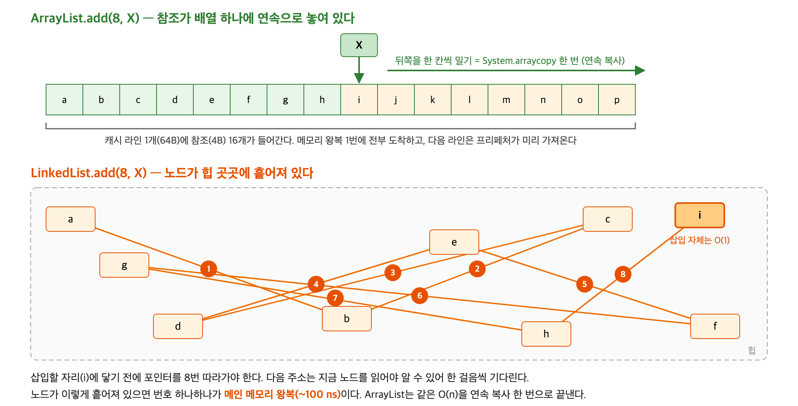
*그림 1-2. 같은 '중간 삽입'이 두 자료구조에서 실제로 하는 일*

### 1.5 ArrayList의 O(n): 한꺼번에 흘려보내는 복사

`ArrayList`는 뒤 원소를 미는 일을 `System.arraycopy` **한 번**으로 합니다. "메모리의 이 구간을 통째로 한 칸 뒤로 옮겨라"는 명령입니다.

- 데이터가 붙어 있으니 캐시 라인 하나에 참조 16개가 들어옵니다.
- 순서대로 읽으니 프리페처가 다음 줄을 미리 가져다 둡니다.
- CPU는 여러 값을 한 명령으로 복사하는 SIMD 명령도 씁니다.

결과적으로 원소 하나를 미는 데 **약 0.1ns**가 걸립니다. 컨베이어 벨트로 상자를 한꺼번에 미는 것과 같습니다.

### 1.6 LinkedList의 O(n): 한 걸음씩 기다리는 사슬

`LinkedList`는 노드를 이렇게 따라갑니다.

```text
1. 노드 A를 읽는다 → A 안에 적힌 "다음 주소"를 알게 된다
2. 그 주소로 가서 노드 B를 읽는다 → B 안의 "다음 주소"를 알게 된다
3. ...
```

핵심은 **B의 주소는 A를 다 읽어야 안다**는 점입니다. CPU는 A 읽기가 끝날 때까지 기다렸다가 B를 읽기 시작합니다. 여러 개를 동시에 읽을 수 없습니다. 이것을 **의존적인 읽기의 사슬**이라고 합니다.

> 보물찾기와 같습니다. 첫 쪽지를 열어 봐야 두 번째 쪽지의 위치를 알 수 있습니다. 쪽지가 모두 같은 방 안에 있어도(= 캐시에 있어도) 하나씩 열어야 하는 건 마찬가지입니다. 쪽지가 온 동네에 흩어져 있으면(= 캐시 미스) 훨씬 더 오래 걸립니다.

여기서 두 가지 상황을 구분해야 합니다.

| 상황 | 노드 배치 | 한 걸음의 비용 |
|---|---|---|
| 리스트를 순서대로 만든 경우 | 노드가 할당 순서대로 메모리에 차례로 놓임. 프리페처가 어느 정도 도움 | 캐시에 맞은 속도. 그래도 **기다림의 사슬**은 남음 |
| 오래 써서 노드가 흩어진 경우 | 리스트 순서와 메모리 위치가 뒤죽박죽. 프리페처가 짐작 못 함 | 한 걸음마다 **메인 메모리 왕복(~100ns)** |

### 1.7 실측 A: ArrayList vs LinkedList 중간 삽입

리스트 한가운데(`size/2`)에 원소를 하나 넣고 바로 빼는 한 쌍의 평균 시간을 JMH로 쟀습니다(측정 방법은 부록 A). 비교 대상은 네 가지입니다.

- **ArrayList**: `add(i, x)` 후 `remove(i)`
- **LinkedList**: 같은 작업. 리스트를 0부터 순서대로 만들어 노드도 메모리에 대체로 차례대로 놓임
- **LinkedList (흩어진 경우)**: 리스트를 만들 때 무작위 위치에 끼워 넣어, 리스트 순서와 메모리 순서가 어긋남. 오래 쓴 실제 리스트에 가까움
- **LinkedList 이터레이터**: `ListIterator`로 위치를 이미 잡아 둔 상태에서 넣고 빼기. 교과서의 O(1)이 성립하는 조건

| 리스트 크기 | ArrayList | LinkedList | LinkedList (흩어짐) | LinkedList 이터레이터 |
|---|---|---|---|---|
| 1천 | **124 ± 17 ns** | 2,580 ± 704 ns | 1,473 ± 198 ns | 27 ± 3 ns |
| 1만 | **1.18 ± 0.15 µs** | 21.1 ± 1.0 µs | 65.6 ± 11.5 µs | 89 ± 51 ns |
| 10만 | **12.1 ± 0.9 µs** | 217 ± 13 µs | 7,125 ± 5,172 µs | 12 ± 1 ns |

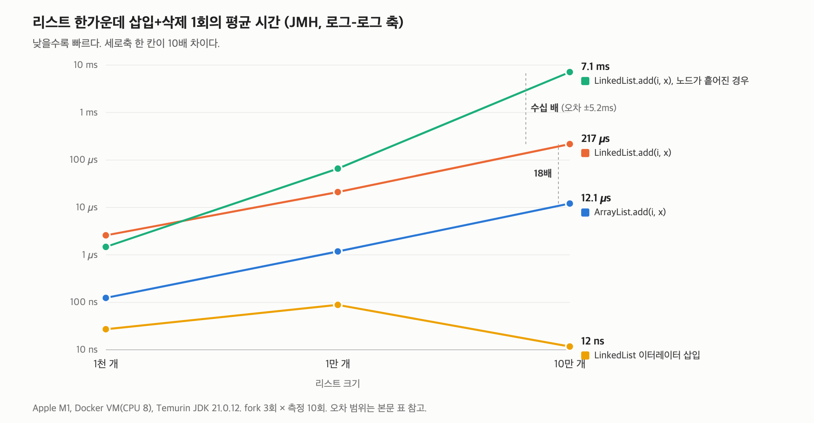
*그림 1-3. 로그-로그 축(세로 한 칸이 10배). 두 선이 나란하면 배율이 일정하다는 뜻이다*

**읽어야 할 것 다섯 가지**

**① 모든 크기에서 ArrayList가 이긴다.** 1천 개에서 20.8배, 1만 개에서 17.8배, 10만 개에서 17.9배. 교과서와 반대 결과가 실제로 재현됩니다.

**② 둘 다 O(n)이 맞다.** 크기가 10배 늘면 시간도 둘 다 약 10배 늡니다. 그래프에서 파랑과 주황 선이 **같은 기울기로 나란히** 올라갑니다. 차이는 **기울기(빅오)가 아니라 높이(상수)** 에 있습니다.

**③ 18배의 원인은 캐시 미스가 아니라 기다림의 사슬이다.** 한 번 잴 때 `add`와 `remove`가 각각 n/2걸음씩, 합쳐서 n걸음을 갑니다. 10만 개라면:

```text
LinkedList 한 걸음 = 217,000ns ÷ 100,000걸음 ≈ 2.2ns
```

2.2ns는 메인 메모리 왕복(100ns)이 아니라 **캐시에 맞았을 때의 속도**입니다. 노드가 캐시에 있어도 다음 주소를 알 때까지 하나씩 기다려야 해서, 한꺼번에 흘려보내는 `ArrayList`(원소당 약 0.1ns)보다 18배 느립니다.

**④ 노드가 흩어지면 수백 배다.**

```text
흩어진 LinkedList 한 걸음 = 7,125,000ns ÷ 100,000걸음 ≈ 71ns
```

71ns는 메인 메모리 왕복에 가까운 값입니다. 흩어진 노드는 프리페처가 짐작하지 못해 한 걸음마다 메인 메모리까지 갑니다. `ArrayList`와 비교하면 수백 배입니다. 크기가 10배 될 때 시간이 45배, 109배로 늘어 O(n)보다 가파른 것도 데이터가 캐시를 넘어서면서 **한 걸음의 비용 자체가 커졌기** 때문입니다.

반대로 1천 개에서는 흩어진 쪽이 오히려 빨랐습니다. 1천 개 정도는 데이터 전체가 캐시에 들어가 배치 차이가 드러나지 않기 때문입니다. **데이터가 캐시를 넘는 순간** 배치의 차이가 폭발합니다.

> 주의: 흩어진 리스트 10만 개의 값은 오차가 평균의 70%를 넘습니다(7.1 ± 5.2ms). 원인은 확인하지 못했습니다. "ms 단위, ArrayList의 수백 배" 정도로만 읽어야 합니다. 또 캐시 미스 횟수를 하드웨어 카운터로 직접 센 것이 아니라, 걸린 시간에서 추정한 해석입니다.

**⑤ 위치를 쥐고 있으면 O(1)은 진짜다.** 이터레이터 삽입은 크기와 관계없이 100ns 미만입니다(1만 개의 89 ± 51ns는 오차가 커서 "100ns 미만"으로만 읽습니다). 교과서가 틀린 것이 아니라, `add(i, x)`가 **위치를 찾는 비용을 숨기고 있었던** 것입니다.

### 1.8 실무에서는

- 리스트가 필요하면 **기본값은 `ArrayList`** 입니다.
- `LinkedList`가 의미 있는 경우는 이터레이터로 위치를 잡아 두고 그 자리에서 삽입·삭제를 반복할 때뿐입니다.
- 양 끝에서만 넣고 빼는 큐·스택 용도라면 배열 기반인 `ArrayDeque`가 대부분 더 빠릅니다.

> **1장 정리:** 둘 다 O(n)이지만 `ArrayList`는 "한꺼번에 흘려보내는 복사", `LinkedList`는 "한 걸음씩 기다리는 포인터 추적"이다. 캐시 안에서도 18배, 노드가 흩어져 캐시 밖으로 나가면 수백 배 차이 난다.

📎 1차 자료: Ulrich Drepper, *What Every Programmer Should Know About Memory* (2007) 3·6장 / [OpenJDK `LinkedList.java`](https://github.com/openjdk/jdk/blob/master/src/java.base/share/classes/java/util/LinkedList.java)의 `node(int)`

---

## 2장. 해시테이블: 충돌, 리사이징, 트리화

> **앞 장에서 이어지는 질문:** 흩어진 노드를 따라가는 일은 비싸다. 그런데 해시테이블 안에도 그런 줄이 숨어 있다.

### 2.1 해시테이블이 빠른 이유

`HashMap`은 키를 **숫자로 바꿔서, 그 숫자를 배열의 칸 번호로 씁니다.**

```text
1. "apple"을 해시 함수(hashCode)에 넣는다 → 정수 하나
2. 그 정수로 칸 번호를 정한다 → 예: 10번 칸
3. 배열의 10번 칸으로 바로 간다 (배열이니 O(1))
```

이 칸을 **버킷**이라고 합니다. 사물함 1,000개를 다 열어 볼 필요 없이, 이름으로 사물함 번호를 계산해 바로 가는 것과 같습니다.

### 2.2 충돌과 체이닝: 조회 비용은 줄 길이다

칸 수는 유한하고 키는 무한하니, 서로 다른 키가 같은 칸에 오는 **충돌**은 피할 수 없습니다. 해시값 자체가 같은 키도 있습니다. Java의 String 해시는 `s[0]×31 + s[1]` 방식이라, `"Aa"`(65×31+97)와 `"BB"`(66×31+66)는 둘 다 **2112**입니다.

Java `HashMap`은 같은 칸에 온 원소들을 **연결 리스트로 줄 세웁니다.** 이를 **체이닝**이라고 합니다.

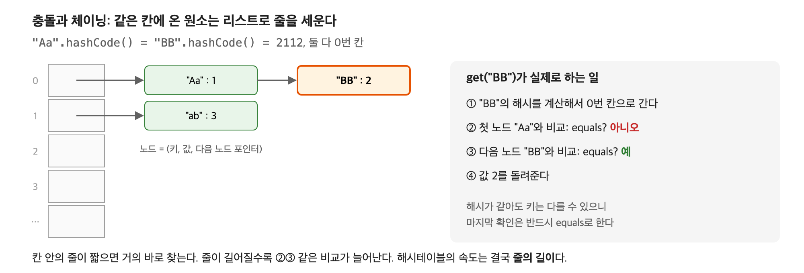
*그림 2-1. 같은 칸에 온 원소는 줄을 서고, 찾을 때는 줄을 따라가며 equals로 비교한다*

`get("BB")`는 0번 칸으로 가서, 첫 노드 "Aa"와 비교(다름), 다음 노드 "BB"와 비교(같음)한 뒤 값을 돌려줍니다. 즉 **조회 비용 = 그 칸의 줄 길이**입니다.

그리고 이 줄은 연결 리스트입니다. 1장의 "흩어진 노드 따라가기" 비용이 여기서도 생깁니다. 그래서 줄은 반드시 짧게 유지해야 합니다.

### 2.3 "평균 O(1)"의 두 조건

줄의 평균 길이는 **적재율** = 원소 수 ÷ 칸 수입니다. "해시테이블은 평균 O(1)"이라는 말은 다음 두 조건이 지켜질 때만 참입니다.

1. **칸이 충분해야 한다.** 그래야 줄이 짧다. 이를 지키는 장치가 **리사이징**(2.4).
2. **키가 칸에 고르게 퍼져야 한다.** 한 칸에 몰리면 그 줄만 길어진다. 이게 깨졌을 때의 대비책이 **트리화**(2.6).

### 2.4 리사이징: 0.75를 넘으면 2배로

`HashMap`은 적재율이 **0.75를 넘으면 칸 수를 2배로** 늘립니다. 기본 16칸이면 16 × 0.75 = 12이므로, 13번째 원소를 넣는 순간 32칸이 됩니다. 칸 수가 바뀌면 칸 번호도 바뀌므로 **모든 원소를 새 칸으로 옮겨야** 하고, 이 작업은 O(n)입니다.

**그런데도 평균이 O(1)인 이유: 분할 상환(amortized)**

2배씩 늘리면 리사이징은 아주 가끔만 일어납니다. n개를 넣는 동안 옮기는 총량을 더하면 다음과 같습니다.

```text
… + n/8 + n/4 + n/2 + n  <  2n
```

총량이 2n 미만이니 원소 하나당 평균 2번 미만, 즉 평균 O(1)입니다. 이사 한 번은 힘들지만 집을 2배씩 넓혀 가면 이사가 드물어서, 하루 평균 이사 노동은 작은 것과 같습니다.

**하지만 리사이징이 일어나는 바로 그 `put` 한 번은 실제로 O(n)입니다.** 원소가 수백만 개인 맵이라면 그 한 번이 눈에 띄는 **지연 스파이크**가 됩니다. 넣을 개수를 미리 알면 처음부터 크게 만들어 그 순간을 없앱니다.

```java
Map<Long, User> users = HashMap.newHashMap(1_000_000);   // JDK 19 이상
```

### 2.5 리사이징의 비밀: 제자리 또는 +16

`HashMap`의 칸 수는 항상 **2의 거듭제곱**입니다. 그래서 나눗셈 대신 비트 연산으로 칸을 고릅니다.

```text
칸 번호 = hash & (칸 수 - 1)
16칸이면 hash & 0b1111 → 해시의 하위 4비트
32칸이면 hash & 0b11111 → 해시의 하위 5비트
```

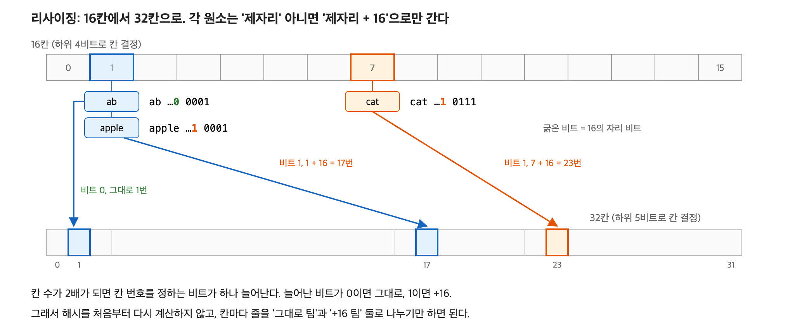
*그림 2-2. 16칸에서 32칸이 되면 각 원소는 제자리에 남거나, 제자리 + 16으로 간다*

32칸이 되면 하위 4비트는 그대로이고 **5번째 비트 하나만 새로 보게** 됩니다. 그 비트가 0이면 제자리, 1이면 제자리 + 16입니다. 해시를 다시 계산하지 않고 줄을 둘로 쪼개기만 하면 됩니다.

> 하위 비트만 쓰면 해시 위쪽의 정보가 버려집니다. 그래서 `HashMap.hash()`는 `h ^ (h >>> 16)`으로 위쪽 16비트를 아래로 섞어 넣습니다.

### 2.6 트리화: 한 칸에 몰리면 그 칸만 트리로

**문제: 해시가 완전히 같은 키들.** 해시가 같으면 비트를 아무리 섞어도 같은 칸에 갑니다. 그리고 `"Aa"`와 `"BB"`의 해시가 같으니 `"AaAa"`, `"AaBB"`, `"BBAa"`, `"BBBB"`도 전부 같습니다. 조각을 k개 이으면 해시가 같은 문자열을 2^k개 만들 수 있습니다(k=20이면 약 100만 개).

**해시 충돌 공격(hash flooding, 2011).** 공격자가 해시가 같은 파라미터 수만 개를 담은 HTTP 요청을 보내면, 서버가 이를 해시테이블에 넣는 순간 전부 한 칸의 줄에 쌓입니다. 하나 넣을 때마다 줄 전체를 훑으니 n개를 넣는 데 O(n²)이 걸려, 요청 몇 개로 서버 CPU가 마비됐습니다.

**해결: JDK 8의 트리화(JEP 180).** 한 칸의 줄이 **8개를 넘으면 그 칸만 레드-블랙 트리로** 바꿉니다. 최악의 경우가 O(n)에서 **O(log n)** 으로 줄어, 해시가 같은 키 100만 개도 수십 번 비교로 찾습니다.

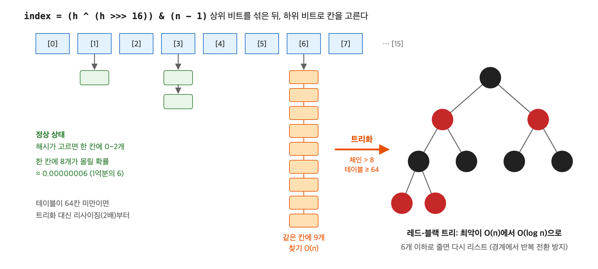
*그림 2-3. 한 칸의 줄이 8개를 넘으면 그 칸만 레드-블랙 트리로 바뀐다*

> **레드-블랙 트리란?**
> 이진 탐색 트리(왼쪽은 작은 값, 오른쪽은 큰 값)는 균형이 잡혀 있으면 O(log n)이지만, 정렬된 순서로 넣으면 한쪽으로 쏠려 연결 리스트처럼 O(n)이 됩니다. 레드-블랙 트리는 노드마다 빨강·검정 색을 붙이고 두 규칙을 지킵니다.
> - 빨강 노드는 연달아 올 수 없다.
> - 어떤 노드에서 아래 끝까지 가는 모든 경로에는 검정 노드가 같은 개수만큼 있다.
>
> 그러면 가장 긴 경로(검-빨-검-빨-…)도 가장 짧은 경로(검-검-…)의 **2배를 넘지 못해**, 높이가 항상 약 2·log₂(n) 이하로 묶입니다. 삽입·삭제로 규칙이 깨지면 색 바꾸기와 회전(부모·자식의 위아래를 바꾸는 재배치)으로 고칩니다. 완벽한 균형 대신 "2배까지는 허용"하는 느슨한 균형이라, 고치는 작업이 가볍습니다. Java의 `TreeMap`도 이 트리입니다.

트리 안에서는 해시로 먼저 비교하고, 해시가 같으면 키가 `Comparable`일 때 `compareTo`로 순서를 정합니다. 키가 `Comparable`이 아니면 O(log n) 보장이 약해집니다.

### 2.7 기준값 8, 6, 64

| 값 | 의미 | 이유 |
|---|---|---|
| **8** | 줄이 이 길이를 넘으면 트리로 | 해시가 고르면 한 칸의 원소 수는 포아송 분포를 따르고, 8개가 몰릴 확률은 약 **1억분의 6**입니다(`HashMap.java` 주석). 넘었다면 해시가 나쁘거나 공격이라는 신호입니다. |
| **6** | 트리가 이 크기 이하로 줄면 리스트로 되돌림 | 8과 간격을 둬서, 경계에서 리스트와 트리를 반복 전환하는 낭비를 막습니다. |
| **64** | 테이블이 이보다 작으면 트리화 대신 리사이징 | 작은 테이블의 충돌은 칸 부족 탓일 가능성이 커서, 칸을 늘리는 게 먼저입니다. |

처음부터 트리로 만들지 않는 이유는 트리 노드가 일반 노드의 약 2배 크기이고, 원소가 몇 개 안 될 때는 리스트가 더 빠르기 때문입니다.

> **2장 정리:** 해시테이블의 평균 O(1)은 "칸이 충분하고 키가 고르게 퍼진다"는 가정 위의 약속이다. Java `HashMap`은 칸이 모자라면 2배로 늘리고(분할 상환 O(1)), 한 칸에 몰리면 그 칸만 트리로 바꿔(최악 O(log n)) 그 약속을 지킨다. 다만 리사이징 순간의 O(n)은 실제 지연 스파이크다.

📎 1차 자료: [OpenJDK `HashMap.java`](https://github.com/openjdk/jdk/blob/master/src/java.base/share/classes/java/util/HashMap.java) "Implementation notes" 주석과 `hash()`, `resize()`, `treeifyBin()` / [JEP 180](https://openjdk.org/jeps/180)

---

## 3장. 블룸 필터: 없는 키를 걸러 DB를 지키기

> **앞 장에서 이어지는 질문:** 해시는 있는 키를 빨리 찾는다. 그럼 해시를 여러 개 쓰고, 값은 버리고 비트만 남기면? 없는 키를 아주 적은 메모리로 걸러 낼 수 있다.

### 3.1 배경: 캐시와 DB

웹 서비스는 보통 DB(예: PostgreSQL) 앞에 캐시 서버(예: Redis)를 둡니다. DB는 믿을 수 있지만 네트워크 왕복과 디스크 때문에 느리고, Redis는 메모리에 있어 빠릅니다. 흔히 쓰는 **캐시 어사이드** 패턴은 다음과 같습니다.

```text
1. Redis에 묻는다 → 있으면 바로 응답 (캐시 히트)
2. 없으면 DB에 묻는다 → 결과를 Redis에 저장하고 응답 (캐시 미스)
3. 다음에 같은 요청은 Redis에서 바로 응답
```

1장의 CPU 캐시와 같은 아이디어를 서버 단위로 한 것입니다. **여기서 "느린 곳"은 네트워크 너머의 DB**입니다.

### 3.2 문제: 캐시 관통(cache penetration)

**DB에 존재하지 않는 키**로 요청이 오면 어떻게 될까요? 없는 데이터는 캐시에 저장할 것도 없으니, 같은 요청이 다시 와도 **매번 캐시를 지나 DB까지 갑니다.** 공격자가 무작위 ID로 요청을 퍼부으면 캐시는 아무 역할도 못 하고 DB가 쓰러집니다. 이것이 **캐시 관통**입니다.

해결하려면 "이 키가 DB에 있나?"를 DB에 묻지 않고 알아야 합니다. 모든 키를 메모리에 들고 있으면 되지만, 키가 1억 개라면 수 GB가 필요합니다.

블룸 필터는 이 질문에 **"확실히 없다"는 대답만큼은 메모리 안에서, 아주 적은 공간으로** 해 줍니다.

### 3.3 구조: 비트 배열 하나와 해시 함수 k개

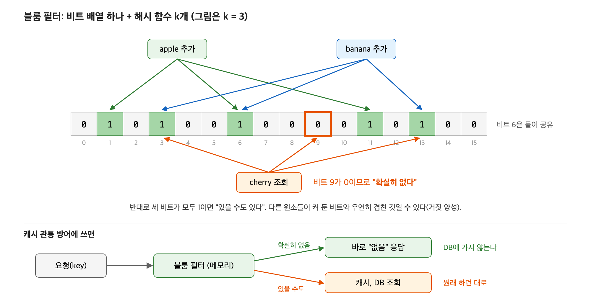
*그림 3-1. 추가할 때는 해시 k개가 가리키는 비트를 켜고, 조회할 때는 그 비트들이 모두 켜져 있는지 본다*

예를 들어 16비트 배열, 해시 3개(k=3)로 해 보겠습니다.

```text
처음:            0 0 0 0 0 0 0 0 0 0 0 0 0 0 0 0   (0번 ~ 15번 비트)

"apple" 추가:    해시 결과 1, 5, 13 → 그 비트를 1로
                 0 1 0 0 0 1 0 0 0 0 0 0 0 1 0 0

"banana" 추가:   해시 결과 3, 8, 13 → 그 비트를 1로 (13은 이미 1)
                 0 1 0 1 0 1 0 0 1 0 0 0 0 1 0 0
```

```text
"cherry" 조회:   해시 결과 1, 9, 13 → 9번 비트가 0
                 → "확실히 없다" (넣었다면 9번이 반드시 1이었을 것)

"grape" 조회:    해시 결과 3, 5, 8 → 셋 다 1
                 → "있을 수도 있다" (실제로는 안 넣었는데, apple과 banana가 켠 비트와 우연히 겹침)
```

| | 뜻 | 블룸 필터에서 |
|---|---|---|
| 거짓 양성 | 없는데 "있다"고 함 | **생길 수 있다** (grape) |
| 거짓 음성 | 있는데 "없다"고 함 | **절대 안 생긴다** |

넣은 원소의 비트는 반드시 켜져 있으므로, "하나라도 0이면 확실히 없다"는 판정은 항상 맞습니다.

### 3.4 캐시 관통 방어에 쓰는 법

```text
1. 블룸 필터에 묻는다 (메모리, 1µs 미만)
2. "확실히 없음" → DB에 안 가고 바로 "없음" 응답
3. "있을 수도"   → 원래대로 Redis → DB 조회
```

거짓 양성이 나와도 **DB 조회가 한 번 더 생길 뿐 틀린 응답은 나가지 않습니다.** 최종 확인은 DB가 하니까요. 거짓 음성은 없으니, 실제로 있는 데이터를 없다고 잘못 답하는 일도 없습니다. 명단에 확실히 없는 사람은 돌려보내고, 헷갈리는 사람만 안쪽 매니저(DB)에게 보내는 문지기와 같습니다.

### 3.5 얼마나 작은가

원소 n개를 넣고 거짓 양성률을 p로 맞추려면 다음 크기가 필요합니다.

```text
최적 비트 수  m = -n · ln(p) / (ln 2)²
최적 해시 수  k = (m / n) · ln 2
```

| 목표 거짓 양성률 | 원소당 비트 | 해시 개수 |
|---|---|---|
| 1% | 약 9.6비트 | 7개 |
| 0.1% | 약 14.4비트 | 10개 |

원소 1억 개, 1%면 약 **120MB**입니다. 키 자체를 저장하지 않으므로 키가 긴 문자열이어도 크기는 같습니다.

### 3.6 대가

- **삭제가 안 된다.** 비트 하나를 여러 원소가 공유하므로, 끄면 다른 원소까지 "없음"으로 판정되는 거짓 음성이 생깁니다.
- **예상 원소 수를 미리 정해야 한다.** 그보다 많이 넣으면 비트가 거의 다 1이 되어 거짓 양성률이 급등합니다.
- 그래서 데이터가 계속 바뀌면 **주기적으로 다시 만듭니다.** 삭제된 키가 필터에 남는 것은 거짓 양성일 뿐이라 DB 조회가 한 번 더 생기는 정도이고, 쌓이면 재생성으로 정리합니다.

### 3.7 실측 B-1: 설정한 거짓 양성률은 지켜지는가

Guava `BloomFilter`를 원소 100만 개 기준으로 만든 뒤 설계 용량의 1배·2배·5배를 넣고, **넣지 않은 키** 100만 개로 조회했습니다.

| 설정 | 넣은 원소 (설계 대비) | 실측 거짓 양성률 | 필터 크기 | 원소당 비트 |
|---|---|---|---|---|
| 1% | 100만 (1배) | **1.01%** | 1.14MB | 9.59 |
| 1% | 200만 (2배) | 15.8% | 1.14MB | 9.59 |
| 1% | 500만 (5배) | 83.2% | 1.14MB | 9.59 |
| 0.1% | 100만 (1배) | **0.096%** | 1.71MB | 14.38 |
| 0.1% | 200만 (2배) | 5.7% | 1.71MB | 14.38 |
| 0.1% | 500만 (5배) | 73.1% | 1.71MB | 14.38 |

- 설계 용량 안에서는 **설정값이 그대로 지켜집니다.** 원소당 비트도 공식(1%면 9.6비트)과 일치합니다. 100만 개 키를 1.14MB로 걸러 냅니다.
- 거짓 음성은 한 번도 나오지 않았습니다(코드 안에서 assert로 확인).
- 용량을 2배만 넘겨도 1%가 16%로 뜁니다. 5배면 80%를 넘어 필터가 사실상 쓸모없어집니다.

### 3.8 실측 B-2: 캐시 관통 방어

Redis(캐시) + PostgreSQL(DB 10만 행)에 요청 2만 건을 보냈습니다. 요청의 **90%는 DB에 없는 무작위 키**(1억 개 범위라 거의 반복되지 않음), 10%는 있는 키입니다. 같은 요청 순서로 세 방식을 비교했습니다.

- **캐시만:** 캐시 어사이드만 사용
- **null 캐싱:** 없는 키도 "없음"(빈 값)으로 Redis에 30초간 저장. 흔히 알려진 캐시 관통 대책
- **블룸 필터:** DB의 모든 id를 필터(fpp 1%)에 넣고, "확실히 없음"이면 DB에 가지 않음

| 방식 | DB 조회 수 | 찾은 행 |
|---|---|---|
| 캐시만 | 19,982 | 2,004 |
| null 캐싱 | 19,981 | 2,004 |
| 블룸 필터 | **2,157** | 2,004 |

- **블룸 필터가 DB 조회를 89% 줄였습니다.** 남은 2,157건은 있는 키 조회 2,004건과 거짓 양성 153건입니다. 없는 키 약 18,000건의 1%(180건)와 비슷한 수준입니다.
- **찾은 행이 세 방식 모두 2,004건으로 같습니다.** 블룸 필터가 틀린 응답을 만들지 않았다는 뜻입니다.
- **null 캐싱은 이 공격에 무력했습니다.** 없는 키가 매번 다르니 저장해 둔 "없음"이 다시 쓰일 일이 한 번도 없고, Redis에 쓰는 작업만 늘어 오히려 느려졌습니다.

> null 캐싱이 쓸모없다는 뜻은 아닙니다. **같은 없는 키가 반복되는** 상황(삭제된 상품 페이지를 계속 새로고침하는 경우 등)에서는 null 캐싱이 더 단순하고 충분합니다. 블룸 필터는 **키가 매번 다른 무작위 공격**일 때 필요합니다.

> 측정의 한계: 각 방식을 1회씩 쟀고, 앱과 DB가 같은 머신이라 네트워크 지연이 거의 없습니다. DB 조회 수와 찾은 행은 요청 순서가 같아 결정적이지만, 지연 시간(p50 74µs → 0µs, p99 4,431µs → 689µs 등)은 실행마다 흔들릴 수 있어 참고로만 봅니다. 실제 환경에서는 DB 왕복이 더 비싸므로 차이는 더 커집니다.

> **3장 정리:** 블룸 필터는 정확도를 조금 내주고(거짓 양성), 느린 곳에 가는 일 자체를 없앤다. "확실히 없음"만큼은 정확하므로 DB 앞의 문지기로 쓸 수 있다. 이 문지기는 5장 LSM 트리에서 다시 나온다.

📎 1차 자료: Burton H. Bloom, "Space/Time Trade-offs in Hash Coding with Allowable Errors", CACM 1970 / [RocksDB Wiki: Bloom Filter](https://github.com/facebook/rocksdb/wiki/RocksDB-Bloom-Filter)

---

## 4장. 스킵리스트와 Redis sorted set

> **앞 장에서 이어지는 질문:** 해시는 키를 빨리 찾지만 순서를 버린다. 게임 랭킹처럼 점수 순서가 필요하면?

### 4.1 Redis sorted set에 필요한 것

Redis sorted set은 멤버와 점수를 짝지어 **점수 순으로 정렬된 상태**를 유지하는 자료형입니다. 다음 연산이 모두 빨라야 합니다.

| 명령 | 하는 일 | 예 |
|---|---|---|
| `ZADD` | 멤버·점수 추가, 갱신 | 철수 1500점 등록 |
| `ZRANGEBYSCORE` | 점수 구간 조회 | 1000~2000점인 사람들 |
| `ZRANGE` | 순위 구간 조회 | 1~10등 |
| `ZRANK` | 내 순위 | 철수는 몇 등? |
| `ZSCORE` | 특정 멤버의 점수 | 철수 점수는? |

레드-블랙 트리(2.6) 같은 균형 트리로도 모두 O(log n)에 할 수 있습니다. 그런데 Redis는 **스킵리스트**를 골랐습니다.

### 4.2 스킵리스트: 고속도로가 있는 정렬 연결 리스트

정렬된 연결 리스트에서는 원하는 값을 찾으려면 처음부터 하나씩 봐야 합니다(O(n)). 스킵리스트는 그 위에 **일부 노드만 연결한 층**을 몇 겹 쌓습니다. 위층일수록 노드가 적어서 크게 건너뜁니다.

```text
L3: head ───────────────── 19 ──────────────────────────────→ 끝
L2: head ───────────────── 19 ──────────────── 44 ──────────→ 끝
L1: head ──────── 7 ────── 19 ────── 31 ────── 44 ──────────→ 끝
L0: head → 3 → 7 → 12 → 19 → 25 → 31 → 38 → 44 → 52 → 끝
```

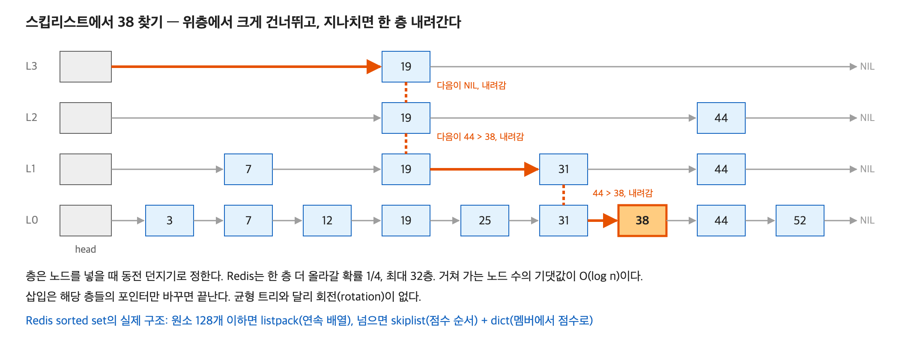
*그림 4-1. 위층에서 크게 건너뛰다가, 목표를 지나칠 것 같으면 한 층 내려간다*

**38 찾기**
1. L3에서 시작해 19로 이동(19 < 38). 다음은 끝이므로 한 층 내려감.
2. L2: 19 다음은 44(44 > 38, 지나침) → 한 층 내려감.
3. L1: 19 다음 31로 이동(31 < 38). 31 다음은 44(지나침) → 한 층 내려감.
4. L0: 31 다음 38. 찾았다.

고속도로로 크게 가다가, 목적지를 지나칠 것 같으면 국도로, 그다음 골목길로 내려가는 것과 같습니다.

### 4.3 층수는 동전 던지기로 정한다

새 노드를 넣을 때 몇 층까지 올라갈지를 **확률로** 정합니다. Redis는 한 층 더 올라갈 확률이 **1/4**이고 최대 32층입니다. 위로 갈수록 노드가 약 1/4씩 줄어서, 검색할 때 거치는 노드 수의 **기댓값이 O(log n)** 이 됩니다.

삽입은 해당 층들에서 앞뒤 포인터만 바꾸면 끝납니다. 균형 트리처럼 **회전으로 균형을 다시 맞출 필요가 없습니다.** 균형은 확률이 맞춰 줍니다.

### 4.4 Redis가 균형 트리 대신 스킵리스트를 고른 이유

Redis 개발자 antirez는 세 가지를 들었습니다.

1. **범위 조회가 자연스럽다.** 맨 아래층이 그냥 정렬된 연결 리스트라, 시작점을 찾은 뒤 옆으로 따라가면 범위 조회가 끝납니다. 트리라면 중위 순회를 해야 합니다.
2. **메모리를 조절할 수 있다.** p = 1/4이면 노드당 앞 포인터는 평균 1/(1−p) ≈ 1.33개입니다. 균형 트리는 노드마다 자식 포인터 2개가 필요합니다.
3. **구현과 확장이 단순하다.** 특히 순위 계산이 그렇습니다. Redis는 포인터마다 "이 포인터로 건너뛰면 노드 몇 개를 지나는지(span)"를 적어 두고, 검색 경로의 span을 더하는 것만으로 순위를 O(log n)에 계산합니다.

```text
L1: head ─(span 2)→ 7 ─(span 2)→ 19 ─(span 2)→ 31
L0: head → 3 → 7 → 12 → 19 → 25 → 31
31의 순위 = 지나온 span의 합 = 2 + 2 + 2 = 6  (3, 7, 12, 19, 25, 31 중 6번째)
```

### 4.5 실제 Redis sorted set: 1부의 종합

실제 Redis sorted set을 열어 보면 1부에서 본 것이 모두 들어 있습니다.

| 크기 | 내부 구조 | 담당 | 연결되는 장 |
|---|---|---|---|
| 작을 때 (원소 128개 이하, 값 64바이트 이하) | **listpack** (연속 메모리 배열) | 모든 연산을 선형 탐색 O(n) | 1장 |
| 클 때 | **dict** (해시테이블) | 멤버 → 점수, `ZSCORE` O(1) | 2장 |
| 클 때 | **skiplist** | 점수 순서, `ZRANGE`·`ZRANK` O(log n) | 4장 |

원소가 적을 때 스킵리스트조차 쓰지 않는 이유는 1장의 결론 그대로입니다. 원소가 적으면 **연속 메모리를 훑는 O(n)이 포인터를 따라가는 O(log n)보다 빠르고 작습니다.** (Redis 7.0 이전에는 listpack 대신 ziplist였습니다. 기준값은 `zset-max-listpack-entries`, `zset-max-listpack-value` 설정입니다.)

원소가 많아지면 한 자료구조로 모든 연산을 해결하려 하지 않고, **연산마다 맞는 구조를 둘 다** 둡니다. 메모리를 조금 더 쓰는 대신 모든 연산이 빨라집니다.

> **4장 정리:** 스킵리스트는 동전 던지기로 층을 쌓아 회전 없이 O(log n)을 얻고, 범위·순위 조회가 쉽다. 복잡도가 같을 때 선택은 구현의 단순함, 범위 조회, 메모리 배치 같은 빅오 밖의 기준으로 갈린다. 이 스킵리스트는 5장 LSM 트리의 memtable로 다시 나온다.

📎 1차 자료: William Pugh, "Skip Lists: A Probabilistic Alternative to Balanced Trees", CACM 1990 / [Redis `t_zset.c`](https://github.com/redis/redis/blob/unstable/src/t_zset.c) / [Redis docs: Sorted sets](https://redis.io/docs/latest/develop/data-types/sorted-sets/) / antirez의 Hacker News 답변(2010)

---

# 2부. 디스크 위의 저장 엔진

## 5장. B-tree vs LSM 트리: 디스크에서 무엇을 내주는가

> **앞 장에서 이어지는 질문:** 지금까지는 데이터가 모두 메모리에 있었다. 하지만 DB의 데이터는 수백 GB, 수 TB라 메모리에 다 들어가지 않는다. 정렬된 데이터를 **디스크에** 어떻게 둘까?

이 장은 이 글에서 가장 어렵습니다. 그래서 결론부터 보고, 한 단계씩 쌓아 올리겠습니다.

> **결론 미리 보기**
> - **B-tree**: 데이터를 정해진 자리에 두고, **그 자리를 고쳐 쓴다.** 찾기는 빠르지만 쓰기가 디스크 곳곳에 흩어진다.
> - **LSM 트리**: 고쳐 쓰지 않고, 새로 들어온 것을 **메모리에 모았다가 한꺼번에 순서대로 새 파일로 쓴다.** 쓰기는 빠르지만 찾을 때 여러 파일을 뒤져야 하고, 나중에 파일을 합치는 정리 작업이 필요하다.
> - 둘 다 O(log n)이지만, **읽기를 싸게 할지 쓰기를 싸게 할지** 서로 반대 선택을 했다.

### 5.1 디스크로 내려가면 무엇이 달라지나

**① 훨씬 느리다.** 메모리(100ns)보다 SSD(수십 µs)는 수백 배, HDD(수 ms)는 수만 배 느립니다. 그래서 디스크 위의 자료구조에서는 CPU 계산 시간은 거의 무시되고, **디스크에 몇 번 가느냐**가 성능을 정합니다.

**② 페이지 단위로 읽고 쓴다.** 디스크는 1바이트씩 다루지 않고 **페이지**라는 덩어리 단위로 읽고 씁니다. PostgreSQL은 **8KB**, MySQL InnoDB는 16KB입니다. 1바이트만 필요해도 8KB를 읽고, 1바이트만 바꿔도 8KB를 다시 씁니다.

> 1장의 캐시 라인(64바이트)과 같은 아이디어입니다. **전송 단위만 64바이트에서 8KB로 커졌을 뿐**입니다.

**③ 흩어진 곳을 오가는 것이 이어진 곳을 쭉 가는 것보다 훨씬 비싸다.**

- **순차 I/O**: 이어진 위치를 쭉 읽거나 씀. 책을 1쪽부터 차례로 읽는 것.
- **랜덤 I/O**: 흩어진 위치를 오감. 3쪽, 271쪽, 58쪽, 190쪽을 번갈아 펼치는 것.

HDD는 원판 위의 헤드가 물리적으로 움직여야 해서, 랜덤 I/O 한 번에 수 ms가 듭니다. SSD는 움직이는 부품은 없지만, 내부적으로 큰 블록 단위로 지우고 써야 해서 작은 랜덤 쓰기가 많으면 내부 정리 작업이 늘고 수명도 빨리 닳습니다. 그래서 **SSD에서도 순차 쓰기가 유리합니다.**

그래서 디스크 위 자료구조의 원칙은 1장과 같습니다. **"한 번 갈 때 최대한 많이, 최대한 순서대로."**

### 5.2 풀어야 할 문제를 정확히 정하기

예를 들어 회원 1억 명(행 하나 약 100바이트, 총 약 10GB)의 테이블이 있다고 합시다. 저장 엔진은 다음 세 가지를 잘해야 합니다.

1. **키로 찾기**: `WHERE id = 42`
2. **범위 조회**: `WHERE id BETWEEN 1000 AND 2000`
3. **쓰기**: 새 행 넣기, 기존 행 고치기, 지우기

B-tree와 LSM을 바로 보기 전에, 단순한 방법 두 가지가 왜 실패하는지 먼저 보겠습니다. 실패 이유가 곧 두 구조가 해결하려는 문제입니다.

**실패한 시도 1: 정렬된 파일 하나 (디스크 위의 `ArrayList`)**

모든 행을 id 순으로 정렬해 파일 하나에 씁니다.

- 찾기: 이진 탐색으로 log₂(파일의 페이지 수)번. 10GB ÷ 8KB ≈ 125만 페이지라 약 **20번의 랜덤 읽기**. 느리지만 견딜 만합니다.
- 범위 조회: 시작점을 찾으면 쭉 순차로 읽으면 되니 좋습니다.
- **쓰기: 최악입니다.** 중간에 행 하나를 넣으려면 그 뒤를 전부 밀어야 하니 **파일의 절반(5GB)을 다시 써야** 합니다. 1장의 `ArrayList`가 디스크에서는 감당이 안 됩니다.

**실패한 시도 2: 이진 탐색 트리를 디스크에 (디스크 위의 `TreeMap`)**

노드 하나에 키 하나를 담는 이진 트리를 디스크에 둡니다.

- 쓰기: 노드 하나만 고치면 되니 정렬된 파일보다 훨씬 낫습니다.
- **찾기가 느립니다.** 1억 개면 높이가 log₂(1억) ≈ **27**입니다. 노드마다 디스크 어디에 있을지 모르니 **27번의 랜덤 읽기**입니다. HDD라면 한 번 찾는 데 수백 ms가 걸립니다.
- 게다가 노드 하나(수십 바이트)를 읽으려고 8KB 페이지를 통째로 읽습니다. 나머지 8KB는 버립니다.

두 실패에서 과제가 분명해집니다.
- 이진 트리는 **높이가 너무 높고**, 페이지를 **낭비**한다. → B-tree가 해결
- 정렬된 파일은 **중간에 끼워 넣기**가 너무 비싸다. → LSM이 "끼워 넣지 말자"로 해결

### 5.3 B-tree: 노드 하나를 페이지 하나로

**아이디어:** 이진 트리의 노드에 키를 하나만 넣지 말고, **노드 하나를 디스크 페이지 하나(8KB)로 만들어 키를 수백 개** 넣습니다. 그러면 한 노드에서 갈라지는 가지도 수백 개가 됩니다. 이 가지 수를 **팬아웃**이라고 합니다.

**팬아웃 계산:** 키가 8바이트이고 자식 페이지 주소도 약 8바이트라면, 8KB 페이지 하나에 약 500쌍이 들어갑니다.

| 높이 | 담을 수 있는 키 수 (팬아웃 500) |
|---|---|
| 1 | 500 |
| 2 | 500 × 500 = 25만 |
| 3 | 500³ = 1억 2,500만 |
| 4 | 500⁴ = 625억 |

**1억 행이 높이 3~4에 들어갑니다.** 이진 트리의 27과 비교해 보세요. 가지를 2개에서 500개로 늘리니 높이가 확 줄었습니다.

**B-tree의 모양**

```text
                     [루트 페이지]
                ┌── 1~1000만 / 1000만~2000만 / … ──┐
                ↓                                   ↓
          [내부 페이지]                         [내부 페이지]
       ┌── 1~2만 / 2만~4만 / … ──┐                    …
       ↓                         ↓
   [리프 페이지]  ⇄  [리프 페이지]  ⇄  [리프 페이지]  ⇄ …
   id 1~40의 행      id 41~80의 행      id 81~120의 행
```

- **루트와 내부 페이지**: 이정표입니다. "이 키 범위는 저 아래 페이지로 가라"는 정보만 담습니다. 도서관의 "000~099 총류는 1층, 100~199 철학은 2층" 안내판과 같습니다.
- **리프 페이지**: 실제 데이터(또는 데이터 위치)가 키 순서로 들어 있습니다.
- **리프끼리는 옆으로 연결**되어 있습니다.

> 엄밀히는 리프에만 데이터를 두고 리프를 연결한 변형을 **B+tree**라고 부릅니다. 실제 DB가 쓰는 것은 대부분 B+tree이고, 이 글에서는 통틀어 B-tree라고 부릅니다.

**찾기: `WHERE id = 42`를 따라가 보기**

```text
1. 루트 페이지를 읽는다 → "42는 1~1000만 구간, 왼쪽 자식으로"
2. 내부 페이지를 읽는다 → "42는 1~2만 구간, 이 리프로"
3. 리프 페이지를 읽는다 → 페이지 안에서 id 42 행을 찾는다
```

페이지 3번이면 끝납니다. 게다가 루트와 내부 페이지는 모든 검색이 지나가므로 늘 **버퍼 풀**(DB가 디스크 페이지를 메모리에 캐싱해 두는 공간)에 올라와 있습니다. 1억 행 테이블의 루트와 내부 페이지는 수 MB에서 수백 MB 정도라 메모리에 넉넉히 들어갑니다. 그래서 **실제 디스크 읽기는 리프 1번, 많아야 2번**입니다.

**범위 조회: `WHERE id BETWEEN 1000 AND 2000`**

id 1000이 있는 리프를 위 방법으로 찾은 뒤, **옆으로 연결된 리프를 따라 쭉 읽습니다.** 키 순서대로 이어진 리프를 읽으니 효율적입니다.

**1장과의 연결:** 캐시 라인 64바이트를 꽉 채워 쓰던 `ArrayList`처럼, B-tree는 **디스크 페이지 8KB를 꽉 채워** 씁니다. 한 번 갈 때 최대한 많이 가져오는 원리를 디스크 크기로 적용한 것입니다.

### 5.4 B-tree의 쓰기: 제자리에서 고친다

B-tree는 각 키가 들어갈 **자리가 정해져 있습니다.** id 42는 반드시 "41~80 리프"에 있어야 합니다. 그래서 쓰기는 이렇게 됩니다.

**행 수정: `UPDATE ... WHERE id = 42`**

```text
1. 위의 찾기 과정으로 id 42가 든 리프 페이지를 찾는다
2. 그 페이지를 메모리(버퍼 풀)에서 고친다
3. 나중에 그 8KB 페이지 전체를 디스크의 원래 자리에 다시 쓴다
```

이것을 **제자리 수정(in-place update)** 이라고 합니다. 두 가지 비용이 생깁니다.

- **작은 수정에도 페이지 전체를 쓴다.** 100바이트 행 하나를 고쳐도 8KB를 씁니다. 논리적으로 100바이트를 바꿨는데 실제로는 약 80배를 쓴 셈입니다. (같은 페이지의 여러 수정이 버퍼 풀에서 모였다가 한 번에 쓰이면 이 배율은 줄어듭니다.)
- **쓰기가 디스크 곳곳에 흩어진다.** id 42, 9천만, 3만, 7천만을 차례로 고치면 서로 다른 리프 4개를 고쳐야 합니다. 그 리프들은 디스크 여기저기에 있으니 **랜덤 쓰기**가 됩니다.

> 3번의 "나중에"를 커밋 이후로 미뤄도 데이터가 안전하게 하는 장치가 6장의 WAL입니다. 하지만 미룬다고 랜덤 쓰기가 사라지지는 않습니다. 결국 언젠가는 그 자리에 써야 합니다.

**새 행 삽입과 페이지 분할**

리프 페이지에 빈자리가 있으면 그 자리에 끼워 넣습니다. **리프가 꽉 차 있으면 분할(split)** 합니다.

```text
삽입 전: [리프: 41 42 43 … 80] (꽉 참) 에 55를 넣어야 함
분할 후: [리프: 41 … 60] ⇄ [새 리프: 61 … 80]  (각각 반쯤 참)
         그리고 위 내부 페이지에 "61부터는 새 리프로"라는 이정표 추가
```

분할은 페이지 2~3개를 새로 써야 하는 비싼 작업이고, 분할된 페이지는 반쯤 비어 있어 공간도 낭비합니다.

**실무 포인트: 기본 키를 무엇으로 하느냐가 쓰기 성능을 바꾼다**

MySQL InnoDB는 테이블 자체가 기본 키 순서의 B+tree입니다. 그래서 기본 키 선택이 쓰기 패턴을 정합니다.

| 기본 키 | 새 행이 들어가는 위치 | 결과 |
|---|---|---|
| `AUTO_INCREMENT` (1, 2, 3, …) | 항상 **맨 오른쪽 리프** | 같은 페이지에 차곡차곡 쌓임. 그 페이지는 버퍼 풀에 있어 디스크 쓰기가 모임. 분할도 끝에서만 일어나고 페이지가 꽉 참 |
| 무작위 UUID | **아무 리프**에나 | 매번 다른 페이지를 건드려 랜덤 쓰기, 중간 분할이 잦고 페이지가 반쯤 비어 공간 낭비 |

같은 B-tree라도 키가 들어오는 순서에 따라 쓰기 비용이 크게 달라집니다. 백엔드에서 "UUID를 기본 키로 쓰면 느려진다"는 말의 이유가 이것입니다. (UUID가 꼭 필요하면 시간순으로 증가하는 UUIDv7 같은 방식을 씁니다.)

> **PostgreSQL은 조금 다릅니다.** PostgreSQL의 테이블 자체는 B-tree가 아니라 **힙**(순서 없이 빈 곳에 쌓는 구조)이고, UPDATE도 옛 행을 덮어쓰지 않고 새 버전을 씁니다(MVCC). PostgreSQL에서 B-tree인 것은 **인덱스**입니다. 다만 인덱스 페이지를 그 자리에서 고치고 랜덤 쓰기가 생긴다는 점은 같습니다. 그래서 이 글에서는 "제자리 수정 B-tree"의 대표 예로 InnoDB를 듭니다.

### 5.5 LSM 트리: "끼워 넣지 말고, 모았다가 새로 쓰자"

**발상의 전환**

정렬된 파일(시도 1)이 실패한 이유는 **이미 쓴 파일 중간에 끼워 넣으려 했기** 때문입니다. B-tree는 페이지를 나눠서 그 비용을 줄였지만, 여전히 정해진 자리를 고칩니다.

LSM 트리(Log-Structured Merge-tree)는 이렇게 생각합니다.

> **"이미 쓴 파일은 절대 고치지 말자. 새로 들어온 것은 메모리에 모아서 정렬한 다음, 새 파일로 한꺼번에 쓰자. 파일이 많아지면 나중에 합치자."**

**LSM의 세 부품**

| 부품 | 위치 | 하는 일 |
|---|---|---|
| **memtable** | 메모리 | 새 쓰기를 모으는 정렬된 구조. RocksDB의 기본은 **4장의 스킵리스트** |
| **SSTable** | 디스크 | memtable을 정렬된 그대로 쓴 파일. **한 번 쓰면 절대 수정하지 않음**(불변) |
| **컴팩션** | 백그라운드 작업 | SSTable 여러 개를 병합 정렬해 하나로 합치고, 옛 버전과 삭제된 데이터를 정리 |

> 비유: 우편함. 편지가 올 때마다 서랍장(디스크)의 정해진 칸을 찾아가 끼워 넣는 대신(B-tree), 일단 책상 위 바구니(memtable)에 받아 둡니다. 바구니가 차면 주소순으로 정렬해 묶음 하나로 서랍에 넣습니다(SSTable). 묶음이 많아지면 주말에 묶음들을 합쳐 다시 정리합니다(컴팩션).

### 5.6 LSM의 쓰기를 한 단계씩 따라가기

키 순서와 상관없이 다음 쓰기가 들어온다고 합시다: `42=A`, `7=B`, `99=C`, `42=D`(42를 다시 수정), `7` 삭제.

**① 쓰기는 memtable에 넣는다 (메모리, 빠름)**

```text
memtable (스킵리스트, 키 순서로 정렬된 상태 유지)
  7  → (삭제 표시)
  42 → D        ← A는 D로 덮어씀 (메모리 안이라 덮어써도 됨)
  99 → C
```

- 수정은 그냥 새 값으로 덮어씁니다. 메모리 안이라 쌉니다.
- **삭제도 지우지 않고 "삭제됨" 표시를 넣습니다.** 이 표시를 **tombstone(묘비)** 이라고 합니다. 디스크의 옛 파일에 7=B가 남아 있을 수 있어서, "7은 삭제됐다"는 사실을 기록해 둬야 하기 때문입니다.
- 크래시 대비로 이 쓰기는 6장의 WAL에도 순차로 기록됩니다.

**② memtable이 차면 SSTable로 내려쓴다 (flush, 순차 쓰기)**

memtable이 정해진 크기(RocksDB 기본 64MB)에 차면, 정렬된 내용을 **처음부터 끝까지 그대로** 디스크에 새 파일로 씁니다.

```text
SSTable #5 (새 파일, 불변):  [7: 삭제] [42: D] [99: C]
```

이미 정렬되어 있으니 그냥 앞에서부터 쭉 쓰면 됩니다. **완전한 순차 쓰기**이고, 기존 파일은 하나도 건드리지 않습니다. 그다음 memtable은 비워서 새 쓰기를 받습니다.

**③ SSTable이 쌓이면 층으로 정리한다**

flush된 파일은 맨 위 층 **L0**에 쌓입니다. 파일이 계속 쌓이면 찾을 때 볼 파일이 늘어나니, 백그라운드에서 컴팩션으로 아래 층에 합쳐 내립니다. 아래 층일수록 약 **10배씩** 커집니다.

```text
메모리:   [memtable]
디스크:   L0: [#5][#4][#3]                 ← flush된 파일들. 키 범위가 서로 겹칠 수 있음
          L1: [1~300][301~600][601~900]    ← 컴팩션 결과. 한 층 안에서는 키 범위가 안 겹침
          L2: L1의 약 10배 …
```

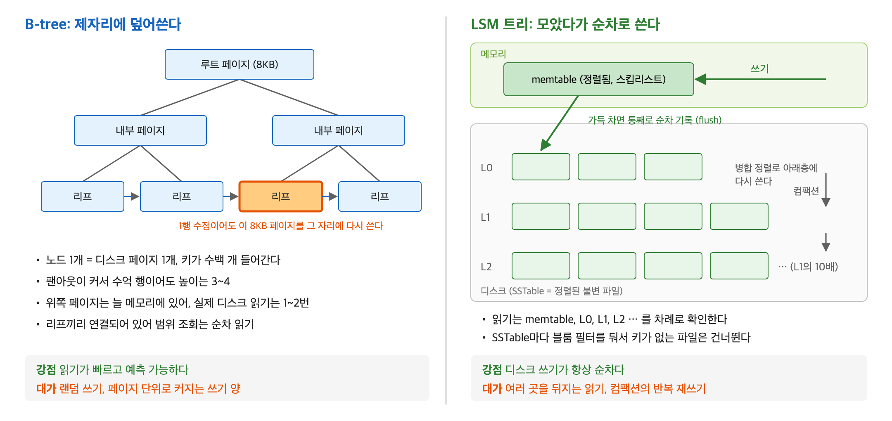
*그림 5-1. B-tree는 정해진 자리에 덮어쓰고, LSM 트리는 메모리에 모았다가 순차로 쓴다*

결과적으로 LSM에서는 **사용자의 쓰기가 디스크에 닿는 모든 경로가 순차 쓰기**입니다. memtable flush도, 컴팩션 결과 쓰기도 새 파일을 앞에서부터 쭉 씁니다. 키가 아무리 무작위로 들어와도 마찬가지입니다. B-tree의 UUID 문제가 LSM에는 없습니다.

### 5.7 LSM의 읽기를 한 단계씩 따라가기

같은 키의 여러 버전이 여러 곳에 있을 수 있으니, **가장 최신인 곳부터** 찾아야 합니다. `id = 42` 조회를 따라가 보겠습니다.

```text
1. memtable을 본다 (메모리)          → 있으면 그게 최신. 끝
2. L0 파일들을 최신 것부터 하나씩 본다 → L0는 파일끼리 키 범위가 겹쳐서 전부 확인해야 함
3. L1에서 42가 들어갈 범위의 파일 하나를 본다 → 한 층 안에서는 안 겹치니 파일 하나만
4. L2, L3 … 도 같은 방식으로 내려가며 본다
5. 처음 발견한 값이 답. tombstone을 먼저 만나면 "삭제됨 = 없음"
```

최신부터 보는 이유: 42를 A로 썼다가 D로 고쳤다면, 옛 파일엔 A가 새 파일엔 D가 있습니다. 새 것을 먼저 만나야 올바른 값 D를 답합니다.

**문제: 없는 키라면 모든 층을 다 뒤져야 합니다.** 여기서 **3장의 블룸 필터**가 다시 나옵니다.

**SSTable마다 블룸 필터를 둡니다.** 파일을 읽기 전에 필터에 먼저 묻고, "이 파일에 42는 확실히 없음"이면 그 파일은 디스크에서 읽지 않고 건너뜁니다. 블룸 필터는 작아서 메모리에 올려 둘 수 있으니, 대부분의 "헛걸음"이 메모리 안에서 끝납니다. 각 파일 안에서도 작은 인덱스로 어느 블록에 키가 있는지 찾아 그 블록만 읽습니다.

**범위 조회는 더 복잡합니다.** `id BETWEEN 1000 AND 2000`이라면, memtable과 모든 층에 흩어진 해당 범위를 **동시에 읽으며 합쳐야**(병합) 합니다. 같은 키가 여러 층에 있으면 최신 것만 남기면서요. B-tree가 리프를 옆으로 쭉 읽는 것보다 할 일이 많습니다.

### 5.8 컴팩션: 나중에 치르는 정리 비용

컴팩션은 정렬된 파일 여러 개를 **병합 정렬**로 합칩니다. 둘 다 이미 정렬되어 있으니 앞에서부터 하나씩 비교하며 내려가면 됩니다.

```text
위 층 파일 (최신):   [7: 삭제] [42: D] [99: C]
아래 층 파일 (옛):   [3: X] [7: B] [42: A] [50: Y]
                         ↓ 병합 (같은 키는 최신만 남김)
새 파일:             [3: X] [42: D] [50: Y] [99: C]
```

- 42는 최신값 D만 남고 옛 값 A는 버려집니다.
- 7은 tombstone이 옛 값 B를 지웁니다. 더 아래 층에 7의 옛 버전이 없다면 tombstone도 버립니다.
- 결과는 새 파일로 **순차로** 씁니다. 원래 파일들은 다 쓰고 나면 지웁니다.

컴팩션은 세 가지를 합니다. 파일 수를 줄여 **읽기를 빠르게** 하고, 옛 버전과 삭제된 데이터를 지워 **공간을 되찾고**, 층 구조를 유지합니다. 대신 **같은 데이터를 층을 내려갈 때마다 다시 씁니다.** 한 번 들어온 데이터가 L0, L1, L2, …로 내려가며 여러 번 디스크에 쓰입니다.

### 5.9 같은 쓰기 하나를 두 엔진에서 나란히 보기

"회원 42의 이름 변경" 하나를 두 엔진에서 처리하면 다음과 같습니다.

| 단계 | B-tree (InnoDB) | LSM 트리 (RocksDB) |
|---|---|---|
| 커밋 시점 | 리프 페이지를 찾아 버퍼 풀에서 수정, WAL 기록 | memtable에 넣고 WAL 기록 |
| 디스크에 실제로 쓰는 시점 | 나중에, 그 페이지를 원래 자리에 | memtable이 찰 때 새 파일로, 이후 컴팩션 때마다 또 |
| 디스크 쓰기의 모양 | **랜덤** (페이지마다 다른 위치) | **순차** (항상 새 파일을 앞에서부터) |
| 옛 값 | 덮어써서 사라짐 | 옛 파일에 남았다가 컴팩션 때 정리 |

그리고 "회원 42 조회"는 이렇게 다릅니다.

| | B-tree | LSM 트리 |
|---|---|---|
| 보는 곳 | 루트 → 내부 → 리프, 한 경로 | memtable, L0 파일들, 각 층의 파일 하나씩 |
| 디스크 읽기 | 대개 리프 1번 | 블룸 필터로 대부분 건너뛰지만, 여러 번이 될 수 있음 |

### 5.10 세 가지 증폭으로 비교하기

디스크 자료구조는 **증폭(amplification)**, 즉 "논리적으로 필요한 양보다 실제로 몇 배 일하느냐"로 비교합니다.

| 증폭 | 뜻 | B-tree | LSM 트리 |
|---|---|---|---|
| **읽기 증폭** | 1건 읽을 때 실제로 읽는 페이지·파일 수 | **작다**. 한 경로, 위쪽은 메모리 | **크다**. 여러 층을 확인. 블룸 필터로 완화 |
| **쓰기 증폭** | 1바이트 쓸 때 디스크에 실제로 쓰는 바이트 | **크다**. 작은 수정에도 페이지 전체(+ 6장의 full page write) | **크다**. 컴팩션이 층마다 다시 씀 |
| **공간 증폭** | 실제 데이터 대비 디스크 사용량 | 분할로 반쯤 빈 페이지 | 아직 정리 안 된 옛 버전·tombstone |

쓰기 증폭 칸이 둘 다 "크다"인 데 주목하세요. 이것이 가장 헷갈리는 부분입니다.

> **"LSM은 쓰기에 강하다"의 정확한 뜻**
> LSM이 줄인 것은 쓰기의 **총량**이 아니라 **랜덤 쓰기**입니다. 컴팩션 때문에 디스크에 쓰는 총 바이트는 B-tree보다 많을 수도 있습니다. 그런데도 "쓰기에 강하다"고 하는 이유는, 모든 쓰기가 순차라서 같은 디스크로 **초당 처리할 수 있는 쓰기가 많고 응답이 빠르기** 때문입니다. 총량이 많은 대가는 SSD 수명 소모와 백그라운드 I/O입니다.

### 5.11 RUM 추측: 셋 다 좋게 만들 수는 없다

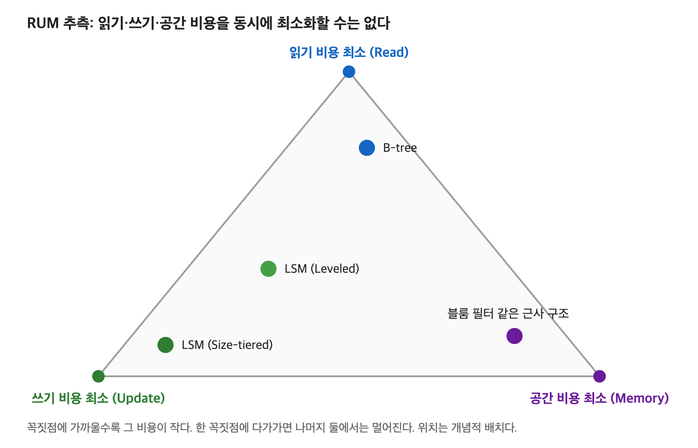
*그림 5-2. RUM 추측. 한 꼭짓점에 다가가면 나머지 둘에서는 멀어진다*

2016년 논문의 **RUM 추측**은 읽기(Read), 쓰기(Update), 공간(Memory) 비용 셋을 **동시에 최소화하는 자료구조는 없다**고 정리합니다. B-tree는 읽기 꼭짓점 가까이에, LSM은 쓰기 꼭짓점 가까이에 있습니다.

LSM 안에서도 컴팩션을 얼마나 부지런히 하느냐에 따라 위치가 움직입니다.

| 전략 | 방식 | 결과 | 대표 |
|---|---|---|---|
| **Leveled** | 층마다 파일을 적극적으로 합쳐 키 범위가 안 겹치게 유지 | 쓰기를 더 하는 대신 읽기와 공간을 아낌 | RocksDB 기본 |
| **Size-tiered** | 비슷한 크기의 파일이 몇 개 모이면 그때 합침 | 쓰기를 아끼는 대신 읽기와 공간을 더 씀 | Cassandra의 전통적 기본 |

### 5.12 그래서 무엇을 고르나

저장 엔진을 고르는 것은 **우리 워크로드가 어떤 증폭을 견딜 수 있는지** 고르는 일입니다.

| 상황 | 선택 | 이유 |
|---|---|---|
| 읽기가 많고 트랜잭션·범위 조회가 중요한 일반 웹 서비스 | **B-tree 계열 RDB** (MySQL, PostgreSQL) | 읽기가 예측 가능하게 빠르고, 범위 조회가 단순 |
| 로그, 이벤트, 시계열, IoT 센서처럼 쓰기가 압도적이고 조회 패턴이 단순 | **LSM 계열** (RocksDB, Cassandra) | 무작위로 들어오는 대량 쓰기를 순차로 받아냄 |

LSM을 고르면 **컴팩션이 몰릴 때 응답 시간이 튀는 것**까지 감수해야 합니다. B-tree를 고르면 기본 키를 순차적으로 설계해 랜덤 쓰기를 줄이는 것이 중요합니다.

> **5장 정리:** 디스크에서는 "몇 번, 어떤 순서로 가느냐"가 전부다. B-tree는 노드를 페이지 크기로 만들어 높이 3~4로 읽기를 빠르게 하고, 그 대가로 정해진 자리를 고치는 랜덤 쓰기를 받아들였다. LSM은 고치지 않고 모았다가 새로 쓰는 방식으로 모든 쓰기를 순차로 만들고, 그 대가로 여러 파일을 뒤지는 읽기와 컴팩션을 받아들였다. LSM 안에는 1부의 스킵리스트(memtable)와 블룸 필터(파일 건너뛰기)가 들어 있다.

📎 1차 자료: [PostgreSQL 16 docs: B-Tree Indexes](https://www.postgresql.org/docs/16/btree.html) / [MySQL 8.0 docs: Clustered and Secondary Indexes](https://dev.mysql.com/doc/refman/8.0/en/innodb-index-types.html) / P. O'Neil et al., "The Log-Structured Merge-Tree (LSM-Tree)", Acta Informatica 1996 / M. Athanassoulis et al., "Designing Access Methods: The RUM Conjecture", EDBT 2016 / [RocksDB Wiki: Leveled Compaction](https://github.com/facebook/rocksdb/wiki/Leveled-Compaction)

---

## 6장. WAL: 메모리에 든 변경을 크래시에서 지키기

> **앞 장에서 이어지는 질문:** B-tree는 바뀐 페이지를 버퍼 풀에 들고 있다가 나중에 쓰고, LSM은 memtable이 찰 때까지 디스크에 쓰지 않는다. 둘 다 변경을 메모리에 들고 있다. 그 상태에서 전원이 꺼지면?

### 6.1 문제: 내구성과 속도가 부딪힌다

DB가 "커밋 성공"이라고 응답한 데이터는 그 직후 서버가 꺼져도 **반드시 남아 있어야** 합니다. 이를 **내구성(Durability)** 이라고 하고, 트랜잭션의 네 성질 ACID의 D입니다.

가장 단순한 방법은 커밋할 때마다 바뀐 페이지를 전부 디스크에 쓰는 것입니다. 하지만 한 트랜잭션이 페이지 A, C, B를 고쳤다면, 그 페이지들은 디스크 곳곳에 흩어져 있으니 커밋마다 **랜덤 쓰기 여러 번**이 생깁니다. 5장에서 피하려던 바로 그 비용입니다.

### 6.2 해결: 로그를 먼저, 순서대로 쓴다

**WAL(Write-Ahead Log)** 의 규칙은 한 줄입니다.

> **데이터 페이지를 디스크에 쓰기 전에, 그 변경을 기록한 로그를 먼저 디스크에 쓴다.**

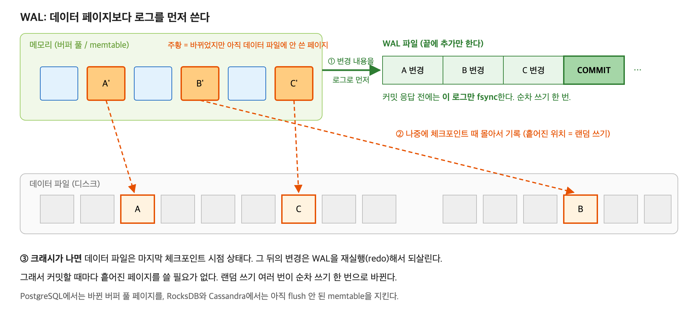
*그림 6-1. 커밋할 때는 로그만 순차로 쓰고, 흩어진 데이터 페이지는 나중에 몰아서 쓴다*

1. 변경이 생기면 "무엇을 어떻게 바꿨는지"를 로그 파일 **끝에 추가**합니다. 끝에 붙이기만 하므로 순차 쓰기입니다.
2. 커밋할 때는 **이 로그만 `fsync`** 해서 디스크에 확실히 내려간 것을 확인하고 응답합니다.
3. 실제 데이터 페이지는 메모리에 둔 채, 나중에 **체크포인트** 때 몰아서 씁니다.
4. 크래시가 나면 데이터 파일은 마지막 체크포인트 시점 상태로 남아 있습니다. 그 뒤의 변경은 WAL을 다시 실행(**redo**)해서 되살립니다.

> **fsync:** 운영체제는 "디스크에 써라"는 요청을 받아도 성능을 위해 잠시 메모리에 모아 뒀다가 씁니다. `fsync`는 "지금 진짜로 디스크에 내려보내고, 끝나면 알려 달라"는 명령입니다. 이걸 해야 전원이 꺼져도 안전합니다.
> **체크포인트:** 메모리에 쌓인 바뀐 페이지들을 데이터 파일에 실제로 반영하는 시점입니다. 체크포인트 이전의 로그는 복구에 더 이상 필요 없습니다.

> 비유: 가게 장부. 물건이 팔릴 때마다 창고의 재고 카드(데이터 페이지)를 찾아다니며 고치면 느립니다. 대신 계산대 일지(로그)의 맨 아랫줄에 "사과 3개 판매"라고 적고 손님을 보냅니다. 재고 카드는 문 닫을 때(체크포인트) 일지를 보고 한꺼번에 고칩니다. 중간에 정전이 나도 일지만 있으면 재고를 복구할 수 있습니다.

### 6.3 결과: 랜덤 쓰기 여러 번을 순차 쓰기 한 번으로

```text
WAL 없이:  커밋마다 흩어진 페이지 랜덤 쓰기 여러 번
WAL 사용:  커밋마다 로그 끝에 순차 쓰기 한 번 (페이지는 나중에 몰아서)
```

5장의 LSM 트리가 **저장 구조 전체**에 적용한 "모았다가 순차로" 아이디어를, B-tree 엔진은 **내구성을 위한 로그**에 적용한 것입니다. 그래서 PostgreSQL(WAL), MySQL InnoDB(redo log), RocksDB(WAL), Cassandra(commit log) 모두 WAL을 둡니다. LSM 엔진의 WAL은 아직 flush되지 않은 memtable을 지킵니다.

> **"WAL은 같은 내용을 두 번 쓰니 느리다"는 오해:** 사용자가 기다리는 커밋 경로에서는 로그 순차 쓰기 한 번만 합니다. 데이터 파일 쓰기는 사용자가 기다리지 않는 나중에 몰아서 합니다. 커밋은 오히려 빨라집니다.

### 6.4 WAL에도 비용은 있다: full_page_writes

PostgreSQL은 체크포인트 이후 어떤 페이지를 **처음 수정할 때, 그 페이지 전체(8KB)를 WAL에 기록**합니다(`full_page_writes`).

8KB 페이지를 디스크에 쓰는 도중 전원이 꺼지면, 앞부분은 새 내용이고 뒷부분은 옛 내용인 **찢어진 페이지(torn page)** 가 생길 수 있습니다. 로그에 "이 행을 이렇게 바꿈"만 있으면 망가진 페이지 위에서는 복구할 수 없습니다. 페이지 전체 사본이 로그에 있어야 그것으로 덮고 다시 시작할 수 있습니다.

- 체크포인트 직후 WAL 양이 급증하는 이유이고, 5장에서 본 B-tree 쓰기 증폭의 한 원인입니다.
- 체크포인트를 자주 하면 복구는 빨라지지만(다시 실행할 로그가 짧으니) 이 전체 페이지 기록이 늘어납니다.

> **6장 정리:** WAL은 "데이터보다 로그를 먼저, 순차로" 쓰는 규칙이다. 커밋할 때 로그만 fsync하면 되므로, 흩어진 페이지의 랜덤 쓰기 여러 번이 순차 쓰기 한 번으로 바뀐다. 블룸 필터가 느린 곳에 가는 **읽기**를 생략하게 해 준다면, WAL은 느린 곳에 가는 **쓰기**를 가장 싼 형태로 바꿔 준다.

📎 1차 자료: [PostgreSQL 16 docs: Reliability and the Write-Ahead Log](https://www.postgresql.org/docs/16/wal-intro.html) / [RocksDB Wiki: Write Ahead Log](https://github.com/facebook/rocksdb/wiki/Write-Ahead-Log)

---

## 7장. 정리: 여섯 개의 자료구조를 한 번에

### 7.1 이야기의 흐름

```text
[들어가며] 교과서는 LinkedList가 빠르다는데, 실측은 ArrayList가 18배 빠르다
① 캐시 지역성   붙어 있으면 한꺼번에, 흩어져 있으면 한 걸음씩 기다린다
                  ↓ 흩어진 노드 따라가기는 비싸다. 해시 충돌 체인도 작은 연결 리스트다
② 해시테이블     줄을 짧게 지키는 리사이징, 한 칸에 몰릴 때의 트리화
                  ↓ 해시를 여러 개 쓰고 비트만 남기면 없는 키를 거를 수 있다
③ 블룸 필터      "확실히 없음"으로 DB를 지킨다 (실측: DB 조회 89% 감소)
                  ↓ 해시는 순서를 버린다. 순서가 필요하면?
④ 스킵리스트     Redis 랭킹. 작으면 연속 배열(①), 크면 해시(②) + 스킵리스트(④)
                  ↓ 데이터가 메모리를 넘으면 디스크로
⑤ B-tree vs LSM  읽기 우선 vs 쓰기 우선. LSM은 스킵리스트(④)와 블룸 필터(③)를 쓴다
                  ↓ 둘 다 변경을 메모리에 들고 있다. 서버가 죽으면?
⑥ WAL            로그를 먼저 순차로 써서 내구성과 속도를 같이 얻는다
```

### 7.2 반복해서 나오는 세 가지 아이디어

| 아이디어 | 메모리에서 | 디스크에서 |
|---|---|---|
| **붙여 놓고 묶어서 가져와라** | 캐시 라인 64B를 꽉 채우는 `ArrayList`, listpack | 페이지 8KB를 꽉 채우는 B-tree 노드 |
| **갈 필요가 없으면 가지 마라** | CPU 캐시, Redis 캐시, 블룸 필터 | 버퍼 풀, SSTable마다의 블룸 필터 |
| **흩어진 쓰기를 모아 순서대로 써라** | (`ArrayList`의 한꺼번에 복사) | LSM의 memtable → SSTable, WAL |

### 7.3 한 장 요약

| 자료구조 | 푸는 문제 | 대가 | 실무 포인트 |
|---|---|---|---|
| ArrayList | 연속 메모리로 캐시를 꽉 채운다 | 중간 이동 O(n) | 리스트의 기본값 |
| HashMap | 평균 O(1) 조회 | 리사이징 순간 O(n) | 크기를 알면 초기 용량 지정 |
| 블룸 필터 | 없는 키를 메모리에서 차단 | 거짓 양성, 삭제 불가 | 캐시 관통 방어 (DB 조회 89%↓) |
| 스킵리스트 | 정렬·범위·순위를 O(log n) | 포인터 메모리 | Redis sorted set (+ dict, listpack) |
| B-tree | 페이지 단위로 빠른 읽기 | 랜덤 쓰기, 페이지 분할 | 읽기 위주 RDB. 기본 키는 순차적으로 |
| LSM 트리 | 모든 쓰기를 순차로 | 읽기 증폭, 컴팩션 | 쓰기 폭주 (RocksDB, Cassandra) |
| WAL | 빠른 커밋 + 내구성 | 로그 양, 체크포인트 비용 | 거의 모든 DB의 기본 |

---

## 8장. 흔한 오해 정리

| 흔한 설명 | 실제 | 근거 |
|---|---|---|
| `LinkedList`는 중간 삽입이 O(1)이라 빠르다 | 위치를 찾는 데 O(n)이 걸려 `ArrayList`보다 18배 이상 느리다 | 1장, 실측 A |
| `LinkedList`가 느린 건 매 노드가 캐시 미스라서다 | 순서대로 만든 리스트는 캐시에 맞아도(한 걸음 2.2ns) 기다림의 사슬 때문에 느리다. 캐시 미스는 흩어졌을 때의 이야기 | 1.7절 |
| `HashMap`은 항상 O(1) | 평균일 뿐. 리사이징 순간은 O(n), 최악은 트리화로 O(log n)까지 막을 뿐(키가 `Comparable`일 때) | 2장 |
| 블룸 필터가 "있다"고 하면 있다 | "있을 수도 있다"일 뿐. 확실한 대답은 "없다"뿐 | 3장 |
| null 캐싱이면 캐시 관통은 해결된다 | 같은 없는 키가 반복될 때만. 무작위 키 공격에는 무력 | 실측 B-2 |
| Redis sorted set은 스킵리스트다 | 작을 땐 listpack(연속 배열), 클 땐 skiplist + dict | 4.5절 |
| PostgreSQL 테이블은 B-tree다 | 테이블은 힙 + MVCC. B-tree인 건 인덱스 | 5.4절 |
| LSM은 쓰기 증폭이 적다 | 컴팩션 때문에 더 클 수도 있다. 줄인 것은 **랜덤** 쓰기 | 5.10절 |
| WAL은 쓰기를 두 번 하니 느리다 | 커밋 경로의 랜덤 쓰기를 순차 쓰기로 바꿔 오히려 빠르다 | 6장 |

---

## 9장. 트레이드오프와 반론

**그럼 `LinkedList`는 쓸 데가 없나?** 이터레이터로 위치를 잡아 둔 상태에서 삽입·삭제를 반복한다면 O(1)이 실제로 성립합니다(실측 12ns). 다만 양 끝에서만 넣고 빼는 용도라면 `ArrayDeque`가 대부분 더 빠릅니다.

**`HashMap` 리사이징을 걱정해야 하나?** 평균은 O(1)이어도 리사이징이 일어나는 `put` 한 번은 O(n)입니다. 지연에 민감한 경로에서 큰 맵을 키운다면 초기 용량을 지정해 그 순간을 없앱니다.

**블룸 필터를 붙일 가치가 있나?** 존재하지 않는 키 조회가 드물면 필터를 만들고 갱신하는 비용만 남습니다. 같은 없는 키가 반복된다면 null 캐싱으로 충분합니다. 키가 매번 다른 무작위 공격일 때 블룸 필터가 필요합니다.

**B-tree vs LSM:** 읽기가 많고 트랜잭션과 범위 조회가 중요한 일반 웹 서비스는 B-tree 계열 RDB가 기본값입니다. 쓰기가 압도적이고 조회 패턴이 단순하면 LSM을 검토합니다. 단 LSM은 컴팩션이 몰릴 때 **지연이 튀는 것**까지 감수해야 합니다.

---

## 10장. 예상 질문과 답

**Q1. 원소 수가 아주 커지면 `ArrayList`와 `LinkedList`의 결과가 뒤집히나?**
뒤집히지 않습니다. 둘 다 O(n)이라 노드가 순서대로 놓인 리스트에서는 배율이 거의 일정합니다(1천 개 20.8배, 1만 개 17.8배, 10만 개 17.9배). 격차가 벌어지는 것은 노드가 흩어져 데이터가 캐시를 넘을 때입니다. 뒤집히는 것은 위치를 이미 쥐고 있는 경우뿐입니다.

**Q2. `HashMap` 트리화 기준은 왜 8이고, 64칸 미만이면 왜 하지 않나?**
해시가 고르면 한 칸에 8개가 몰릴 확률은 약 1억분의 6이라, 그 상황은 해시 품질 문제나 공격의 신호로 봅니다. 테이블이 작을 때의 충돌은 칸 부족 탓일 가능성이 커서 리사이징이 먼저입니다.

**Q3. 블룸 필터로 캐시 관통을 막을 때 데이터가 추가되거나 삭제되면?**
추가는 필터에도 넣으면 됩니다. 삭제는 필터에서 지울 수 없지만, 지운 키가 "있을 수도"로 남는 것은 거짓 양성일 뿐이라 DB 조회가 한 번 더 생기는 정도입니다. 삭제가 쌓이면 거짓 양성률이 오르므로 주기적으로 다시 만듭니다.

**Q4. Redis는 왜 균형 트리가 아니라 스킵리스트를 쓰나?**
기대 복잡도는 같은데, 범위 조회가 맨 아래층 순회 그 자체라 자연스럽고, span을 붙여 순위를 계산하는 확장이 단순하기 때문입니다. 원소가 적을 때는 그마저도 쓰지 않고 연속 배열(listpack)을 씁니다.

**Q5. LSM이 쓰기에 강하다면서 쓰기 증폭은 더 클 수 있다는 건 모순 아닌가?**
"쓰기에 강하다"는 것은 랜덤 쓰기를 없애 쓰기 처리량과 지연이 좋다는 뜻입니다. 컴팩션이 같은 데이터를 여러 번 다시 쓰므로 디스크에 쓰는 총 바이트는 클 수 있고, 그 대가가 SSD 수명과 백그라운드 I/O입니다.

**Q6. PostgreSQL은 B-tree DB 아닌가?**
PostgreSQL의 테이블은 힙이고 UPDATE는 MVCC로 새 버전을 씁니다. B-tree인 것은 인덱스입니다. 테이블 자체가 B+tree인 "제자리 수정"의 대표는 MySQL InnoDB입니다.

**Q7. UUID를 기본 키로 쓰면 왜 느려지나?**
InnoDB는 테이블이 기본 키 순서의 B+tree라, 무작위 UUID로 넣으면 새 행이 매번 다른 리프로 갑니다. 랜덤 쓰기와 중간 페이지 분할이 잦아지고 페이지가 반쯤 비어 공간도 낭비됩니다. `AUTO_INCREMENT`처럼 증가하는 키는 항상 맨 오른쪽 리프에 쌓여 이 문제가 없습니다. UUID가 필요하면 시간순으로 증가하는 UUIDv7 같은 방식을 씁니다.

**Q8. LSM에서 없는 키를 찾으면 모든 층을 다 읽나?**
SSTable마다 블룸 필터가 있어서, "확실히 없음"인 파일은 디스크에서 읽지 않고 건너뜁니다. 필터는 메모리에 있으므로 대부분의 헛걸음이 메모리 안에서 끝납니다. 3장의 블룸 필터가 저장 엔진 안에서 쓰이는 모습입니다.

---

## 부록 A. 실측 방법과 재현

### A.1 측정 환경

- Apple M1 (8코어), OrbStack Docker VM (CPU 8, 메모리 4GB)
- Temurin JDK 21.0.12, JMH 1.37, PostgreSQL 16, Redis 7
- 재현: [`E6_data_structures_storage_engines/run_all.sh`](./E6_data_structures_storage_engines/run_all.sh) 한 번으로 빌드와 측정 전체가 Docker 안에서 돈다. 원본 로그는 [`results/`](./E6_data_structures_storage_engines/results)에 있다.
- 코드: [`ListInsertBenchmark.java`](./E6_data_structures_storage_engines/src/main/java/e6/ListInsertBenchmark.java)(실측 A), [`BloomFalsePositive.java`](./E6_data_structures_storage_engines/src/main/java/e6/BloomFalsePositive.java)(실측 B-1), [`CachePenetrationDemo.java`](./E6_data_structures_storage_engines/src/main/java/e6/CachePenetrationDemo.java)(실측 B-2)

### A.2 JMH를 쓴 이유와 용어

`System.nanoTime()`으로 직접 재면 두 가지 함정에 빠집니다. Java는 실행 중에 자주 쓰는 코드를 기계어로 최적화(JIT 컴파일)하므로 처음 몇 번은 느리게 나옵니다. 또 결과를 쓰지 않는 계산은 JVM이 아예 지워 버려 "0초"가 나올 수 있습니다. **JMH(Java Microbenchmark Harness)** 는 이 함정을 피해 줍니다.

| 용어 | 뜻 |
|---|---|
| warmup | 본 측정 전에 미리 돌려 JIT 최적화를 끝내는 단계. 결과는 버림 (5회) |
| iteration | 1초 동안 반복 실행해 평균을 내는 한 회차 (10회) |
| fork | JVM을 새로 띄워 처음부터 다시 재는 것. JVM마다 다른 운을 평균 내기 위함 (3회) |
| avgt | 1회 실행 평균 시간 |
| 표본 30개 | fork 3회 × 측정 10회 |

### A.3 "124 ± 17 ns" 읽는 법

- **124**: 30개 표본의 평균
- **± 17**: 99.9% 신뢰 구간. 진짜 평균이 107~141ns 사이일 가능성이 매우 높다는 뜻

오차가 평균에 비해 작을수록 믿을 만합니다. 12.1 ± 0.9µs(오차 7%)는 믿을 만하지만, 7,125 ± 5,172µs(오차 73%)는 숫자 자체를 믿으면 안 되고 "ms 단위"로만 읽어야 합니다.

### A.4 로그 축 그래프 읽는 법

그림 1-3의 세로축은 로그 축이라 한 칸이 10배입니다.
- **두 선의 세로 간격이 일정하면 배율이 일정하다**는 뜻입니다.
- **기울기가 같으면 빅오가 같다**는 뜻입니다. 크기 10배에 시간 10배(한 칸)면 O(n)입니다.
- 흩어진 LinkedList 선이 더 가파른 것은 데이터가 캐시를 넘으며 한 걸음의 비용 자체가 커졌기 때문입니다.

### A.5 측정의 한계

- 한 대의 노트북(Docker VM)에서 잰 결과입니다. 절댓값은 하드웨어마다 다르고, 배율과 경향을 봐야 합니다.
- 캐시 미스를 하드웨어 성능 카운터로 직접 세지 않았습니다. 캐시에 관한 해석은 시간 측정에서 내린 추정입니다.
- 흩어진 LinkedList 10만 개는 오차가 매우 커서 원인을 확인하지 못했습니다.
- 실측 B-2는 각 방식 1회 측정이고 앱과 DB가 같은 머신이라, 지연 시간은 참고로만 보고 결정적인 DB 조회 수를 근거로 삼았습니다.
- 5장과 6장(B-tree, LSM, WAL)은 실측 없이 공식 문서와 논문에 근거한 설명입니다.

---

## 부록 B. 용어 사전

| 용어 | 뜻 |
|---|---|
| 캐시 히트 / 미스 | 찾는 데이터가 캐시에 있음 / 없어서 느린 곳까지 감 |
| 캐시 라인 | CPU가 메모리에서 한 번에 가져오는 덩어리 (보통 64바이트) |
| 프리페처 | 순차 접근을 보고 다음 데이터를 미리 가져오는 하드웨어 |
| 공간 지역성 | 가까이 붙은 데이터를 이어서 읽는 성질 |
| 의존적 읽기 사슬 | 앞의 값을 읽어야 다음 주소를 알 수 있어 하나씩 기다리는 상황 |
| 버킷 | 해시테이블의 칸 |
| 체이닝 | 충돌한 원소를 같은 칸에 연결 리스트로 줄 세우는 방식 |
| 적재율 | 원소 수 ÷ 칸 수 |
| 분할 상환 (amortized) | 가끔 일어나는 비싼 작업을 전체 횟수로 나눠 본 평균 비용 |
| 레드-블랙 트리 | 색 규칙으로 높이를 O(log n)으로 지키는 균형 이진 탐색 트리 |
| 트리화 | `HashMap`에서 긴 줄을 레드-블랙 트리로 바꾸는 것 |
| hash flooding | 해시가 같은 키를 대량으로 보내 서버를 느리게 만드는 공격 |
| 캐시 어사이드 | 캐시에 먼저 묻고, 없으면 DB에서 가져와 캐시에 넣는 패턴 |
| 캐시 관통 | 없는 키 요청이 캐시를 매번 통과해 DB를 두드리는 현상 |
| 거짓 양성 / 거짓 음성 | 없는데 있다고 함 / 있는데 없다고 함 |
| span | 스킵리스트 포인터가 건너뛰는 노드 수. 순위 계산에 씀 |
| listpack | Redis의 연속 메모리 배열 구조 (구 ziplist) |
| 페이지 | 디스크 읽기·쓰기 단위 (PostgreSQL 8KB, InnoDB 16KB) |
| 랜덤 / 순차 I/O | 흩어진 위치를 오감 / 이어진 위치를 쭉 읽고 씀 |
| 팬아웃 | 트리 노드 하나에서 갈라지는 가지 수 |
| B+tree | 리프에만 데이터를 두고 리프끼리 연결한 B-tree 변형 |
| 버퍼 풀 | DB가 디스크 페이지를 메모리에 캐싱하는 공간 |
| 제자리 수정 (in-place update) | 데이터를 원래 자리에서 고쳐 쓰는 방식 |
| 페이지 분할 (split) | 꽉 찬 B-tree 페이지를 둘로 나누는 작업 |
| 힙 (DB) | 행을 순서 없이 빈 곳에 쌓는 테이블 저장 방식 (PostgreSQL) |
| MVCC | 덮어쓰지 않고 새 버전을 만들어 동시에 읽고 쓰게 하는 방식 |
| memtable | LSM에서 쓰기를 모으는 메모리 속 정렬 구조 |
| SSTable | LSM에서 디스크에 쓰는 정렬된 불변 파일 |
| flush | memtable을 SSTable로 디스크에 내려쓰기 |
| tombstone | LSM의 삭제 표시 |
| 컴팩션 | SSTable들을 병합 정렬해 합치고 옛 버전을 정리하는 작업 |
| 읽기 / 쓰기 / 공간 증폭 | 논리적 필요량 대비 실제로 읽는 양 / 쓰는 양 / 차지하는 공간 |
| RUM 추측 | 읽기·쓰기·공간 비용을 동시에 최소화할 수 없다는 주장 |
| Leveled / Size-tiered | LSM 컴팩션 전략 (읽기·공간 우선 / 쓰기 우선) |
| 내구성 | 커밋된 데이터는 크래시 후에도 남아야 한다는 성질 (ACID의 D) |
| fsync | 운영체제에 "지금 진짜로 디스크에 써라"라고 하는 명령 |
| 체크포인트 | 메모리의 바뀐 페이지를 데이터 파일에 반영하는 시점 |
| redo | 로그를 다시 실행해 변경을 되살리는 복구 |
| torn page | 쓰다가 끊겨 반쪽만 새 내용인 페이지 |

---

## 부록 C. 참고한 1차 자료

- [OpenJDK `HashMap.java`](https://github.com/openjdk/jdk/blob/master/src/java.base/share/classes/java/util/HashMap.java), [`LinkedList.java`](https://github.com/openjdk/jdk/blob/master/src/java.base/share/classes/java/util/LinkedList.java)
- [JEP 180: Handle Frequent HashMap Collisions with Balanced Trees](https://openjdk.org/jeps/180)
- Ulrich Drepper, *What Every Programmer Should Know About Memory*, 2007
- Burton H. Bloom, "Space/Time Trade-offs in Hash Coding with Allowable Errors", CACM 13(7), 1970
- William Pugh, "Skip Lists: A Probabilistic Alternative to Balanced Trees", CACM 33(6), 1990
- [Redis `t_zset.c`](https://github.com/redis/redis/blob/unstable/src/t_zset.c), [Redis docs: Sorted sets](https://redis.io/docs/latest/develop/data-types/sorted-sets/)
- P. O'Neil et al., "The Log-Structured Merge-Tree (LSM-Tree)", Acta Informatica 33, 1996
- M. Athanassoulis et al., "Designing Access Methods: The RUM Conjecture", EDBT 2016
- [PostgreSQL 16 docs: B-Tree Indexes](https://www.postgresql.org/docs/16/btree.html), [Write-Ahead Logging](https://www.postgresql.org/docs/16/wal-intro.html)
- [MySQL 8.0 docs: Clustered and Secondary Indexes](https://dev.mysql.com/doc/refman/8.0/en/innodb-index-types.html)
- [RocksDB Wiki](https://github.com/facebook/rocksdb/wiki): Bloom Filter, Leveled Compaction, Write Ahead Log, MemTable
